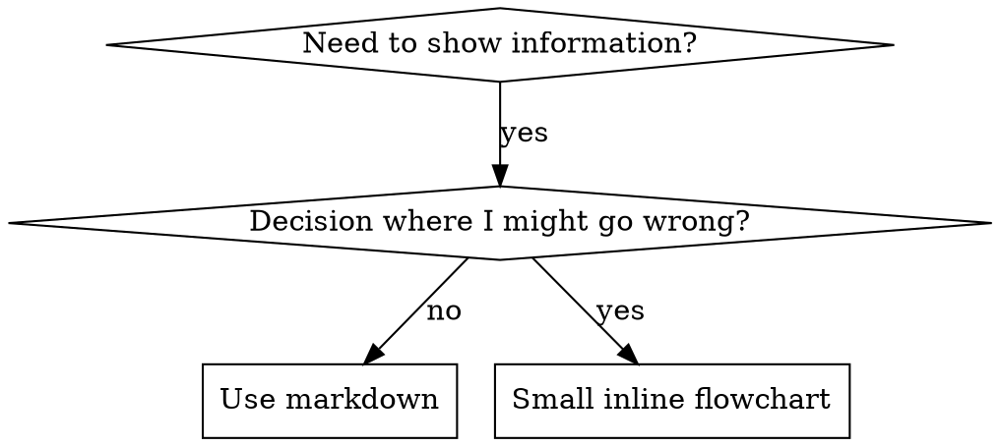

# Writing Skills (Escribir Skills)

## Visión general

**Escribir skills ES Desarrollo Guiado por Pruebas (TDD) aplicado a la documentación de procesos.**

**Las skills personales viven en directorios específicos del agente (`~/.claude/skills` para Claude Code, `~/.agents/skills/` para Codex)**

Escribes casos de prueba (escenarios de presión con subagentes), los ves fallar (comportamiento base), escribes la skill (documentación), ves que las pruebas pasan (los agentes cumplen) y refactorizas (cierras resquicios).

**Principio central:** Si no has visto fallar a un agente sin la skill, no sabes si la skill enseña lo correcto.

**CONOCIMIENTO PREVIO REQUERIDO:** Debes entender la skill superpowers:test-driven-development antes de usar esta skill. Esa skill define el ciclo fundamental RED-GREEN-REFACTOR. Esta skill adapta el TDD a la documentación.

**Guía oficial:** Para las buenas prácticas oficiales de Anthropic sobre la autoría de skills, consulta anthropic-best-practices.md. Ese documento aporta patrones y directrices adicionales que complementan el enfoque centrado en TDD de esta skill.

## ¿Qué es una Skill?

Una **skill** es una guía de referencia sobre técnicas, patrones o herramientas probadas. Las skills ayudan a futuras instancias de Claude a encontrar y aplicar enfoques efectivos.

**Las skills SON:** Técnicas, patrones, herramientas y guías de referencia reutilizables

**Las skills NO SON:** Narraciones sobre cómo resolviste un problema una vez

## Correspondencia entre TDD y Skills

| Concepto TDD | Creación de Skills |
|-------------|----------------|
| **Caso de prueba** | Escenario de presión con subagente |
| **Código de producción** | Documento de la skill (SKILL.md) |
| **La prueba falla (RED)** | El agente viola la regla sin la skill (línea base) |
| **La prueba pasa (GREEN)** | El agente cumple con la skill presente |
| **Refactorizar** | Cerrar resquicios manteniendo el cumplimiento |
| **Escribir la prueba primero** | Ejecutar el escenario base ANTES de escribir la skill |
| **Verla fallar** | Documentar las racionalizaciones exactas que usa el agente |
| **Código mínimo** | Escribir la skill que aborda esas violaciones específicas |
| **Verla pasar** | Verificar que el agente ahora cumple |
| **Ciclo de refactorización** | Encontrar nuevas racionalizaciones → taparlas → re-verificar |

Todo el proceso de creación de skills sigue el ciclo RED-GREEN-REFACTOR.

## Cuándo Crear una Skill

**Crear cuando:**
- La técnica no te resultó intuitivamente obvia
- Volverías a consultarla en distintos proyectos
- El patrón aplica de forma amplia (no es específico de un proyecto)
- Otros se beneficiarían de ella

**No crear para:**
- Soluciones puntuales
- Prácticas estándar ya bien documentadas en otro lugar
- Convenciones específicas del proyecto (ponlas en CLAUDE.md)
- Restricciones mecánicas (si se puede aplicar con regex/validación, automatízalo; reserva la documentación para las decisiones de criterio)

## Tipos de Skill

### Técnica
Método concreto con pasos a seguir (condition-based-waiting, root-cause-tracing)

### Patrón
Forma de pensar sobre problemas (flatten-with-flags, test-invariants)

### Referencia
Documentación de API, guías de sintaxis, documentación de herramientas (office docs)

## Estructura de Directorios


```
skills/
  skill-name/
    SKILL.md              # Referencia principal (obligatorio)
    supporting-file.*     # Solo si es necesario
```

**Espacio de nombres plano** - todas las skills en un único espacio de nombres consultable

**Ficheros separados para:**
1. **Referencia extensa** (100+ líneas) - documentación de API, sintaxis exhaustiva
2. **Herramientas reutilizables** - Scripts, utilidades, plantillas

**Mantener inline:**
- Principios y conceptos
- Patrones de código (< 50 líneas)
- Todo lo demás

## Estructura de SKILL.md

**Frontmatter (YAML):**
- Dos campos obligatorios: `name` y `description` (ver [agentskills.io/specification](https://agentskills.io/specification) para todos los campos soportados)
- Máximo 1024 caracteres en total
- `name`: Usar solo letras, números y guiones (sin paréntesis ni caracteres especiales)
- `description`: En tercera persona, describe SOLO cuándo usarla (NO qué hace)
  - Empieza con "Use when..." ("Usar cuando...") para centrarte en las condiciones que la activan
  - Incluye síntomas, situaciones y contextos específicos
  - **NUNCA resumas el proceso o flujo de trabajo de la skill** (ver la sección CSO para saber por qué)
  - Mantenlo por debajo de 500 caracteres si es posible

```markdown
---
name: Skill-Name-With-Hyphens
description: Use when [specific triggering conditions and symptoms]
---

# Skill Name

## Overview
What is this? Core principle in 1-2 sentences.

## When to Use
[Small inline flowchart IF decision non-obvious]

Bullet list with SYMPTOMS and use cases
When NOT to use

## Core Pattern (for techniques/patterns)
Before/after code comparison

## Quick Reference
Table or bullets for scanning common operations

## Implementation
Inline code for simple patterns
Link to file for heavy reference or reusable tools

## Common Mistakes
What goes wrong + fixes

## Real-World Impact (optional)
Concrete results
```


## Optimización para la Búsqueda de Claude (CSO)

**Crítico para el descubrimiento:** El futuro Claude necesita ENCONTRAR tu skill

### 1. Campo de Descripción Enriquecido

**Propósito:** Claude lee la descripción para decidir qué skills cargar para una tarea dada. Haz que responda: "¿Debería leer esta skill ahora mismo?"

**Formato:** Empieza con "Use when..." ("Usar cuando...") para centrarte en las condiciones que la activan

**CRÍTICO: Description = Cuándo usarla, NO Qué hace la skill**

La descripción debe describir ÚNICAMENTE las condiciones que la activan. No resumas el proceso o flujo de trabajo de la skill en la descripción.

**Por qué importa esto:** Las pruebas revelaron que cuando una descripción resume el flujo de trabajo de la skill, Claude puede seguir la descripción en lugar de leer el contenido completo de la skill. Una descripción que decía "revisión de código entre tareas" hizo que Claude hiciera UNA sola revisión, aunque el diagrama de flujo de la skill mostraba claramente DOS revisiones (cumplimiento de la especificación y luego calidad del código).

Cuando se cambió la descripción a simplemente "Use when executing implementation plans with independent tasks" ("Usar cuando se ejecuten planes de implementación con tareas independientes") (sin resumen del flujo de trabajo), Claude leyó correctamente el diagrama de flujo y siguió el proceso de revisión en dos etapas.

**La trampa:** Las descripciones que resumen el flujo de trabajo crean un atajo que Claude tomará. El cuerpo de la skill se convierte en documentación que Claude se salta.

```yaml
# ❌ BAD: Summarizes workflow - Claude may follow this instead of reading skill
description: Use when executing plans - dispatches subagent per task with code review between tasks

# ❌ BAD: Too much process detail
description: Use for TDD - write test first, watch it fail, write minimal code, refactor

# ✅ GOOD: Just triggering conditions, no workflow summary
description: Use when executing implementation plans with independent tasks in the current session

# ✅ GOOD: Triggering conditions only
description: Use when implementing any feature or bugfix, before writing implementation code
```

**Contenido:**
- Usa disparadores, síntomas y situaciones concretas que señalen que esta skill aplica
- Describe el *problema* (condiciones de carrera, comportamiento inconsistente) no *síntomas específicos de un lenguaje* (setTimeout, sleep)
- Mantén los disparadores agnósticos a la tecnología a menos que la propia skill sea específica de una tecnología
- Si la skill es específica de una tecnología, hazlo explícito en el disparador
- Escribe en tercera persona (se inyecta en el system prompt)
- **NUNCA resumas el proceso o flujo de trabajo de la skill**

```yaml
# ❌ BAD: Too abstract, vague, doesn't include when to use
description: For async testing

# ❌ BAD: First person
description: I can help you with async tests when they're flaky

# ❌ BAD: Mentions technology but skill isn't specific to it
description: Use when tests use setTimeout/sleep and are flaky

# ✅ GOOD: Starts with "Use when", describes problem, no workflow
description: Use when tests have race conditions, timing dependencies, or pass/fail inconsistently

# ✅ GOOD: Technology-specific skill with explicit trigger
description: Use when using React Router and handling authentication redirects
```

### 2. Cobertura de Palabras Clave

Usa palabras que Claude buscaría:
- Mensajes de error: "Hook timed out", "ENOTEMPTY", "race condition"
- Síntomas: "flaky", "hanging", "zombie", "pollution"
- Sinónimos: "timeout/hang/freeze", "cleanup/teardown/afterEach"
- Herramientas: comandos reales, nombres de librerías, tipos de fichero

### 3. Nomenclatura Descriptiva

**Usa voz activa, con el verbo primero:**
- ✅ `creating-skills` no `skill-creation`
- ✅ `condition-based-waiting` no `async-test-helpers`

### 4. Eficiencia de Tokens (Crítico)

**Problema:** los flujos getting-started y las skills que se referencian con frecuencia se cargan en CADA conversación. Cada token cuenta.

**Recuentos de palabras objetivo:**
- flujos getting-started: <150 palabras cada uno
- Skills que se cargan con frecuencia: <200 palabras en total
- Otras skills: <500 palabras (aun así, sé conciso)

**Técnicas:**

**Mover los detalles a la ayuda de la herramienta:**
```bash
# ❌ BAD: Document all flags in SKILL.md
search-conversations supports --text, --both, --after DATE, --before DATE, --limit N

# ✅ GOOD: Reference --help
search-conversations supports multiple modes and filters. Run --help for details.
```

**Usar referencias cruzadas:**
```markdown
# ❌ BAD: Repeat workflow details
When searching, dispatch subagent with template...
[20 lines of repeated instructions]

# ✅ GOOD: Reference other skill
Always use subagents (50-100x context savings). REQUIRED: Use [other-skill-name] for workflow.
```

**Comprimir ejemplos:**
```markdown
# ❌ BAD: Verbose example (42 words)
your human partner: "How did we handle authentication errors in React Router before?"
You: I'll search past conversations for React Router authentication patterns.
[Dispatch subagent with search query: "React Router authentication error handling 401"]

# ✅ GOOD: Minimal example (20 words)
Partner: "How did we handle auth errors in React Router?"
You: Searching...
[Dispatch subagent → synthesis]
```

**Eliminar redundancia:**
- No repitas lo que ya está en skills referenciadas de forma cruzada
- No expliques lo que resulta obvio a partir del comando
- No incluyas varios ejemplos del mismo patrón

**Verificación:**
```bash
wc -w skills/path/SKILL.md
# getting-started workflows: aim for <150 each
# Other frequently-loaded: aim for <200 total
```

**Nombrar según lo que HACES o la idea central:**
- ✅ `condition-based-waiting` > `async-test-helpers`
- ✅ `using-skills` no `skill-usage`
- ✅ `flatten-with-flags` > `data-structure-refactoring`
- ✅ `root-cause-tracing` > `debugging-techniques`

**Los gerundios (-ing) funcionan bien para procesos:**
- `creating-skills`, `testing-skills`, `debugging-with-logs`
- Activo, describe la acción que estás realizando

### 4. Referenciar Otras Skills

**Al escribir documentación que referencia otras skills:**

Usa solo el nombre de la skill, con marcadores explícitos de obligatoriedad:
- ✅ Bien: `**REQUIRED SUB-SKILL:** Use superpowers:test-driven-development`
- ✅ Bien: `**REQUIRED BACKGROUND:** You MUST understand superpowers:systematic-debugging`
- ❌ Mal: `See skills/testing/test-driven-development` (no queda claro si es obligatoria)
- ❌ Mal: `@skills/testing/test-driven-development/SKILL.md` (fuerza la carga, consume contexto)

**Por qué no usar enlaces con @:** La sintaxis `@` fuerza la carga inmediata del fichero, consumiendo 200k+ tokens de contexto antes de que lo necesites.

## Uso de Diagramas de Flujo



**Usa diagramas de flujo SOLO para:**
- Puntos de decisión no obvios
- Bucles de proceso en los que podrías detenerte demasiado pronto
- Decisiones de "cuándo usar A frente a B"

**Nunca uses diagramas de flujo para:**
- Material de referencia → Tablas, listas
- Ejemplos de código → Bloques markdown
- Instrucciones lineales → Listas numeradas
- Etiquetas sin significado semántico (step1, helper2)

Consulta @graphviz-conventions.dot para las reglas de estilo de graphviz.

**Para visualizarlo con tu compañero humano:** Usa `render-graphs.js` en este directorio para renderizar a SVG los diagramas de flujo de una skill:
```bash
./render-graphs.js ../some-skill           # Each diagram separately
./render-graphs.js ../some-skill --combine # All diagrams in one SVG
```

## Ejemplos de Código

**Un ejemplo excelente supera a muchos mediocres**

Elige el lenguaje más relevante:
- Técnicas de testing → TypeScript/JavaScript
- Depuración de sistemas → Shell/Python
- Procesamiento de datos → Python

**Un buen ejemplo:**
- Es completo y ejecutable
- Está bien comentado explicando el POR QUÉ
- Proviene de un escenario real
- Muestra el patrón con claridad
- Está listo para adaptar (no es una plantilla genérica)

**No hagas esto:**
- Implementar en 5+ lenguajes
- Crear plantillas de rellenar-el-hueco
- Escribir ejemplos artificiosos

Se te da bien portar código de un lenguaje a otro; un ejemplo excelente es suficiente.

## Organización de Ficheros

### Skill Autocontenida
```
defense-in-depth/
  SKILL.md    # Everything inline
```
Cuándo: Todo el contenido cabe, no se necesita referencia extensa

### Skill con Herramienta Reutilizable
```
condition-based-waiting/
  SKILL.md    # Overview + patterns
  example.ts  # Working helpers to adapt
```
Cuándo: La herramienta es código reutilizable, no solo narrativa

### Skill con Referencia Extensa
```
pptx/
  SKILL.md       # Overview + workflows
  pptxgenjs.md   # 600 lines API reference
  ooxml.md       # 500 lines XML structure
  scripts/       # Executable tools
```
Cuándo: El material de referencia es demasiado extenso para ir inline

## La Ley de Hierro (Igual que en TDD)

```
NO SKILL WITHOUT A FAILING TEST FIRST
```
(NINGUNA SKILL SIN UNA PRUEBA QUE FALLE PRIMERO)

Esto aplica tanto a las skills NUEVAS como a las EDICIONES de skills existentes.

¿Escribiste la skill antes de probarla? Bórrala. Empieza de nuevo.
¿Editaste una skill sin probarla? Misma violación.

**Sin excepciones:**
- No para "añadidos simples"
- No para "solo añadir una sección"
- No para "actualizaciones de documentación"
- No conserves cambios sin probar como "referencia"
- No "adaptes" mientras ejecutas las pruebas
- Borrar significa borrar

**CONOCIMIENTO PREVIO REQUERIDO:** La skill superpowers:test-driven-development explica por qué esto importa. Los mismos principios aplican a la documentación.

## Probar Todos los Tipos de Skill

Distintos tipos de skill necesitan distintos enfoques de prueba:

### Skills que Imponen Disciplina (reglas/requisitos)

**Ejemplos:** TDD, verification-before-completion, designing-before-coding

**Probar con:**
- Preguntas académicas: ¿Entienden las reglas?
- Escenarios de presión: ¿Cumplen bajo estrés?
- Múltiples presiones combinadas: tiempo + coste hundido + agotamiento
- Identificar racionalizaciones y añadir contraargumentos explícitos

**Criterio de éxito:** El agente sigue la regla bajo la máxima presión

### Skills de Técnica (guías de cómo hacer algo)

**Ejemplos:** condition-based-waiting, root-cause-tracing, defensive-programming

**Probar con:**
- Escenarios de aplicación: ¿Pueden aplicar la técnica correctamente?
- Escenarios de variación: ¿Manejan los casos límite?
- Pruebas de información faltante: ¿Tienen huecos las instrucciones?

**Criterio de éxito:** El agente aplica con éxito la técnica a un nuevo escenario

### Skills de Patrón (modelos mentales)

**Ejemplos:** reducing-complexity, conceptos de information-hiding

**Probar con:**
- Escenarios de reconocimiento: ¿Reconocen cuándo aplica el patrón?
- Escenarios de aplicación: ¿Pueden usar el modelo mental?
- Contraejemplos: ¿Saben cuándo NO aplicarlo?

**Criterio de éxito:** El agente identifica correctamente cuándo/cómo aplicar el patrón

### Skills de Referencia (documentación/API)

**Ejemplos:** documentación de API, referencias de comandos, guías de librerías

**Probar con:**
- Escenarios de recuperación: ¿Pueden encontrar la información correcta?
- Escenarios de aplicación: ¿Pueden usar correctamente lo que encontraron?
- Prueba de huecos: ¿Están cubiertos los casos de uso comunes?

**Criterio de éxito:** El agente encuentra y aplica correctamente la información de referencia

## Racionalizaciones Comunes para Saltarse las Pruebas

| Excusa | Realidad |
|--------|---------|
| "La skill es obviamente clara" | Clara para ti ≠ clara para otros agentes. Pruébala. |
| "Es solo una referencia" | Las referencias pueden tener huecos, secciones poco claras. Prueba la recuperación. |
| "Probar es excesivo" | Las skills sin probar tienen problemas. Siempre. 15 min de pruebas ahorran horas. |
| "Probaré si surgen problemas" | Problemas = los agentes no pueden usar la skill. Prueba ANTES de desplegar. |
| "Demasiado tedioso de probar" | Probar es menos tedioso que depurar una mala skill en producción. |
| "Estoy seguro de que es buena" | El exceso de confianza garantiza problemas. Pruébala de todas formas. |
| "Con la revisión académica basta" | Leer ≠ usar. Prueba escenarios de aplicación. |
| "No hay tiempo para probar" | Desplegar una skill sin probar desperdicia más tiempo arreglándola después. |

**Todo esto significa: Prueba antes de desplegar. Sin excepciones.**

## Blindar las Skills Contra la Racionalización

Las skills que imponen disciplina (como TDD) necesitan resistir la racionalización. Los agentes son inteligentes y encontrarán resquicios cuando estén bajo presión.

**Nota de psicología:** Entender POR QUÉ funcionan las técnicas de persuasión ayuda a aplicarlas de forma sistemática. Ver persuasion-principles.md para los fundamentos de investigación (Cialdini, 2021; Meincke et al., 2025) sobre autoridad, compromiso, escasez, prueba social y unidad.

### Cierra Cada Resquicio Explícitamente

No te limites a enunciar la regla: prohíbe los workarounds específicos:

<Bad>
```markdown
Write code before test? Delete it.
```
</Bad>

<Good>
```markdown
Write code before test? Delete it. Start over.

**No exceptions:**
- Don't keep it as "reference"
- Don't "adapt" it while writing tests
- Don't look at it
- Delete means delete
```
</Good>

### Aborda los Argumentos de "Espíritu vs. Letra"

Añade un principio fundacional temprano:

```markdown
**Violating the letter of the rules is violating the spirit of the rules.**
```
(Violar la letra de las reglas es violar el espíritu de las reglas.)

Esto corta de raíz toda una categoría de racionalizaciones de tipo "estoy siguiendo el espíritu".

### Construye una Tabla de Racionalizaciones

Recoge las racionalizaciones de las pruebas base (ver la sección de Pruebas más abajo). Cada excusa que hagan los agentes va a la tabla:

```markdown
| Excuse | Reality |
|--------|---------|
| "Too simple to test" | Simple code breaks. Test takes 30 seconds. |
| "I'll test after" | Tests passing immediately prove nothing. |
| "Tests after achieve same goals" | Tests-after = "what does this do?" Tests-first = "what should this do?" |
```

### Crea una Lista de Señales de Alerta

Facilita que los agentes se autoevalúen cuando estén racionalizando:

```markdown
## Red Flags - STOP and Start Over

- Code before test
- "I already manually tested it"
- "Tests after achieve the same purpose"
- "It's about spirit not ritual"
- "This is different because..."

**All of these mean: Delete code. Start over with TDD.**
```

### Actualiza el CSO con Síntomas de Violación

Añade a la descripción: síntomas de cuándo estás A PUNTO de violar la regla:

```yaml
description: use when implementing any feature or bugfix, before writing implementation code
```

## RED-GREEN-REFACTOR para Skills

Sigue el ciclo TDD:

### RED: Escribe una Prueba que Falle (Línea Base)

Ejecuta un escenario de presión con un subagente SIN la skill. Documenta el comportamiento exacto:
- ¿Qué decisiones tomó?
- ¿Qué racionalizaciones usó (textualmente)?
- ¿Qué presiones desencadenaron violaciones?

Esto es "ver fallar la prueba": debes ver qué hacen los agentes de forma natural antes de escribir la skill.

### GREEN: Escribe la Skill Mínima

Escribe la skill que aborda esas racionalizaciones específicas. No añadas contenido extra para casos hipotéticos.

Ejecuta los mismos escenarios CON la skill. El agente debería cumplir ahora.

### REFACTOR: Cierra Resquicios

¿El agente encontró una nueva racionalización? Añade un contraargumento explícito. Vuelve a probar hasta que sea a prueba de balas.

**Metodología de pruebas:** Consulta @testing-skills-with-subagents.md para la metodología completa de pruebas:
- Cómo escribir escenarios de presión
- Tipos de presión (tiempo, coste hundido, autoridad, agotamiento)
- Tapar resquicios de forma sistemática
- Técnicas de meta-pruebas

## Antipatrones

### ❌ Ejemplo Narrativo
"In session 2025-10-03, we found empty projectDir caused..."
**Por qué es malo:** Demasiado específico, no reutilizable

### ❌ Dilución Multilenguaje
example-js.js, example-py.py, example-go.go
**Por qué es malo:** Calidad mediocre, carga de mantenimiento

### ❌ Código en Diagramas de Flujo
```dot
step1 [label="import fs"];
step2 [label="read file"];
```
**Por qué es malo:** No se puede copiar y pegar, es difícil de leer

### ❌ Etiquetas Genéricas
helper1, helper2, step3, pattern4
**Por qué es malo:** Las etiquetas deberían tener significado semántico

## STOP: Antes de Pasar a la Siguiente Skill

**Después de escribir CUALQUIER skill, DEBES DETENERTE y completar el proceso de despliegue.**

**NO hagas esto:**
- Crear varias skills en lote sin probar cada una
- Pasar a la siguiente skill antes de que la actual esté verificada
- Saltarte las pruebas porque "hacerlo en lote es más eficiente"

**La checklist de despliegue de abajo es OBLIGATORIA para CADA skill.**

Desplegar skills sin probar = desplegar código sin probar. Es una violación de los estándares de calidad.

## Checklist de Creación de Skills (Adaptada a TDD)

**IMPORTANTE: Usa TodoWrite para crear tareas pendientes para CADA elemento de la checklist siguiente.**

**Fase RED - Escribir la Prueba que Falla:**
- [ ] Crear escenarios de presión (3+ presiones combinadas para skills de disciplina)
- [ ] Ejecutar los escenarios SIN la skill - documentar el comportamiento base textualmente
- [ ] Identificar patrones en las racionalizaciones/fallos

**Fase GREEN - Escribir la Skill Mínima:**
- [ ] El nombre usa solo letras, números y guiones (sin paréntesis/caracteres especiales)
- [ ] Frontmatter YAML con los campos obligatorios `name` y `description` (máx. 1024 caracteres; ver [spec](https://agentskills.io/specification))
- [ ] La descripción empieza con "Use when..." e incluye disparadores/síntomas específicos
- [ ] La descripción está escrita en tercera persona
- [ ] Palabras clave a lo largo de todo el texto para la búsqueda (errores, síntomas, herramientas)
- [ ] Visión general clara con el principio central
- [ ] Aborda los fallos específicos de la línea base identificados en RED
- [ ] Código inline O enlace a un fichero separado
- [ ] Un ejemplo excelente (no multilenguaje)
- [ ] Ejecutar los escenarios CON la skill - verificar que los agentes ahora cumplen

**Fase REFACTOR - Cerrar Resquicios:**
- [ ] Identificar NUEVAS racionalizaciones a partir de las pruebas
- [ ] Añadir contraargumentos explícitos (si es una skill de disciplina)
- [ ] Construir la tabla de racionalizaciones a partir de todas las iteraciones de prueba
- [ ] Crear la lista de señales de alerta
- [ ] Volver a probar hasta que sea a prueba de balas

**Comprobaciones de Calidad:**
- [ ] Diagrama de flujo pequeño solo si la decisión no es obvia
- [ ] Tabla de referencia rápida
- [ ] Sección de errores comunes
- [ ] Sin narrativa de historias
- [ ] Ficheros de apoyo solo para herramientas o referencia extensa

**Despliegue:**
- [ ] Confirmar (commit) la skill en git y subirla a tu fork (si está configurado)
- [ ] Considerar contribuirla de vuelta mediante un PR (si es útil de forma general)

## Flujo de Descubrimiento

Cómo el futuro Claude encuentra tu skill:

1. **Se encuentra con un problema** ("los tests son inestables")
3. **Encuentra la SKILL** (la descripción coincide)
4. **Escanea la visión general** (¿es esto relevante?)
5. **Lee los patrones** (tabla de referencia rápida)
6. **Carga el ejemplo** (solo cuando lo implementa)

**Optimiza para este flujo** - pon los términos consultables pronto y con frecuencia.

## La Conclusión

**Crear skills ES TDD para la documentación de procesos.**

Misma Ley de Hierro: ninguna skill sin una prueba que falle primero.
Mismo ciclo: RED (línea base) → GREEN (escribir la skill) → REFACTOR (cerrar resquicios).
Mismos beneficios: mejor calidad, menos sorpresas, resultados a prueba de balas.

Si sigues TDD para el código, síguelo para las skills. Es la misma disciplina aplicada a la documentación.
