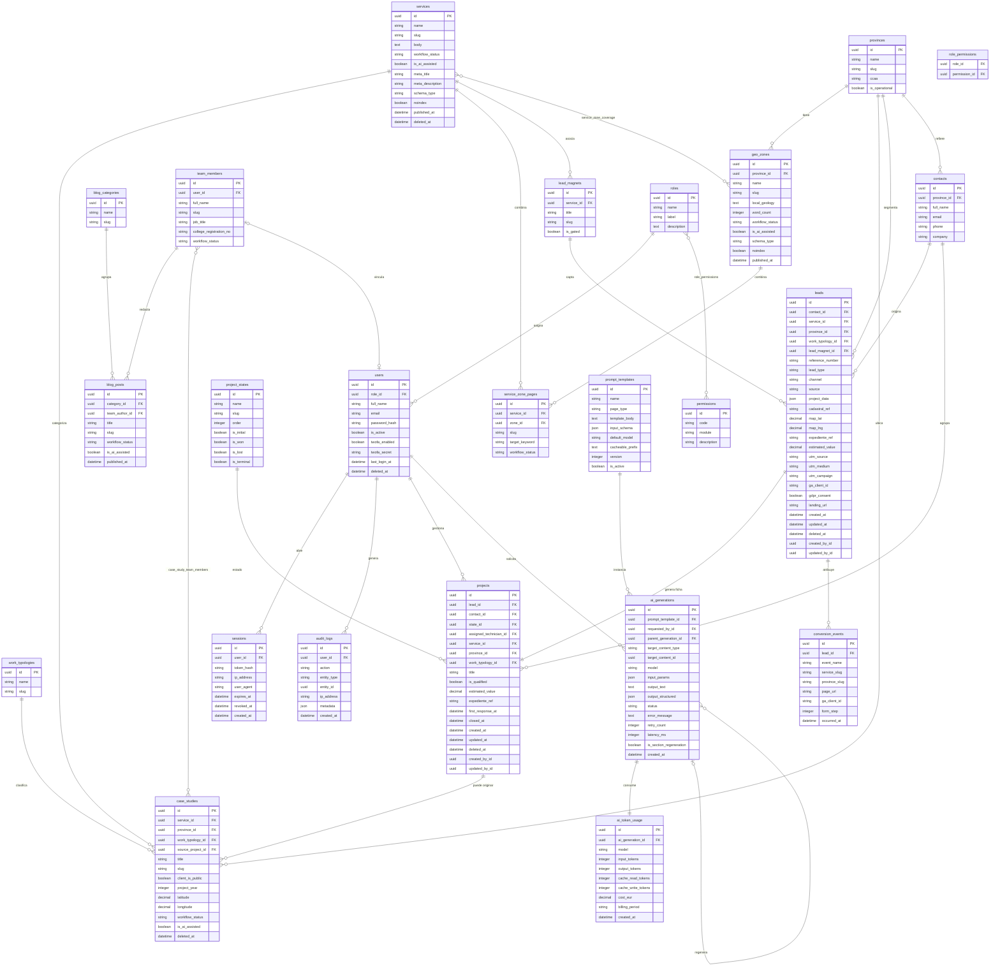

## Índice

0. [Ficha del proyecto](#0-ficha-del-proyecto)
1. [Descripción general del producto](#1-descripción-general-del-producto)
2. [Arquitectura del sistema](#2-arquitectura-del-sistema)
3. [Modelo de datos](#3-modelo-de-datos)
4. [Especificación de la API](#4-especificación-de-la-api)
5. [Historias de usuario](#5-historias-de-usuario)
6. [Tickets de trabajo](#6-tickets-de-trabajo)
7. [Pull requests](#7-pull-requests)
8. [Documentación de referencia](#documentación-de-referencia)

---

## Documentación de referencia

Este README es el **informe de entrega del proyecto**. La fuente de verdad canónica vive en los documentos siguientes; si hay discrepancia, prevalecen ellos.

### Documentación funcional (`docs/functional/`)

| Documento | Contenido |
|---|---|
| [`prd-web-b2b-geoteknia.md`](docs/functional/prd-web-b2b-geoteknia.md) | PRD completo: requisitos, personas, OKRs, historias de usuario |
| [`mvp-web-b2b-geoteknia.md`](docs/functional/mvp-web-b2b-geoteknia.md) | Alcance del MVP, priorización y Definition of Done |
| [`arquitectura-stack-web-b2b-geoteknia.md`](docs/functional/arquitectura-stack-web-b2b-geoteknia.md) | Decisiones de arquitectura, stack y riesgos |
| [`modelo-datos-web-b2b-geoteknia.md`](docs/functional/modelo-datos-web-b2b-geoteknia.md) | Modelo de datos conceptual (entidades, bloques, relaciones) |

### Documentación técnica (`docs/technical/`)

| Documento | Contenido |
|---|---|
| [`base-standards.md`](docs/technical/base-standards.md) | Estándares transversales del proyecto |
| [`backend-standards.md`](docs/technical/backend-standards.md) | Route Handlers, Prisma, Auth.js, IA server-side |
| [`frontend-standards.md`](docs/technical/frontend-standards.md) | App Router, SEO, JSON-LD, formularios, `/admin` |
| [`data-model.md`](docs/technical/data-model.md) | Modelo relacional Prisma (implementación) |
| [`api-spec.yml`](docs/technical/api-spec.yml) | Contratos OpenAPI de la API |
| [`development_guide.md`](docs/technical/development_guide.md) | Guía de instalación y puesta en marcha en local |
| [`documentation-standards.md`](docs/technical/documentation-standards.md) | Normas de mantenimiento de documentación |
| [`openspec-tasks-mandatory-steps.md`](docs/technical/openspec-tasks-mandatory-steps.md) | Pasos obligatorios en tareas OpenSpec |

---

## 0. Ficha del proyecto

### **0.1. Tu nombre completo:**

Alvaro Lopez Panadero

### **0.2. Nombre del proyecto:**

Geoteknia

### **0.3. Descripción breve del proyecto:**

Proyecto web B2B para una empresa de ingeniería geotécnica en España, diseñado para captar leads cualificados (SEO + SEM) y convertirlos en proyectos mediante páginas de servicio y zona, casos técnicos, formularios de alta conversión y analítica completa; además incluye un portal interno para gestionar leads/proyectos y generar contenido SEO asistido por IA.

### **0.4. URL del proyecto:**

https://github.com/zifiul/finalproject-alp

### 0.5. URL o archivo comprimido del repositorio

---

## 1. Descripción general del producto

> **Fuente de verdad:** [`docs/functional/prd-web-b2b-geoteknia.md`](docs/functional/prd-web-b2b-geoteknia.md), [`docs/functional/mvp-web-b2b-geoteknia.md`](docs/functional/mvp-web-b2b-geoteknia.md)

### **1.1. Objetivo:**

Geoteknia es una plataforma web B2B diseñada para convertir la presencia digital de una empresa de ingeniería geotécnica española en su principal canal de captación de leads cualificados. El producto resuelve un problema crítico del sector: la mayoría de empresas geotécnicas operan con webs institucionales estáticas que son invisibles para las búsquedas transaccionales ("estudios geotécnicos Madrid", "sondeos mecánicos Valencia") y no disponen de infraestructura para convertir el tráfico en solicitudes de presupuesto. Geoteknia está dirigido a tres perfiles de cliente —arquitectos e ingenieros de proyecto, promotores y directores de obra, y técnicos de licitaciones de obra pública— y a un equipo interno que gestiona leads, proyectos y contenido SEO. Su propuesta de valor diferencial es la combinación de una arquitectura de silos SEO (servicio × zona geográfica × casos de estudio) con un portal de administración interno que permite generar y publicar contenido técnico asistido por la API de Claude (Anthropic), convirtiendo la producción de contenido —el principal cuello de botella para escalar la autoridad temática— en un proceso semiautomatizado con revisión humana obligatoria.

### **1.2. Características y funcionalidades principales:**

**Páginas de servicio con arquitectura de silo SEO** — Cada uno de los 8 servicios principales (estudios geotécnicos, sondeos mecánicos, ensayos de laboratorio, control de calidad de cimentaciones, informes periciales, geotecnia marítima, instrumentación y hidrogeología) dispone de su propia landing page con metodología, normativa aplicable (CTE DB-SE-C, UNE-EN ISO 22476), entregables y CTA contextual, lo que permite posicionar búsquedas transaccionales específicas e incrementar la tasa de conversión al reducir la distancia entre el intent del usuario y el punto de conversión.

**Geo-landing pages por provincia operativa** — Una página por provincia con geología local específica, casos de estudio de esa zona y CTA pre-rellenado capta las búsquedas con intención local ("estudios geotécnicos Sevilla"), que representan el patrón dominante del sector, y transmite al visitante proximidad operativa y conocimiento del terreno antes de la primera llamada.

**Formulario multi-paso contextual y pre-rellenable** — El formulario de captación principal se divide en tres pasos progresivos (servicio/zona → datos del proyecto → contacto) y acepta parámetros de URL para pre-rellenarse desde cualquier landing o campaña SEM, cualificando el lead desde el primer contacto y eliminando el ciclo manual de email genérico → llamada de cualificación → propuesta.

**CRM ligero integrado (portal /admin)** — Cada lead entrante —por formulario, llamada, WhatsApp o descarga de recurso— crea automáticamente una ficha de proyecto en el portal interno con pipeline de estados configurable (Lead nuevo → Cualificado → Presupuestado → Adjudicado → Entregado), asignación a técnico, registro de hitos y KPI de primera respuesta (<48 h), eliminando la dependencia de hojas de cálculo y correo electrónico para la gestión comercial.

**Generación de contenido SEO asistida por IA (Claude API)** — El portal permite a un editor seleccionar tipo de página (servicio, geo-landing, caso de estudio, artículo de blog, FAQ) y sus parámetros clave (servicio, provincia, keyword objetivo, geología local) para obtener un borrador estructurado con terminología técnica real del sector, H1/H2/H3, meta title y meta description propuestos, y sugerencia de schema markup, haciendo viable producir las 100–160 URLs objetivo a una velocidad inaccesible con redacción manual.

**Flujo editorial humano-en-el-bucle** — Todo contenido generado por IA pasa obligatoriamente por el flujo Borrador IA → En revisión → Aprobado → Publicado, con editor visual, posibilidad de regenerar secciones concretas y registro de quién aprueba y cuándo, garantizando rigor técnico en contenido YMYL (un dato normativo erróneo puede comprometer una cimentación) y cumplimiento de los criterios E-E-A-T de Google.

**Catálogo de casos de estudio técnicos** — Sección filtrable por servicio, tipología de obra, provincia y año donde cada caso es una URL indexable con problemática geotécnica, solución técnica, maquinaria empleada y fotografías de campo reales; actúa como principal herramienta de prueba de solvencia ante clientes B2B técnicos y genera contenido único e irreplicable que refuerza la autoridad temática del dominio.

**Calculadora de alcance geotécnico y microconversiones** — La calculadora interactiva devuelve estimaciones orientativas de número de sondeos y profundidad según el CTE a partir del tipo de obra, plantas y superficie, convirtiendo tráfico informacional en leads cualificados; complementada por la microconversión "Enviar ubicación de parcela" (referencia catastral o pin de Maps en <15 segundos) y click-to-call/WhatsApp segmentados, el producto captura intenciones de compra de alta urgencia que un formulario largo perdería.

### **1.3. Diseño y experiencia de usuario:**

> Proporciona imágenes y/o videotutorial mostrando la experiencia del usuario desde que aterriza en la aplicación, pasando por todas las funcionalidades principales.

### **1.4. Instrucciones de instalación:**

> Ver [`docs/technical/development_guide.md`](docs/technical/development_guide.md) y el contexto de stack en [`docs/technical/base-standards.md`](docs/technical/base-standards.md) §2.

---

## 2. Arquitectura del Sistema

> **Fuente de verdad:** [`docs/functional/arquitectura-stack-web-b2b-geoteknia.md`](docs/functional/arquitectura-stack-web-b2b-geoteknia.md), [`docs/technical/backend-standards.md`](docs/technical/backend-standards.md), [`docs/technical/frontend-standards.md`](docs/technical/frontend-standards.md)

### **2.1. Diagrama de arquitectura:**

El sistema sigue el patrón de **monolito modular** sobre Next.js 15 (App Router). Un único despliegue agrupa el frontal público (SSG + ISR on-demand) y el portal de administración interno (`/admin`), con fronteras de dominio bien definidas en código. Esta decisión maximiza la velocidad de entrega y minimiza el coste operativo a la escala real del MVP (~3.500 sesiones/mes, ~40 leads/mes), y mantiene una vía de extracción limpia hacia un backend desacoplado (p. ej. NestJS) cuando el back-office lo justifique.

**Patrón elegido:** Monolito modular (modular monolith). **Beneficios principales:** un solo lenguaje (TypeScript E2E), un solo despliegue, tipos compartidos sin contrato API manual, y la pieza clave para este proyecto — ISR on-demand (`revalidatePath`) — que permite publicar contenido desde el portal y revalidar la URL del silo en el frontal sin ningún redespliegue de código. **Sacrificio principal:** hasta que el back-office crezca a plataforma, no hay separación de ciclos de despliegue entre el frontal y la API.

```
┌─────────────────────────────────────────────────────────────────┐
│                         CLOUDFLARE                              │
│                   DNS + WAF + Turnstile                         │
└────────────────────────┬────────────────────────────────────────┘
                         │
          ┌──────────────┴──────────────┐
          │                             │
    Visitante B2B               Usuario interno
    (móvil/desktop)             (/admin)
          │                             │
┌─────────▼─────────────────────────────▼─────────────────────────┐
│                           VERCEL                                │
│  ┌─────────────────────┐   ┌────────────────────────────────┐   │
│  │   Next.js Frontal   │   │    Portal /admin (noindex)     │   │
│  │   SSG + ISR on-dem  │   │  Auth.js + RBAC + 2FA + log    │   │
│  │   JSON-LD, sitemap  │   └──────────────┬─────────────────┘   │
│  │   CWV optimizado    │                  │                     │
│  └──────────┬──────────┘   ┌─────────────▼───────────────────┐  │
│             │              │   Route Handlers + Server Acts  │  │
│             └──────────────►   Leads · Proyectos · Content   │  │
│                            │   IA (Claude, server-side only) │  │
│                            └──────────────┬──────────────────┘  │
└────────────────────────────────────────── │ ────────────────────┘
                                            │
              ┌─────────────────────────────┼───────────────────┐
              │                             │                   │
    ┌─────────▼─────────┐        ┌───────────▼──────┐  ┌────────▼──────┐
    │  PostgreSQL Neon  │        │  API de Claude   │  │    Resend     │
    │  (región EU)      │        │  Sonnet / Opus   │  │  Email trans. │
    │  Prisma ORM       │        │  Prompt caching  │  │  React Email  │
    └───────────────────┘        └──────────────────┘  └───────────────┘

← GA4 + GTM + Consent Mode v2 (navegador; bloqueado hasta consentimiento) →
```

### **2.2. Descripción de componentes principales:**

| Componente | Tecnología | Responsabilidad |
|---|---|---|
| **Frontal público** | Next.js 15 + React 19 + TypeScript + Tailwind CSS | Páginas de servicio, geo-landings, casos de estudio, blog, calculadora, microconversiones. SSG para contenido estático; ISR on-demand para páginas publicadas desde el portal. `next/image` genera AVIF/WebP automáticamente. Metadata API y componentes JSON-LD para schema markup (Service, LocalBusiness, Article, Person, FAQPage…). |
| **Portal de administración** | Same Next.js (App Router, route groups) — `/admin` | CRM ligero (pipeline de leads/proyectos), módulo de generación de contenido IA, flujo editorial (Borrador IA → Revisión → Aprobado → Publicado), publicación que dispara `revalidatePath`. Excluido de indexación: `noindex` + robots disallow. |
| **Capa de negocio** | Route Handlers + Server Actions + `/lib` (módulos de dominio) | Lógica separada en `/lib/leads`, `/lib/projects`, `/lib/content`, `/lib/ia`. Validación con Zod. La clave de la API de Claude nunca sale del servidor. |
| **Base de datos** | PostgreSQL · Neon (serverless, región EU) · Prisma | Almacena leads, proyectos, estados del pipeline, contenido editorial, roles/usuarios y log de tokens de IA. Migraciones versionadas con Prisma Migrate; seeds para datos iniciales. |
| **Auth y control de acceso** | Auth.js v5 (NextAuth) + TOTP 2FA + RBAC en BD | Roles: Administrador, Gestor, Editor, Técnico. Contraseñas hasheadas con argon2. Sesiones con expiración. Audit log de acciones sensibles (publicar, aprobar, eliminar). |
| **Integración IA** | `@anthropic-ai/sdk` (server-side) | Genera borradores de servicio, geo-landing, casos, blog, FAQs y meta tags. Modelo por defecto `claude-sonnet-4-6`; `claude-opus-4-8` para piezas pillar. Prompt caching para partes estáticas. Log de tokens consumidos + alerta de tope mensual. Retries con backoff y degradación elegante. |
| **Email transaccional** | Resend + React Email | Confirmación de lead en <2 h con nombre de técnico asignado y plazo (RF-Q3). Plantillas tipadas en React. |
| **Anti-spam** | Cloudflare Turnstile | Protección de formularios sin fricción, sin enviar datos de comportamiento a Google (alineado con RGPD/Consent Mode v2). |
| **Tracking y analítica** | GA4 + GTM + Consent Mode v2 | DataLayer con `servicio`, `provincia`, `lead_type`; eventos `generate_lead`, `click_tel`, `click_whatsapp`, `calculator_use`, `resource_download`. Tags bloqueados hasta consentimiento. |
| **Observabilidad** | Axiom (logs) | Axiom centraliza logs estructurados de Route Handlers y Server Actions. |

### **2.3. Descripción de alto nivel del proyecto y estructura de ficheros**

La estructura sigue la convención del **App Router de Next.js** organizada por responsabilidad, con una capa de negocio (`/lib`) desacoplada del framework:

```
Geoteknia/
├── app/
│   ├── (public)/                     # Frontal público (layout independiente)
│   │   ├── servicios/[slug]/         # Páginas de servicio (SSG + schema Service)
│   │   ├── zonas/[slug]/             # Geo-landings (SSG + schema LocalBusiness)
│   │   ├── proyectos/[slug]/         # Casos de estudio (ISR + schema Article)
│   │   ├── blog/[categoria]/[slug]/  # Blog técnico (ISR + schema Article)
│   │   ├── equipo/                   # Fichas de equipo (schema Person)
│   │   ├── maquinaria/
│   │   ├── acreditaciones/
│   │   ├── licitaciones/
│   │   ├── recursos/              # Lead magnets (gated content)
│   │   ├── presupuesto/           # Formulario multi-paso principal
│   │   └── contacto/
│   ├── (admin)/                   # Portal interno — noindex, RBAC
│   │   ├── dashboard/
│   │   ├── leads/                 # Pipeline de leads/proyectos
│   │   ├── contenido/             # Generación IA + flujo editorial
│   │   └── configuracion/
│   └── api/                       # Route Handlers
│       ├── leads/
│       ├── proyectos/
│       ├── contenido/
│       └── ia/
├── lib/                           # Lógica de negocio (framework-agnostic)
│   ├── leads/                     # Dominio leads: crear, cualificar, asignar
│   ├── projects/                  # Dominio proyectos: estados, hitos
│   ├── content/                   # Dominio contenido: flujo editorial, publicación
│   ├── ia/                        # Integración Claude: prompts, retry, log de tokens
│   └── auth/                      # RBAC, roles, audit log
├── components/
│   ├── ui/                        # Primitivos (botones, inputs, formularios)
│   ├── seo/                       # JSON-LD, canonical, sitemap helpers
│   ├── forms/                     # Formulario multi-paso, calculadora, microconv.
│   └── admin/                     # Componentes del portal
├── prisma/
│   ├── schema.prisma              # Modelo de datos
│   ├── migrations/                # Migraciones versionadas
│   └── seed.ts                    # Datos iniciales
├── public/                        # Assets estáticos (fotos optimizadas pre-build)
├── tests/
│   ├── unit/                      # Vitest — lógica de dominio
│   └── e2e/                       # Playwright — flujos críticos
└── .github/workflows/
    └── ci.yml                     # Lint + typecheck + test + Lighthouse CI + migrate
```

**Patrón aplicado:** la capa `/lib` es framework-agnostic y contiene toda la lógica de dominio. Los Route Handlers y Server Actions son finos (reciben, validan con Zod, delegan a `/lib`, responden). Esto define fronteras limpias para extraer el back-office si el sistema crece.

### **2.4. Infraestructura y despliegue**

**Proveedores:**

| Proveedor | Rol |
|---|---|
| **Vercel** | Hosting de Next.js (funciones serverless + CDN edge global). Preview automático por PR. Variables de entorno seguras (clave de Claude, conexión DB, secretos de Auth.js). |
| **Neon** | PostgreSQL serverless, región `eu-west-1`. Scale-to-zero en idle (coste ~0 en MVP). Branching de BD por PR para previsualizar migraciones. |
| **Cloudflare** | DNS autoritativo + WAF (protege `/admin` de fuerza bruta y escaneo) + Turnstile (anti-spam en formularios). |
| **GitHub** | Repositorio + GitHub Actions (CI/CD). |

**Pipeline de despliegue:**

```
Push / PR
    │
    ▼
GitHub Actions
    ├── pnpm lint + tsc --noEmit
    ├── vitest (tests de unidad)
    ├── playwright (E2E en entorno de preview)
    ├── Lighthouse CI — gate: LCP<2.5s / INP<200ms / CLS<0.1 / a11y≥90
    └── Si rama main: prisma migrate deploy → Vercel deploy (producción)
         │
         └── Si PR: Vercel preview deploy + Neon branch preview
```

**Publicación de contenido desde el portal (sin redespliegue):**

```
Editor aprueba contenido en /admin
    → Server Action llama a prisma (estado = Publicado)
    → revalidatePath('/servicios/sondeos-mecanicos')
    → Vercel regenera la página en edge
    → Sitemap XML se actualiza en la siguiente petición
```

### **2.5. Seguridad**

| Práctica | Implementación |
|---|---|
| **HTTPS / HSTS** | Forzado en Vercel + cabecera `Strict-Transport-Security` en `next.config.ts` |
| **Secretos en servidor** | Clave de Claude, cadena de conexión DB y secretos de Auth.js solo en variables de entorno de Vercel. Nunca en cliente ni en repositorio. |
| **Autenticación del portal** | Auth.js v5: credenciales + TOTP 2FA, argon2 para hashes, sesiones JWT con expiración, rotación de tokens |
| **RBAC** | Roles (Admin/Gestor/Editor/Técnico) almacenados en BD; verificación en Server Actions y Route Handlers con middleware de Auth.js |
| **Audit log** | Tabla `audit_log` en BD: acción, usuario, entidad afectada, timestamp. Cubre publicar, aprobar, eliminar, cambiar estado |
| **Anti-spam** | Cloudflare Turnstile en todos los formularios públicos; validación adicional en servidor con Zod |
| **RGPD / LOPDGDD** | Consent Mode v2 en GTM: todos los tags de marketing bloqueados hasta consentimiento explícito. Datos de leads en PostgreSQL EU. Sin PII en prompts enviados a Claude. DPA firmado con cada proveedor. |
| **Aislamiento del portal** | `/admin` con `X-Robots-Tag: noindex` + `robots.txt` disallow. Sin enlaces desde el frontal indexable. WAF de Cloudflare filtra el tráfico hacia esa ruta. |
| **Protección contra injección** | Todas las queries pasan por Prisma (prepared statements). Inputs validados con Zod antes de llegar a la lógica de dominio. |
| **Control de coste IA** | Log de tokens consumidos por generación en BD. Límite mensual configurable. Alerta por email al superar umbral. Backoff ante rate limits. |

### **2.6. Tests**

| Nivel | Herramienta | Qué cubre |
|---|---|---|
| **Unidad** | Vitest | Lógica de dominio en `/lib`: cálculo de alcance (calculadora CTE), validación de estados del pipeline, construcción de prompts de Claude, cálculo de coste de tokens |
| **E2E — formulario multi-paso** | Playwright | Flujo completo: aterrizaje en landing de servicio → completar 3 pasos con validación en tiempo real → envío → email de confirmación → ficha de lead creada en portal |
| **E2E — portal y flujo editorial** | Playwright | Login + 2FA → crear borrador IA → flujo Borrador→Revisión→Aprobado→Publicado → verificar que la URL del silo es accesible y tiene el schema correcto |
| **E2E — seguridad RBAC** | Playwright | Intento de acceso a rutas de admin sin autenticar → redirige a login. Acceso con rol Técnico a módulo de contenido → devuelve 403. |
| **Rendimiento / a11y** | Lighthouse CI (en CI) | Gate en cada despliegue: LCP < 2,5 s / INP < 200 ms / CLS < 0,1 / accesibilidad ≥ 90 en plantillas de servicio, zona, caso y blog |
| **Schemas JSON-LD** | Script Node en CI (Schema Markup Validator API) | Valida que los schemas `Service`, `LocalBusiness`, `Article`, `Person`, `FAQPage` y `BreadcrumbList` son correctos antes de desplegar |

---

## 3. Modelo de Datos

> **Fuente de verdad:** [`docs/functional/modelo-datos-web-b2b-geoteknia.md`](docs/functional/modelo-datos-web-b2b-geoteknia.md) (modelo conceptual), [`docs/technical/data-model.md`](docs/technical/data-model.md) (modelo relacional Prisma)

### **3.1. Diagrama del modelo de datos:**

El modelo se organiza en seis módulos: **taxonomías** (`provinces`, `work_typologies`), **contenido publicable** (servicios, geo-landings, casos, blog, equipo, FAQs, lead magnets), **tablas de relación M:N** (cobertura servicio-zona, maquinaria-servicio, etc.), **usuarios y seguridad** (RBAC con roles/permisos, sesiones, audit log), **CRM ligero** (leads, proyectos, estados del pipeline) y **generación IA** (plantillas de prompt, generaciones, consumo de tokens).

Convenciones transversales: todas las entidades usan **UUID v4 como clave primaria** [ASUNCIÓN]; el **Bloque AUDIT** (`id`, `created_at`, `updated_at`, `deleted_at` para soft delete, `created_by_id`, `updated_by_id`) se aplica en casi todas; el **Bloque SEO** añade `slug`, `meta_title`, `meta_description`, `canonical_url`, `schema_type` y `noindex`; el **Bloque EDITORIAL** añade `workflow_status`, `is_ai_assisted` y los campos del flujo de aprobación. Las tablas append-only (`audit_logs`, `sessions`, `conversion_events`, `content_revisions`, `ai_token_usage`) no llevan `updated_at` ni `deleted_at`.



### **3.2. Descripción de entidades principales:**

Los tres **bloques reutilizables** aplican a múltiples entidades y se referencian en cada descripción:

> **Bloque AUDIT:** `id` UUID PK · `created_at` datetime NOT NULL · `updated_at` datetime NOT NULL · `deleted_at` datetime (soft delete, NULL = activo) · `created_by_id` FK → users · `updated_by_id` FK → users.
>
> **Bloque SEO:** `slug` string UNIQUE NOT NULL · `meta_title` string(60) · `meta_description` string(155) · `canonical_url` string · `schema_type` enum NOT NULL · `noindex` boolean NOT NULL (default false) · `og_image_id` FK → media_assets · `h1` string.
>
> **Bloque EDITORIAL:** `workflow_status` enum NOT NULL (`borrador_ia` → `en_revision` → `aprobado` → `publicado`; también `rechazado`, `despublicado`) · `is_ai_assisted` boolean NOT NULL · `author_id` FK → users · `reviewed_by_id` FK → users · `approved_by_id` FK → users · `approved_at` datetime · `published_at` datetime · `scheduled_publish_at` datetime · `current_version` integer NOT NULL.

---

#### `services` — RF-01

Página de servicio principal (pillar page del silo). Una fila por servicio ofertado (estudios geotécnicos, sondeos, ensayos de laboratorio, etc.). Entidad central de la arquitectura de silos SEO. Aplica **+ Bloque AUDIT + Bloque SEO + Bloque EDITORIAL**.

| Atributo | Tipo | Restricciones | Descripción |
|---|---|---|---|
| `id` | UUID | PK NOT NULL | Clave primaria (Bloque AUDIT) |
| `name` | string | NOT NULL | Nombre del servicio |
| `summary` | text | — | Resumen corto para listados |
| `body` | text | NOT NULL | Cuerpo editorial con H2/H3 |
| `methodology` | json | — | Pasos metodológicos estructurados |
| `applicable_norms` | text | — | CTE DB-SE-C, UNE-EN ISO 22476… |
| `deliverables` | json | — | Memoria, columnas litológicas… |
| `hero_image_id` | UUID | FK → media_assets | Imagen de cabecera |
| `order` | integer | — | Orden de aparición en listados |
| `is_pillar` | boolean | NOT NULL default true | Indica página pillar de silo |
| `slug` | string | UNIQUE NOT NULL | URL (Bloque SEO) |
| `meta_title` | string(60) | — | Title SEO (Bloque SEO) |
| `meta_description` | string(155) | — | Meta description SEO (Bloque SEO) |
| `canonical_url` | string | — | Canonical explícito (Bloque SEO) |
| `schema_type` | enum | NOT NULL | `Service` (Bloque SEO) |
| `noindex` | boolean | NOT NULL | Default false (Bloque SEO) |
| `workflow_status` | enum | NOT NULL | Estado editorial (Bloque EDITORIAL) |
| `is_ai_assisted` | boolean | NOT NULL | Trazabilidad IA E-E-A-T (Bloque EDITORIAL) |
| `published_at` | datetime | — | Fecha de publicación efectiva (Bloque EDITORIAL) |
| `scheduled_publish_at` | datetime | — | Publicación programada RF-21 (Bloque EDITORIAL) |
| `current_version` | integer | NOT NULL | Versión vigente enlazada a `content_revisions` |
| `created_at` | datetime | NOT NULL | (Bloque AUDIT) |
| `updated_at` | datetime | NOT NULL | (Bloque AUDIT) |
| `deleted_at` | datetime | — | Soft delete (Bloque AUDIT) |

**Relaciones:** 1:N → `case_studies` (service_id) · 1:N → `service_zone_pages` (service_id) · 1:N → `faq_groups` (service_id) · 1:N → `lead_magnets` (service_id) · M:N ↔ `geo_zones` (vía `service_zone_coverage`) · M:N ↔ `machinery` (vía `machinery_services`) · M:N ↔ `blog_posts` (vía `blog_post_services`).

**Índices:** `slug` (único) · `workflow_status` · `deleted_at`.

---

#### `geo_zones` — RF-04

Geo-landing por provincia/municipio operativo con contenido mínimo de 800–1.200 palabras (anti-thin content). Materializa el patrón SEO servicio × zona. Aplica **+ Bloque AUDIT + Bloque SEO + Bloque EDITORIAL**.

| Atributo | Tipo | Restricciones | Descripción |
|---|---|---|---|
| `id` | UUID | PK NOT NULL | Clave primaria |
| `province_id` | UUID | FK → provinces NOT NULL | Provincia de la zona geográfica |
| `name` | string | NOT NULL | Nombre de la zona o municipio |
| `local_geology` | text | NOT NULL | Geología específica local (diferenciador de contenido) |
| `operational_base` | text | — | Base/maquinaria disponible en la zona |
| `body` | text | NOT NULL | Cuerpo del geo-landing (mín. 800 palabras) |
| `word_count` | integer | — | Control de thin content |
| `hero_image_id` | UUID | FK → media_assets | Imagen de cabecera |
| `slug` | string | UNIQUE NOT NULL | URL (Bloque SEO) |
| `meta_title` | string(60) | — | Title SEO (Bloque SEO) |
| `meta_description` | string(155) | — | Meta description SEO (Bloque SEO) |
| `schema_type` | enum | NOT NULL | `LocalBusiness` (Bloque SEO) |
| `noindex` | boolean | NOT NULL | Default false (Bloque SEO) |
| `workflow_status` | enum | NOT NULL | Estado editorial (Bloque EDITORIAL) |
| `is_ai_assisted` | boolean | NOT NULL | Trazabilidad IA (Bloque EDITORIAL) |
| `published_at` | datetime | — | Fecha de publicación (Bloque EDITORIAL) |
| `current_version` | integer | NOT NULL | Versión vigente (Bloque EDITORIAL) |
| `created_at` | datetime | NOT NULL | (Bloque AUDIT) |
| `updated_at` | datetime | NOT NULL | (Bloque AUDIT) |
| `deleted_at` | datetime | — | Soft delete (Bloque AUDIT) |

**Relaciones:** N:1 → `provinces` (province_id) · M:N ↔ `services` (vía `service_zone_coverage`) · 1:N → `service_zone_pages`.

**Índices:** `slug` (único) · `province_id` · `workflow_status`.

---

#### `case_studies` — RF-03

Caso de estudio / proyecto técnico publicable. Prueba de solvencia E-E-A-T. Puede originarse desde un proyecto CRM en estado "Entregado" mediante `source_project_id` (RF-18). Aplica **+ Bloque AUDIT + Bloque SEO + Bloque EDITORIAL**.

| Atributo | Tipo | Restricciones | Descripción |
|---|---|---|---|
| `id` | UUID | PK NOT NULL | Clave primaria |
| `title` | string | NOT NULL | Título del caso |
| `service_id` | UUID | FK → services NOT NULL | Servicio principal del caso |
| `province_id` | UUID | FK → provinces NOT NULL | Ubicación del proyecto |
| `work_typology_id` | UUID | FK → work_typologies NOT NULL | Tipología de obra |
| `client_name` | string | — | Nombre del cliente (si público) |
| `client_is_public` | boolean | NOT NULL | Indica si se puede mostrar el cliente |
| `problem` | text | NOT NULL | Problemática geotécnica planteada |
| `solution` | text | NOT NULL | Solución técnica aplicada |
| `boreholes_count` | integer | — | Número de sondeos ejecutados |
| `meters_drilled` | decimal | — | Metros totales perforados |
| `tests_summary` | text | — | Resumen de ensayos realizados |
| `result` | text | — | Resultado y conclusiones |
| `project_year` | integer | — | Año de ejecución del proyecto |
| `latitude` | decimal | — | Latitud para localización estructurada |
| `longitude` | decimal | — | Longitud para localización estructurada |
| `source_project_id` | UUID | FK → projects | Proyecto CRM de origen (RF-18) |
| `slug` | string | UNIQUE NOT NULL | URL (Bloque SEO) |
| `meta_title` | string(60) | — | Title SEO (Bloque SEO) |
| `schema_type` | enum | NOT NULL | `Article` (Bloque SEO) |
| `noindex` | boolean | NOT NULL | Default false (Bloque SEO) |
| `workflow_status` | enum | NOT NULL | Estado editorial (Bloque EDITORIAL) |
| `is_ai_assisted` | boolean | NOT NULL | Trazabilidad IA (Bloque EDITORIAL) |
| `published_at` | datetime | — | Fecha de publicación (Bloque EDITORIAL) |
| `current_version` | integer | NOT NULL | Versión vigente (Bloque EDITORIAL) |
| `created_at` | datetime | NOT NULL | (Bloque AUDIT) |
| `deleted_at` | datetime | — | Soft delete (Bloque AUDIT) |

**Relaciones:** N:1 → `services` · N:1 → `provinces` · N:1 → `work_typologies` · N:1 (opt.) → `projects` (source_project_id) · M:N ↔ `team_members` (vía `case_study_team_members`, con `role`) · M:N ↔ `media_assets` (vía `content_media` — galería de fotos de campo).

**Índices:** `slug` (único) · `service_id` · `province_id` · `work_typology_id` · `project_year` · `workflow_status`.

---

#### `leads` — RF-02 / RF-08 / RF-11 / RF-15 / RF-Q2 / RF-18

Conversión entrante que captura datos de contacto sea cual sea el canal. Genera número de referencia único (mostrado en email de confirmación RF-02/US-12) y dispara la creación automática de un `project`. Núcleo del flujo de atribución (US-13/US-14). Aplica **+ Bloque AUDIT**.

[ASUNCIÓN: `leads` es el evento de conversión inmutable con su atribución; `projects` es la ficha viva del pipeline. La relación es 1:1 inicial.]

| Atributo | Tipo | Restricciones | Descripción |
|---|---|---|---|
| `id` | UUID | PK NOT NULL | Clave primaria |
| `contact_id` | UUID | FK → contacts | Interlocutor deduplicado |
| `reference_number` | string | UNIQUE NOT NULL | Nº de referencia mostrado en email (US-12) |
| `lead_type` | enum | NOT NULL | `presupuesto` / `licitacion` / `recurso` / `ubicacion` |
| `channel` | enum | NOT NULL | `formulario` / `whatsapp` / `tel` / `ubicacion` / `lead_magnet` |
| `source` | enum | NOT NULL | `organico` / `sem` / `directo` / `referral` |
| `service_id` | UUID | FK → services | Servicio de interés |
| `province_id` | UUID | FK → provinces | Zona del proyecto |
| `work_typology_id` | UUID | FK → work_typologies | Tipología de obra |
| `project_data` | json | — | Nº plantas, superficie, fase (calculadora RF-Q1) |
| `cadastral_ref` | string | — | Referencia catastral (RF-Q2) |
| `map_lat` | decimal | — | Latitud del pin Maps (RF-Q2) |
| `map_lng` | decimal | — | Longitud del pin Maps (RF-Q2) |
| `expediente_ref` | string | — | Referencia de expediente licitación (RF-15/US-11) |
| `estimated_value` | decimal | — | Valor estimado del contrato |
| `lead_magnet_id` | UUID | FK → lead_magnets | Recurso descargado que originó el lead (RF-11) |
| `utm_source` | string | — | Atribución UTM |
| `utm_medium` | string | — | Atribución UTM |
| `utm_campaign` | string | — | Atribución UTM |
| `ga_client_id` | string | — | Client ID de GA4 para atribución cruzada |
| `gdpr_consent` | boolean | NOT NULL | Consentimiento RGPD registrado (RNF-SEC) |
| `landing_url` | string | — | URL de aterrizaje del lead |
| `created_at` | datetime | NOT NULL | (Bloque AUDIT) |
| `deleted_at` | datetime | — | Soft delete — derecho de supresión RGPD |

**Relaciones:** N:1 (opt.) → `contacts` · N:1 (opt.) → `services` · N:1 (opt.) → `provinces` · N:1 (opt.) → `work_typologies` · N:1 (opt.) → `lead_magnets` · 1:1 → `projects` (ficha generada automáticamente) · 1:N → `conversion_events`.

**Índices:** `reference_number` (único) · `lead_type` · `channel` · `source` · `service_id` · `province_id` · `created_at`.

---

#### `projects` — RF-18

Ficha de proyecto del pipeline CRM. Creada automáticamente desde un `lead`; gestiona estado, técnico asignado, hitos y el KPI de primera respuesta (<48 h, RF-Q3). Aplica **+ Bloque AUDIT** (incluye `deleted_at` para RGPD: derecho de supresión).

| Atributo | Tipo | Restricciones | Descripción |
|---|---|---|---|
| `id` | UUID | PK NOT NULL | Clave primaria |
| `lead_id` | UUID | FK → leads NOT NULL | Lead que originó la ficha |
| `contact_id` | UUID | FK → contacts | Interlocutor del proyecto |
| `title` | string | NOT NULL | Título descriptivo del proyecto |
| `state_id` | UUID | FK → project_states NOT NULL | Estado actual del pipeline |
| `assigned_technician_id` | UUID | FK → users | Técnico responsable asignado |
| `service_id` | UUID | FK → services | Servicio principal |
| `province_id` | UUID | FK → provinces | Zona del proyecto |
| `work_typology_id` | UUID | FK → work_typologies | Tipología de obra |
| `estimated_value` | decimal | — | Valor estimado (para priorización) |
| `first_response_at` | datetime | — | KPI: timestamp de primera respuesta (<48 h) |
| `is_qualified` | boolean | NOT NULL default false | Lead cualificado por el gestor |
| `expediente_ref` | string | — | Referencia expediente licitación |
| `closed_at` | datetime | — | Fecha de cierre del proyecto |
| `created_at` | datetime | NOT NULL | (Bloque AUDIT) |
| `updated_at` | datetime | NOT NULL | (Bloque AUDIT) |
| `deleted_at` | datetime | — | Soft delete / RGPD (Bloque AUDIT) |

**Relaciones:** N:1 → `leads` · N:1 (opt.) → `contacts` · N:1 → `project_states` · N:1 (opt.) → `users` (técnico) · N:1 (opt.) → `services` · N:1 (opt.) → `provinces` · 1:N → `project_state_history` · 1:N → `project_milestones` · 1:N → `project_notes` · 1:N → `project_documents` · 1:N → `case_studies` (puede originar un caso publicable).

**Índices:** `state_id` · `assigned_technician_id` · `service_id` · `province_id` · `created_at` · `is_qualified`.

---

#### `users` — RF-17

Usuario interno del portal `/admin`. Acceso por email + hash de contraseña argon2 + TOTP 2FA. Tiene un único rol principal que determina los permisos vía RBAC. [ASUNCIÓN: un usuario tiene un rol principal (role_id); si se requiriera multi-rol se introduciría tabla `user_roles` M:N.] Aplica **+ Bloque AUDIT**.

| Atributo | Tipo | Restricciones | Descripción |
|---|---|---|---|
| `id` | UUID | PK NOT NULL | Clave primaria |
| `full_name` | string | NOT NULL | Nombre completo del usuario |
| `email` | string | UNIQUE NOT NULL | Email de acceso al portal |
| `password_hash` | string | NOT NULL | Hash argon2 (RNF-ADMIN) |
| `role_id` | UUID | FK → roles NOT NULL | Rol principal RBAC |
| `is_active` | boolean | NOT NULL | Cuenta activa / desactivada |
| `twofa_enabled` | boolean | NOT NULL default false | 2FA TOTP activado |
| `twofa_secret` | string | — | Secreto TOTP cifrado en reposo |
| `last_login_at` | datetime | — | Último acceso registrado |
| `created_at` | datetime | NOT NULL | (Bloque AUDIT) |
| `updated_at` | datetime | NOT NULL | (Bloque AUDIT) |
| `deleted_at` | datetime | — | Soft delete (Bloque AUDIT) |

**Relaciones:** N:1 → `roles` · 1:N → `sessions` · 1:N → `audit_logs` · 1:N → `projects` (técnico asignado) · 1:N → `ai_generations` (solicitante) · 1:N → `content_revisions` (editor) · 1:1 (opt.) ↔ `team_members`.

**Índices:** `email` (único) · `role_id` · `is_active`.

---

#### `roles` / `permissions` / `role_permissions` — RF-17

Matriz RBAC del portal. Cuatro roles predefinidos: `admin`, `gestor`, `editor`, `tecnico`. Los permisos son atómicos por módulo/acción (p. ej. `content.publish`, `projects.assign`).

**`roles`**

| Atributo | Tipo | Restricciones | Descripción |
|---|---|---|---|
| `id` | UUID | PK NOT NULL | Clave primaria |
| `name` | enum | UNIQUE NOT NULL | `admin` / `gestor` / `editor` / `tecnico` |
| `label` | string | NOT NULL | Etiqueta legible para la UI |
| `description` | text | — | Descripción del alcance del rol |

**Relaciones:** 1:N → `users` · M:N ↔ `permissions` (vía `role_permissions`). **Índices:** `name` (único).

**`permissions`**

| Atributo | Tipo | Restricciones | Descripción |
|---|---|---|---|
| `id` | UUID | PK NOT NULL | Clave primaria |
| `code` | string | UNIQUE NOT NULL | Identificador atómico p. ej. `content.publish` |
| `module` | string | NOT NULL | Módulo: `projects` / `content` / `users` / `ai` |
| `description` | string | — | Descripción del permiso |

**Relaciones:** M:N ↔ `roles` (vía `role_permissions`). **Índices:** `code` (único) · `module`.

**`role_permissions`** (tabla puente, sin PK propia)

| Atributo | Tipo | Restricciones | Descripción |
|---|---|---|---|
| `role_id` | UUID | FK → roles NOT NULL | Rol |
| `permission_id` | UUID | FK → permissions NOT NULL | Permiso asignado al rol |

**Índices:** único compuesto (`role_id`, `permission_id`).

---

#### `ai_generations` — RF-19 / RNF-IA

Una fila por invocación a la API de Claude. Registra inputs, salida, modelo, estado, reintentos y latencia. La auto-referencia `parent_generation_id` soporta la regeneración de secciones concretas (RF-20). Base de la gobernanza y trazabilidad del contenido asistido por IA. Append-only operativo.

| Atributo | Tipo | Restricciones | Descripción |
|---|---|---|---|
| `id` | UUID | PK NOT NULL | Clave primaria |
| `prompt_template_id` | UUID | FK → prompt_templates NOT NULL | Plantilla usada para la generación |
| `target_content_type` | string | — | Entidad destino p. ej. `services` |
| `target_content_id` | UUID | — | ID de la entidad destino |
| `requested_by_id` | UUID | FK → users NOT NULL | Usuario que solicitó la generación |
| `model` | enum | NOT NULL | `claude-sonnet-4-6` / `claude-opus-4-8` |
| `input_params` | json | NOT NULL | Valores de entrada del editor (servicio, zona, keyword…) |
| `rendered_prompt` | text | — | Prompt completo enviado a Claude |
| `output_text` | text | — | Texto generado por Claude |
| `output_structured` | json | — | H1/H2-H3/meta/schema/links estructurados |
| `status` | enum | NOT NULL | `success` / `error` / `partial` / `retrying` |
| `error_message` | text | — | Detalle del error para gestión (RNF-IA) |
| `retry_count` | integer | NOT NULL default 0 | Nº de reintentos con backoff exponencial |
| `latency_ms` | integer | — | Latencia de la llamada a Claude |
| `is_section_regeneration` | boolean | NOT NULL default false | Reprompt de sección concreta (RF-20) |
| `parent_generation_id` | UUID | FK → ai_generations | Generación padre (auto-referencia) |
| `created_at` | datetime | NOT NULL | Timestamp append-only |

**Relaciones:** N:1 → `prompt_templates` · N:1 → `users` (solicitante) · auto-ref N:1 → `ai_generations` (parent) · 1:1 → `ai_token_usage` · 1:N → `content_revisions` (revisiones producidas a partir de esta generación).

**Índices:** `prompt_template_id` · `requested_by_id` · `model` · `status` · `created_at` · compuesto (`target_content_type`, `target_content_id`).

---

#### `ai_token_usage` — RNF-IA

Ledger de consumo de tokens y coste estimado por generación. Separado de `ai_generations` (tabla operativa) para servir como base contable agregable por periodo `billing_period`. Soporta el límite mensual configurable y las alertas de `ai_budget_config`. **Append-only** (sin `updated_at` ni `deleted_at`).

| Atributo | Tipo | Restricciones | Descripción |
|---|---|---|---|
| `id` | UUID | PK NOT NULL | Clave primaria |
| `ai_generation_id` | UUID | FK → ai_generations UNIQUE NOT NULL | Generación asociada (relación 1:1) |
| `model` | enum | NOT NULL | Modelo usado (`claude-sonnet-4-6` / `claude-opus-4-8`) |
| `input_tokens` | integer | NOT NULL | Tokens de entrada consumidos |
| `output_tokens` | integer | NOT NULL | Tokens de salida generados |
| `cache_read_tokens` | integer | — | Tokens leídos de caché (prompt caching) |
| `cache_write_tokens` | integer | — | Tokens escritos en caché |
| `cost_eur` | decimal | NOT NULL | Coste estimado en EUR de la llamada |
| `billing_period` | string | NOT NULL | `YYYY-MM` — clave de agregación mensual |
| `created_at` | datetime | NOT NULL | Timestamp append-only |

**Relaciones:** 1:1 → `ai_generations` (`ai_generation_id` único).

**Índices:** `ai_generation_id` (único) · `billing_period` · `model` · `created_at`.

---

## 4. Especificación de la API

> **Fuente de verdad:** [`docs/technical/api-spec.yml`](docs/technical/api-spec.yml)

La API de Geoteknia se expone mediante **Route Handlers de Next.js 15** (`app/api/**/route.ts`) sobre la capa de dominio en `/lib`, con validación de entrada con **Zod** y persistencia con **Prisma + PostgreSQL (Neon)**. Se documentan los **3 endpoints más representativos del valor del producto**:

1. **`POST /api/leads`** — Alta de un lead (público + Turnstile). Es el corazón del producto: convierte tráfico en oportunidad comercial y crea automáticamente la ficha de proyecto (RF-02/RF-18).
2. **`POST /api/admin/content/generate`** — Generación de un borrador de contenido SEO con la API de Claude (diferenciador del producto; requiere sesión y rol `Editor`+, RF-19).
3. **`PATCH /api/admin/projects/{projectId}/state`** — Avance de un proyecto en el pipeline del CRM con registro de la transición (requiere sesión y rol `Gestor`+, RF-18).

```yaml
openapi: 3.1.0
info:
  title: Geoteknia API
  version: 1.0.0
  description: >
    API del monolito modular de Geoteknia (Next.js 15 App Router). Expone la
    captación de leads del frontal público y la gestión del back-office (/admin):
    generación de contenido SEO asistida por la API de Claude y pipeline CRM.
servers:
  - url: https://geoteknia.es
    description: Producción
  - url: http://localhost:3000
    description: Desarrollo local

tags:
  - name: Leads
    description: Captación de leads (frontal público).
  - name: Contenido IA
    description: Generación de borradores de contenido SEO con la API de Claude.
  - name: Proyectos
    description: Pipeline del CRM ligero (portal /admin).

paths:
  /api/leads:
    post:
      tags: [Leads]
      operationId: createLead
      summary: Crear un lead desde el frontal público
      description: >
        Registra una conversión entrante (formulario multi-paso, microconversión de
        ubicación, lead magnet o solicitud de licitación). Valida el token de
        Cloudflare Turnstile, deduplica/crea el `contact`, genera un
        `reference_number` único y dispara el alta automática de un `project` en el
        estado inicial del pipeline. Endpoint público (sin sesión).
      security: []
      requestBody:
        required: true
        content:
          application/json:
            schema:
              $ref: '#/components/schemas/LeadInput'
      responses:
        '201':
          description: Lead creado; ficha de proyecto generada.
          content:
            application/json:
              schema:
                $ref: '#/components/schemas/Lead'
        '400':
          description: Cuerpo inválido (fallo de validación Zod).
          content:
            application/json:
              schema: { $ref: '#/components/schemas/Error' }
        '403':
          description: Token de Turnstile ausente o inválido.
          content:
            application/json:
              schema: { $ref: '#/components/schemas/Error' }
        '429':
          description: Límite de peticiones superado (rate limiting anti-abuso).
          content:
            application/json:
              schema: { $ref: '#/components/schemas/Error' }

  /api/admin/content/generate:
    post:
      tags: [Contenido IA]
      operationId: generateContentDraft
      summary: Generar un borrador de contenido SEO con la API de Claude
      description: >
        Renderiza la `prompt_template` del `pageType` indicado con los parámetros del
        editor e invoca la API de Claude (server-side). Persiste la invocación en
        `ai_generations` y el consumo en `ai_token_usage`, y devuelve el borrador
        estructurado (H1, H2/H3, meta title/description y schema sugerido). El
        contenido entra en el flujo editorial humano-en-el-bucle como `Borrador IA`.
        Requiere sesión de Auth.js y rol `Editor` o superior.
      security:
        - cookieAuth: []
      requestBody:
        required: true
        content:
          application/json:
            schema:
              $ref: '#/components/schemas/ContentGenerationRequest'
      responses:
        '200':
          description: Borrador generado correctamente.
          content:
            application/json:
              schema:
                $ref: '#/components/schemas/ContentDraft'
        '400':
          description: Parámetros inválidos para la plantilla (validación Zod).
          content:
            application/json:
              schema: { $ref: '#/components/schemas/Error' }
        '401':
          description: No autenticado.
          content:
            application/json:
              schema: { $ref: '#/components/schemas/Error' }
        '403':
          description: Autenticado pero sin rol suficiente (RBAC).
          content:
            application/json:
              schema: { $ref: '#/components/schemas/Error' }
        '429':
          description: Presupuesto mensual de tokens de IA agotado (RNF-IA).
          content:
            application/json:
              schema: { $ref: '#/components/schemas/Error' }
        '502':
          description: Fallo upstream de la API de Claude tras reintentos.
          content:
            application/json:
              schema: { $ref: '#/components/schemas/Error' }

  /api/admin/projects/{projectId}/state:
    patch:
      tags: [Proyectos]
      operationId: updateProjectState
      summary: Avanzar un proyecto en el pipeline del CRM
      description: >
        Transiciona el `project` a un nuevo `project_state` (Lead nuevo → Cualificado
        → Presupuestado → Adjudicado → En ejecución → Entregado / Perdido), validando
        que la transición sea legal, y registra el cambio (quién y cuándo) en
        `project_state_history`. Requiere sesión de Auth.js y rol `Gestor` o superior;
        la acción queda registrada en `audit_logs`.
      security:
        - cookieAuth: []
      parameters:
        - name: projectId
          in: path
          required: true
          description: Identificador (UUID) del proyecto.
          schema:
            type: string
            format: uuid
      requestBody:
        required: true
        content:
          application/json:
            schema:
              $ref: '#/components/schemas/ProjectStateUpdate'
      responses:
        '200':
          description: Estado actualizado.
          content:
            application/json:
              schema:
                $ref: '#/components/schemas/Project'
        '400':
          description: Cuerpo inválido (validación Zod).
          content:
            application/json:
              schema: { $ref: '#/components/schemas/Error' }
        '401':
          description: No autenticado.
          content:
            application/json:
              schema: { $ref: '#/components/schemas/Error' }
        '403':
          description: Autenticado pero sin rol suficiente (RBAC).
          content:
            application/json:
              schema: { $ref: '#/components/schemas/Error' }
        '404':
          description: Proyecto no encontrado.
          content:
            application/json:
              schema: { $ref: '#/components/schemas/Error' }
        '409':
          description: Transición de estado no permitida desde el estado actual.
          content:
            application/json:
              schema: { $ref: '#/components/schemas/Error' }

components:
  securitySchemes:
    cookieAuth:
      type: apiKey
      in: cookie
      name: authjs.session-token
      description: Cookie de sesión emitida por Auth.js v5; el RBAC se resuelve en BD.

  schemas:
    LeadInput:
      type: object
      required: [leadType, channel, source, gdprConsent, turnstileToken, contact]
      properties:
        leadType:
          type: string
          enum: [presupuesto, licitacion, recurso, ubicacion]
        channel:
          type: string
          enum: [formulario, whatsapp, tel, ubicacion, lead_magnet]
        source:
          type: string
          enum: [organico, sem, directo, referral]
        serviceSlug:
          type: string
          description: Servicio de interés.
          example: estudios-geotecnicos
        provinceSlug:
          type: string
          example: madrid
        workTypologySlug:
          type: string
          example: edificio-residencial
        projectData:
          type: object
          description: Datos cualificadores del proyecto.
          properties:
            plantas: { type: integer }
            superficieM2: { type: number }
            fase: { type: string }
          additionalProperties: true
        cadastralRef:
          type: string
          description: Referencia catastral (microconversión RF-Q2).
        mapLat: { type: number, format: double }
        mapLng: { type: number, format: double }
        landingUrl: { type: string, format: uri }
        utmSource: { type: string }
        utmMedium: { type: string }
        utmCampaign: { type: string }
        gaClientId: { type: string }
        gdprConsent:
          type: boolean
          description: Consentimiento RGPD obligatorio (RNF-SEC).
        turnstileToken:
          type: string
          description: Token de Cloudflare Turnstile a validar en servidor.
        contact:
          $ref: '#/components/schemas/ContactInput'

    ContactInput:
      type: object
      required: [fullName, email]
      properties:
        fullName: { type: string }
        email: { type: string, format: email }
        phone: { type: string }
        company: { type: string }
        professionalRole:
          type: string
          description: Perfil del interlocutor.
          example: arquitecto

    Lead:
      type: object
      properties:
        id: { type: string, format: uuid }
        referenceNumber:
          type: string
          example: GTK-2026-000482
        leadType: { type: string, enum: [presupuesto, licitacion, recurso, ubicacion] }
        channel: { type: string }
        source: { type: string }
        contactId: { type: string, format: uuid }
        projectId:
          type: string
          format: uuid
          description: Ficha de proyecto creada automáticamente.
        createdAt: { type: string, format: date-time }

    ContentGenerationRequest:
      type: object
      required: [pageType, model, inputParams]
      properties:
        pageType:
          type: string
          enum: [service, geo_zone, service_zone, case_study, blog, faq, meta]
        model:
          type: string
          enum: [claude-sonnet-4-6, claude-opus-4-8]
          default: claude-sonnet-4-6
        targetContentType:
          type: string
          description: Entidad destino (cuando se regenera contenido existente).
          example: service_zone_page
        targetContentId:
          type: string
          format: uuid
        isSectionRegeneration:
          type: boolean
          default: false
        inputParams:
          type: object
          description: Valores del editor que rellenan la plantilla de prompt.
          properties:
            servicio: { type: string, example: estudios-geotecnicos }
            provincia: { type: string, example: sevilla }
            keywordObjetivo: { type: string, example: "estudios geotécnicos Sevilla" }
            geologiaLocal: { type: string, example: "arcillas expansivas del Guadalquivir" }
            normativa: { type: string, example: "CTE DB-SE-C; UNE-EN ISO 22476" }
          additionalProperties: true

    ContentDraft:
      type: object
      properties:
        aiGenerationId: { type: string, format: uuid }
        model: { type: string }
        status: { type: string, enum: [success, partial, error, retrying] }
        workflowStatus: { type: string, example: borrador_ia }
        structured:
          type: object
          properties:
            h1: { type: string }
            sections:
              type: array
              items:
                type: object
                properties:
                  heading: { type: string }
                  level: { type: integer, enum: [2, 3] }
                  body: { type: string }
            metaTitle: { type: string }
            metaDescription: { type: string }
            schemaSuggestion:
              type: string
              description: Tipo de schema.org sugerido.
              example: Service
        tokenUsage:
          type: object
          properties:
            inputTokens: { type: integer }
            outputTokens: { type: integer }
            cacheReadTokens: { type: integer }
            costEur: { type: number, format: double }
        latencyMs: { type: integer }

    ProjectStateUpdate:
      type: object
      required: [toStateSlug]
      properties:
        toStateSlug:
          type: string
          description: Slug del estado destino del pipeline.
          enum: [lead-nuevo, cualificado, presupuestado, adjudicado, en-ejecucion, entregado, perdido]
        note:
          type: string
          description: Nota opcional sobre la transición (queda en el historial).
        assignedTechnicianId:
          type: string
          format: uuid
          description: Técnico asignado al avanzar el proyecto.

    Project:
      type: object
      properties:
        id: { type: string, format: uuid }
        title: { type: string }
        stateSlug: { type: string }
        stateName: { type: string }
        isQualified: { type: boolean }
        assignedTechnicianId: { type: string, format: uuid }
        estimatedValue: { type: number, format: double }
        firstResponseAt: { type: string, format: date-time }
        updatedAt: { type: string, format: date-time }

    Error:
      type: object
      required: [error]
      properties:
        error:
          type: object
          properties:
            code:
              type: string
              example: VALIDATION_ERROR
            message:
              type: string
              example: "El campo 'contact.email' no es un email válido."
            details:
              type: array
              description: Issues de Zod (cuando aplica).
              items:
                type: object
                properties:
                  path: { type: string }
                  message: { type: string }
```

### Ejemplos

#### 1. `POST /api/leads`

**Petición**

```http
POST /api/leads HTTP/1.1
Host: geoteknia.es
Content-Type: application/json

{
  "leadType": "presupuesto",
  "channel": "formulario",
  "source": "organico",
  "serviceSlug": "estudios-geotecnicos",
  "provinceSlug": "madrid",
  "workTypologySlug": "edificio-residencial",
  "projectData": { "plantas": 6, "superficieM2": 1200, "fase": "anteproyecto" },
  "landingUrl": "https://geoteknia.es/servicios/estudios-geotecnicos",
  "utmSource": "google",
  "utmMedium": "organic",
  "gaClientId": "GA1.2.1098765432.1717689600",
  "gdprConsent": true,
  "turnstileToken": "0.AbCdEf...token-turnstile...",
  "contact": {
    "fullName": "Laura Martínez Ruiz",
    "email": "laura.martinez@estudio-arq.es",
    "phone": "+34 600 123 456",
    "company": "Estudio Arquitectura Norte SL",
    "professionalRole": "arquitecto"
  }
}
```

**Respuesta**

```http
HTTP/1.1 201 Created
Content-Type: application/json

{
  "id": "1f1c5b7a-3d2e-4c9a-8b11-9e7f0a2c6d44",
  "referenceNumber": "GTK-2026-000482",
  "leadType": "presupuesto",
  "channel": "formulario",
  "source": "organico",
  "contactId": "a3e8c2d1-77b4-4f2a-9c0e-2b6d8f1a4e90",
  "projectId": "7c9d4e2b-1a3f-4c8d-bb20-5e6f7a8b9c01",
  "createdAt": "2026-06-09T10:42:13.512Z"
}
```

#### 2. `POST /api/admin/content/generate`

**Petición**

```http
POST /api/admin/content/generate HTTP/1.1
Host: geoteknia.es
Content-Type: application/json
Cookie: authjs.session-token=eyJhbGciOi...

{
  "pageType": "service_zone",
  "model": "claude-sonnet-4-6",
  "isSectionRegeneration": false,
  "inputParams": {
    "servicio": "estudios-geotecnicos",
    "provincia": "sevilla",
    "keywordObjetivo": "estudios geotécnicos Sevilla",
    "geologiaLocal": "arcillas expansivas de la vega del Guadalquivir",
    "normativa": "CTE DB-SE-C; UNE-EN ISO 22476"
  }
}
```

**Respuesta**

```http
HTTP/1.1 200 OK
Content-Type: application/json

{
  "aiGenerationId": "b8f3a1c0-9d2e-4a7b-8c11-3f6e0d5a2b9c",
  "model": "claude-sonnet-4-6",
  "status": "success",
  "workflowStatus": "borrador_ia",
  "structured": {
    "h1": "Estudios geotécnicos en Sevilla",
    "sections": [
      {
        "heading": "Geología de Sevilla y su impacto en la cimentación",
        "level": 2,
        "body": "La vega del Guadalquivir presenta arcillas expansivas que..."
      },
      {
        "heading": "Metodología y normativa aplicable",
        "level": 2,
        "body": "Conforme al CTE DB-SE-C y a la UNE-EN ISO 22476, el estudio..."
      }
    ],
    "metaTitle": "Estudios geotécnicos en Sevilla | Geoteknia",
    "metaDescription": "Estudios geotécnicos en Sevilla según CTE DB-SE-C. Sondeos, ensayos y recomendaciones de cimentación. Solicita presupuesto en 48 h.",
    "schemaSuggestion": "Service"
  },
  "tokenUsage": {
    "inputTokens": 1840,
    "outputTokens": 1320,
    "cacheReadTokens": 1536,
    "costEur": 0.0231
  },
  "latencyMs": 4120
}
```

#### 3. `PATCH /api/admin/projects/{projectId}/state`

**Petición**

```http
PATCH /api/admin/projects/7c9d4e2b-1a3f-4c8d-bb20-5e6f7a8b9c01/state HTTP/1.1
Host: geoteknia.es
Content-Type: application/json
Cookie: authjs.session-token=eyJhbGciOi...

{
  "toStateSlug": "presupuestado",
  "note": "Enviado presupuesto v1 (3 sondeos, 15 m). A la espera de respuesta del cliente.",
  "assignedTechnicianId": "d2c4b6a8-1e3f-4a5b-9c7d-8e0f1a2b3c4d"
}
```

**Respuesta**

```http
HTTP/1.1 200 OK
Content-Type: application/json

{
  "id": "7c9d4e2b-1a3f-4c8d-bb20-5e6f7a8b9c01",
  "title": "Estudio geotécnico — Edificio residencial (Madrid)",
  "stateSlug": "presupuestado",
  "stateName": "Presupuestado",
  "isQualified": true,
  "assignedTechnicianId": "d2c4b6a8-1e3f-4a5b-9c7d-8e0f1a2b3c4d",
  "estimatedValue": 4200.00,
  "firstResponseAt": "2026-06-09T11:05:00.000Z",
  "updatedAt": "2026-06-09T13:20:45.880Z"
}
```

---

## 5. Historias de Usuario

> **Fuente de verdad:** [`docs/functional/prd-web-b2b-geoteknia.md`](docs/functional/prd-web-b2b-geoteknia.md) (requisitos e historias de usuario)

**Historia de Usuario 1**

> **US-01 — P1 (Arquitecto técnico).** Como **arquitecto técnico**, quiero **solicitar un presupuesto de estudio geotécnico desde la landing del servicio con el formulario multi-paso pre-rellenado con el servicio y la provincia desde los que llego**, para **completar la solicitud en menos de 3 pasos sin reintroducir datos ya implícitos en la página de aterrizaje**.
> **Criterios de aceptación:**
> - El formulario admite URL params `?servicio=estudios-geotecnicos&provincia=madrid` y pre-rellena automáticamente el paso 1 al aterrizar; el usuario no puede avanzar al paso 2 sin completar los campos obligatorios del paso 1.
> - El paso 2 muestra campos condicionados al servicio seleccionado (tipo de edificación, nº de plantas, superficie, fase del proyecto) con validación en tiempo real que marca errores en el campo antes de intentar avanzar al paso 3.
> - Al enviar correctamente se muestra confirmación en pantalla con el número de referencia (ej. `GTK-2026-000482`) y se envía un email en < 2 h con el técnico asignado y el plazo de respuesta (≤ 48 h lab.).
> - Cada envío exitoso dispara el evento GA4 `generate_lead` con los parámetros `servicio`, `provincia` y `lead_type=presupuesto` en el `dataLayer`.

**Historia de Usuario 2**

> **US-02 — P4a (Gestor de proyectos).** Como **gestor de proyectos**, quiero **que cada lead entrante (formulario, WhatsApp, llamada o microconversión de ubicación) cree automáticamente una ficha de proyecto en el portal con sus datos de origen y pueda avanzarla por el pipeline de estados hasta "Entregado"**, para **gestionar el ciclo comercial completo sin reintroducir datos ni depender de hojas de cálculo externas**.
> **Criterios de aceptación:**
> - Al registrarse un lead, se crea automáticamente una ficha `project` en estado "Lead nuevo" con `service_id`, `province_id`, `lead_type`, `channel` y `source` heredados del lead sin ninguna intervención manual del gestor.
> - El gestor puede transicionar el proyecto a través de los estados (Lead nuevo → Cualificado → Presupuestado → Adjudicado → En ejecución → Entregado → Perdido) y asignar un técnico; cada transición queda registrada en `project_state_history` con el usuario que la realizó y el timestamp.
> - La vista de pipeline filtra proyectos por estado, técnico asignado, servicio y provincia; los proyectos con `first_response_at` vacío y `created_at` > 48 h se destacan visualmente como en riesgo de SLA.
> - Todas las acciones de avance de estado requieren sesión activa de Auth.js v5 con rol `Gestor` o superior; un intento sin autenticar redirige a `/admin/login`.

**Historia de Usuario 3**

> **US-03 — P4b (Editor de contenido / Responsable SEO).** Como **editor de contenido**, quiero **generar un borrador de geo-landing SEO seleccionando servicio, provincia, keyword objetivo y geología local, revisarlo en el portal y publicarlo directamente en la URL del silo**, para **producir contenido técnicamente riguroso para las 100+ URLs objetivo sin redactar desde cero y sin intervención del equipo de desarrollo**.
> **Criterios de aceptación:**
> - El portal muestra antes de llamar a la API los tokens estimados y el coste en EUR de la generación; si el presupuesto mensual acumulado supera el límite configurado, el botón de generar queda deshabilitado con mensaje explicativo.
> - El borrador incluye: H1, al menos 3 secciones H2 con cuerpo (≥ 150 palabras c/u), meta title (≤ 60 caracteres) y meta description (≤ 155 caracteres) con terminología real (geología local de la provincia, CTE DB-SE-C, SPT/DPSH) y sugerencia de schema markup; el contenido entra en estado `borrador_ia` sin publicarse.
> - El flujo de estados es obligatorio e irreversible en orden ascendente: `borrador_ia` → `en_revision` → `aprobado` → `publicado`; ninguna acción permite pasar de `borrador_ia` directamente a `publicado`; cada cambio registra `approved_by_id` y `approved_at` en la BD.
> - Al confirmar la publicación, el Server Action actualiza el estado en BD, llama a `revalidatePath('/zonas/[slug]')` (RF-21) y la URL del silo del frontal devuelve el contenido actualizado en la siguiente petición sin ningún redespliegue de código; el sitemap XML recoge la nueva URL en la siguiente generación.

---

## 6. Tickets de Trabajo

> **Backlog completo:** `tickets/backend/`, `tickets/frontend/`, `tickets/db/`. Los ejemplos siguientes son representativos; el detalle de cada ticket vive en su fichero Markdown correspondiente.

### Ticket 1 — Backend

## FEAT-01 — Endpoint POST /api/leads: captación de leads con Turnstile y creación automática de proyecto

### Descripción

Implementar el Route Handler `POST /api/leads` que materializa el flujo de conversión principal del producto (RF-02 / RF-18). El endpoint recibe el payload del formulario multi-paso desde el frontal público, valida el token de Cloudflare Turnstile en servidor, crea o deduplica el contacto, persiste el lead con todos sus atributos de cualificación y atribución, genera automáticamente una ficha de proyecto en el estado inicial del pipeline, y envía el email de confirmación al lead con número de referencia. Es el endpoint de mayor criticidad del sistema: un fallo silencioso supone pérdida de oportunidades comerciales.

### Ruta(s) afectada(s)

- `app/api/leads/route.ts` — Route Handler público (POST)
- `lib/leads/create-lead.ts` — lógica de dominio: validación, deduplicación de contacto, generación de `reference_number`, transacción Prisma
- `lib/leads/turnstile.ts` — validación del token Turnstile contra la API de Cloudflare
- `lib/projects/create-from-lead.ts` — creación automática de la ficha de proyecto
- `lib/email/templates/lead-confirmation.tsx` — plantilla React Email de confirmación

### Criterios de aceptación

- [ ] El endpoint rechaza peticiones sin token Turnstile o con token inválido con HTTP 403 y código `TURNSTILE_INVALID`.
- [ ] Un payload con campos faltantes u obligatorios en formato incorrecto devuelve HTTP 400 con el array de issues de Zod en `error.details`.
- [ ] Un payload válido crea exactamente un registro `lead` y un registro `project` en la misma transacción Prisma; si cualquiera de las dos escrituras falla, ninguna persiste.
- [ ] El campo `reference_number` generado tiene el formato `GTK-YYYY-NNNNNN` (año + secuencia de 6 dígitos con padding de ceros) y es único en la tabla.
- [ ] Si ya existe un `contact` con el mismo email, se reutiliza su `id` (deduplicación); si no existe, se crea.
- [ ] El proyecto se crea en el `project_state` marcado como `is_initial = true` en la tabla `project_states`.
- [ ] El email de confirmación se envía mediante Resend en un plazo < 2 h con el `reference_number` y el plazo de respuesta (≤ 48 h laborables).
- [ ] La respuesta de éxito es HTTP 201 con `id`, `referenceNumber`, `contactId` y `projectId`.
- [ ] El endpoint devuelve HTTP 429 si se superan 10 peticiones por IP en 60 segundos.
- [ ] Ningún campo PII del lead (nombre, email, teléfono) se loguea en Axiom ni se incluye en prompts futuros de Claude (RNF-IA).

### Implementación técnica

1. **Schema Zod** (`lib/leads/schemas.ts`): definir `LeadInputSchema` con todos los campos del payload (ver especificación OpenAPI). Marcar como opcionales `serviceSlug`, `provinceSlug`, `projectData`, `cadastralRef`, `mapLat`/`mapLng`, UTMs y `gaClientId`; obligatorios `leadType`, `channel`, `source`, `gdprConsent`, `turnstileToken` y el objeto `contact` (con `fullName` y `email` obligatorios).
2. **Validación Turnstile** (`lib/leads/turnstile.ts`): llamada `fetch` a `https://challenges.cloudflare.com/turnstile/v0/siteverify` con `secret` de variable de entorno `TURNSTILE_SECRET_KEY` y el token del body. Devolver `boolean`; lanzar si la llamada falla (502 upstream).
3. **Lógica de dominio** (`lib/leads/create-lead.ts`):
   - Generar `reference_number` con formato `GTK-${year}-${padStart(sequenceN, 6, '0')}` usando una secuencia atómica (query `SELECT MAX + 1` dentro de la transacción o campo autoincrement auxiliar).
   - `prisma.$transaction([...])` con: upsert de `contact` por `email`, insert de `lead`, insert de `project` (estado inicial, `lead_id` FK).
   - Encolar o llamar directamente a Resend tras confirmar la transacción.
4. **Route Handler** (`app/api/leads/route.ts`): parsear body con `LeadInputSchema.safeParse`, devolver 400 si falla, llamar a `validateTurnstile`, devolver 403 si falla, llamar a `createLead`, devolver 201 con el resultado.
5. **Códigos HTTP**: 201 (éxito), 400 (validación Zod), 403 (Turnstile inválido), 429 (rate limit), 500 (error inesperado — nunca exponer stack trace).
6. **Audit log**: este endpoint es público (no genera entrada en `audit_logs`; el log se registra a nivel de lead por `created_by_id = null`).

### Seguridad

- **Autenticación requerida:** Pública — protección anti-abuso mediante Cloudflare Turnstile + rate limiting por IP.
- **Datos de entrada validados con Zod:** Sí — `LeadInputSchema` antes de cualquier lógica de negocio.
- **PII en logs o prompts de Claude:** No — los campos `fullName`, `email` y `phone` se escriben en BD pero no se loguean en Axiom ni se reenvían a ninguna API externa salvo Resend para el email de confirmación.
- **Entrada en `audit_log`:** No (endpoint público sin sesión).

### Tests a escribir

- **Unitario (Vitest)** — `lib/leads/create-lead.test.ts`:
  - Happy path: crea lead + proyecto y devuelve `referenceNumber` con formato correcto.
  - Deduplicación: si el email ya existe, reutiliza el `contact_id` y no crea duplicado.
  - Rollback: si el insert de `project` falla, el lead tampoco persiste.
- **E2E (Playwright)** — `tests/e2e/leads/create-lead.spec.ts`:
  - Flujo completo desde el formulario en `/presupuesto`: completar 3 pasos → enviar → recibir pantalla de confirmación con `reference_number` → verificar ficha de lead creada en `/admin/leads`.
  - Error Turnstile: simular token inválido → formulario muestra error genérico sin exponer detalles.

### Dependencias

- Tickets previos necesarios: `DB-01` (schema `leads`, `projects`, `project_states`, `contacts`)
- Variables de entorno requeridas: `TURNSTILE_SECRET_KEY`, `RESEND_API_KEY`, `DATABASE_URL`

### Estimación

Complejidad: **L**
Puntos de historia: **5**

---

### Ticket 2 — Frontend

## FEAT-02 — Formulario multi-paso de solicitud de presupuesto con pre-relleno por URL params y tracking GA4

### Descripción

Implementar el formulario de captación principal en la ruta `/presupuesto` (RF-02 / US-03). Es el principal punto de conversión del producto: un formulario de tres pasos progresivos que reduce la fricción percibida frente a un formulario largo de una sola página. Debe aceptar parámetros de URL (`?servicio=...&provincia=...`) para pre-rellenarse desde cualquier landing de servicio o campaña SEM, cualificando el lead desde el primer contacto. Cada envío exitoso dispara el evento de conversión `generate_lead` en GA4/GTM.

### Ruta(s) / Componente(s) afectado(s)

- `app/(public)/presupuesto/page.tsx` — RSC con Metadata API y schema `Service` en JSON-LD
- `components/forms/BudgetForm/` — Client Component raíz del formulario multi-paso
  - `BudgetForm.tsx` — orquestador de pasos y estado global del formulario
  - `Step1ServiceZone.tsx` — Paso 1: servicio + provincia
  - `Step2ProjectData.tsx` — Paso 2: datos del proyecto (campos condicionales por servicio)
  - `Step3Contact.tsx` — Paso 3: datos de contacto
  - `FormSuccess.tsx` — pantalla de confirmación con número de referencia
  - `useFormParams.ts` — hook para leer y aplicar URL params al estado inicial
- Renderizado: página RSC con formulario como Client Component embebido.

### Criterios de aceptación

- [ ] La URL `?servicio=estudios-geotecnicos&provincia=madrid` pre-rellena el selector de servicio y provincia en el Paso 1 sin intervención del usuario.
- [ ] El usuario no puede avanzar al Paso 2 sin completar los campos obligatorios del Paso 1; los errores se muestran inline en el campo que los origina antes del intento de avance.
- [ ] El Paso 2 muestra solo los campos relevantes al servicio seleccionado (p. ej. "nº de plantas" y "superficie" para estudios geotécnicos de edificación; "urgencia" y "tipo de obra" para servicios de emergencia).
- [ ] Un indicador de progreso visual ("Paso 1 de 3") es visible en todo momento y muestra el paso activo.
- [ ] Al enviar correctamente el Paso 3, se llama al endpoint `POST /api/leads` y se muestra `FormSuccess` con el `referenceNumber` devuelto por la API.
- [ ] Si la llamada a la API falla, se muestra un mensaje de error genérico sin exponer detalles técnicos y el formulario permanece rellenable (sin perder los datos introducidos).
- [ ] En móvil, el CTA de avance de paso ("Siguiente") es un botón sticky en la parte inferior de la pantalla.
- [ ] El componente es accesible: navegable con teclado, roles ARIA correctos en el indicador de progreso (`role="progressbar"`), foco gestionado al cambiar de paso, contraste ≥ 4.5:1.
- [ ] Al enviar con éxito, el `dataLayer` de GTM recibe el evento `generate_lead` con los parámetros `servicio`, `provincia` y `lead_type`.

### Especificación de UI/UX

- **Estado vacío:** Paso 1 visible con selector de servicio (8 opciones) y selector de provincia; sin pre-relleno si no hay URL params.
- **Estado cargando (envío):** botón "Enviar solicitud" del Paso 3 muestra spinner y se deshabilita; el formulario no es editable durante la petición.
- **Estado éxito:** `FormSuccess` con el número de referencia (`GTK-2026-NNNNNN`), aviso de email de confirmación en < 2 h y CTA secundario "Volver al inicio".
- **Estado error de API:** banner de error inline sobre el botón de envío; el formulario permanece editable.
- **Pre-relleno por URL params:** `useFormParams` lee `searchParams.get('servicio')` y `searchParams.get('provincia')` en el montaje del componente y los aplica al estado inicial de React Hook Form.
- **Campos condicionales del Paso 2:**
  - Todos los servicios: `work_typology` (tipología de obra), `project_phase` (fase del proyecto).
  - Servicios de edificación (estudios geotécnicos, sondeos, control de calidad): `num_floors` (nº de plantas) y `area_m2` (superficie aproximada).
  - Servicios de urgencia: `urgency` (urgencia: ≤ 24 h / 48 h / no urgente).
  - Licitaciones (`lead_type = licitacion`): `expediente_ref` (referencia de expediente).
- **Responsive:** layout de una columna en móvil; indicador de progreso horizontal en desktop, vertical compacto en móvil; botón CTA sticky en `position: sticky; bottom: 0` en móvil.
- **Accesibilidad:** `aria-live="polite"` en la zona de mensajes de error; `aria-current="step"` en el paso activo del indicador; foco al primer campo del nuevo paso al avanzar (`autoFocus` o `ref.focus()`).

### SEO y rendimiento

- **Schema JSON-LD:** no aplica directamente al formulario; la página `/presupuesto` incluye `BreadcrumbList` y `WebPage` en el RSC.
- **Metadata API:** `title: "Solicitar presupuesto de estudio geotécnico | Geoteknia"`, `description: "Solicita presupuesto en 3 pasos. Respuesta en < 48 h laborables."`, `robots: { index: true, follow: true }`.
- **Core Web Vitals:** el formulario es Client Component; el RSC de la página debe renderizar el skeleton del Paso 1 en el servidor para minimizar CLS. El botón sticky no debe provocar saltos de layout en el scroll inicial (CLS < 0,1).
- **Imágenes:** no aplica en esta ruta.

### Tracking (GA4 / GTM)

- **Evento al enviar con éxito:** `generate_lead` con parámetros `{ servicio: string, provincia: string, lead_type: 'presupuesto' | 'licitacion' | 'ubicacion', channel: 'formulario' }` enviado al `dataLayer` de GTM tras recibir HTTP 201 de la API.
- **Evento al abandonar el formulario:** `form_abandon` con `{ step: number }` al desmontar el componente si el formulario no se ha enviado (opcional, fase 2).
- **Conversión GA4:** sí — `generate_lead` marcado como conversión en GA4.

### Tests a escribir

- **E2E (Playwright)** — `tests/e2e/forms/budget-form.spec.ts`:
  - Happy path: navegar a `/presupuesto?servicio=estudios-geotecnicos&provincia=sevilla` → verificar pre-relleno en Paso 1 → completar Paso 2 con nº de plantas y superficie → completar Paso 3 con email y teléfono → enviar → verificar pantalla de confirmación con `reference_number` presente.
  - Validación: intentar avanzar del Paso 1 sin provincia → verificar que el error aparece inline y el paso no avanza.
  - Error de API: simular respuesta 500 de `POST /api/leads` → verificar que el formulario muestra el banner de error y los datos introducidos no se pierden.
  - Accesibilidad: `expect(page).toHaveNoViolations()` con axe-core en el Paso 1 y en la pantalla de confirmación.
- **Lighthouse CI:** Performance ≥ 90, Accessibility ≥ 95, SEO ≥ 90 en la ruta `/presupuesto`.

### Dependencias

- Tickets previos necesarios: `FEAT-01` (endpoint `POST /api/leads`)
- Endpoints de API requeridos: `POST /api/leads`
- Variables de entorno requeridas: `NEXT_PUBLIC_TURNSTILE_SITE_KEY` (para el widget de Turnstile en el cliente)

### Estimación

Complejidad: **L**
Puntos de historia: **5**

---

### Ticket 3 — Base de datos

## DB-01 — Schema Prisma: entidades leads, contacts, projects, project\_states y project\_state\_history

### Descripción

Definir en `prisma/schema.prisma` las entidades del módulo CRM ligero que materializan el flujo lead → proyecto del portal (RF-02 / RF-18 / US-14 / US-15). Este schema es el prerequisito bloqueante de `FEAT-01` (endpoint de captación) y `FEAT-02` (formulario). Cubre la captura del lead con atribución completa, la deduplicación de contactos, el pipeline de estados configurable y el historial de transiciones para trazabilidad y auditoría. Las entidades deben seguir las convenciones del modelo de datos del proyecto: UUID v4 como PK, Bloque AUDIT en todas las entidades mutables y entidades append-only sin `updated_at` ni `deleted_at`.

### Entidades afectadas

| Entidad | Tipo de cambio | Motivo |
|---|---|---|
| `contacts` | nueva | Deduplicación del interlocutor entre leads; RF-02 |
| `leads` | nueva | Evento de conversión inmutable con atribución completa; RF-02 |
| `project_states` | nueva | Catálogo configurable de estados del pipeline; RF-18 |
| `projects` | nueva | Ficha viva del pipeline CRM creada automáticamente desde un lead; RF-18 |
| `project_state_history` | nueva | Log append-only de transiciones de estado para trazabilidad; RF-18 / US-15 |

### Cambios en `schema.prisma`

```prisma
enum LeadType {
  presupuesto
  licitacion
  recurso
  ubicacion
}

enum LeadChannel {
  formulario
  whatsapp
  tel
  ubicacion
  lead_magnet
}

enum LeadSource {
  organico
  sem
  directo
  referral
}

model Contact {
  id          String   @id @default(uuid())
  email       String   @unique
  fullName    String
  phone       String?
  company     String?
  provinceId  String?
  createdAt   DateTime @default(now())
  updatedAt   DateTime @updatedAt
  deletedAt   DateTime?
  createdById String?

  province    Province?  @relation(fields: [provinceId], references: [id])
  leads       Lead[]
  projects    Project[]

  @@index([email])
  @@index([deletedAt])
}

model Lead {
  id              String      @id @default(uuid())
  contactId       String?
  referenceNumber String      @unique
  leadType        LeadType
  channel         LeadChannel
  source          LeadSource
  serviceId       String?
  provinceId      String?
  workTypologyId  String?
  /// Datos estructurados del proyecto: plantas, superficie, fase (calculadora RF-Q1)
  projectData     Json?
  cadastralRef    String?
  mapLat          Decimal?    @db.Decimal(9, 6)
  mapLng          Decimal?    @db.Decimal(9, 6)
  expedienteRef   String?
  estimatedValue  Decimal?    @db.Decimal(12, 2)
  leadMagnetId    String?
  utmSource       String?
  utmMedium       String?
  utmCampaign     String?
  gaClientId      String?
  gdprConsent     Boolean
  landingUrl      String?
  createdAt       DateTime    @default(now())
  /// Soft delete — derecho de supresión RGPD
  deletedAt       DateTime?

  contact      Contact?      @relation(fields: [contactId], references: [id])
  service      Service?      @relation(fields: [serviceId], references: [id])
  province     Province?     @relation(fields: [provinceId], references: [id])
  leadMagnet   LeadMagnet?   @relation(fields: [leadMagnetId], references: [id])
  project      Project?

  @@index([referenceNumber])
  @@index([leadType])
  @@index([channel])
  @@index([source])
  @@index([serviceId])
  @@index([provinceId])
  @@index([createdAt])
}

model ProjectState {
  id          String   @id @default(uuid())
  name        String
  slug        String   @unique
  order       Int
  /// El estado en el que entra todo proyecto recién creado desde un lead
  isInitial   Boolean  @default(false)
  isWon       Boolean  @default(false)
  isLost      Boolean  @default(false)
  /// Estado terminal: no admite más transiciones
  isTerminal  Boolean  @default(false)
  createdAt   DateTime @default(now())
  updatedAt   DateTime @updatedAt

  projects    Project[]
  history     ProjectStateHistory[]

  @@index([isInitial])
  @@index([order])
}

model Project {
  id                    String    @id @default(uuid())
  leadId                String    @unique
  contactId             String?
  title                 String
  stateId               String
  assignedTechnicianId  String?
  serviceId             String?
  provinceId            String?
  workTypologyId        String?
  estimatedValue        Decimal?  @db.Decimal(12, 2)
  /// KPI: timestamp de primera respuesta; debe ser < 48 h laborables (RF-Q3)
  firstResponseAt       DateTime?
  isQualified           Boolean   @default(false)
  expedienteRef         String?
  closedAt              DateTime?
  createdAt             DateTime  @default(now())
  updatedAt             DateTime  @updatedAt
  deletedAt             DateTime?
  createdById           String?
  updatedById           String?

  lead                Lead              @relation(fields: [leadId], references: [id])
  contact             Contact?          @relation(fields: [contactId], references: [id])
  state               ProjectState      @relation(fields: [stateId], references: [id])
  assignedTechnician  User?             @relation(fields: [assignedTechnicianId], references: [id])
  service             Service?          @relation(fields: [serviceId], references: [id])
  province            Province?         @relation(fields: [provinceId], references: [id])
  stateHistory        ProjectStateHistory[]
  caseSources         CaseStudy[]

  @@index([stateId])
  @@index([assignedTechnicianId])
  @@index([serviceId])
  @@index([provinceId])
  @@index([createdAt])
  @@index([isQualified])
  @@index([deletedAt])
}

/// Append-only: registra cada transición de estado del pipeline. Sin updated_at ni deleted_at.
model ProjectStateHistory {
  id           String   @id @default(uuid())
  projectId    String
  fromStateId  String?
  toStateId    String
  changedById  String
  note         String?
  createdAt    DateTime @default(now())

  project      Project      @relation(fields: [projectId], references: [id])
  toState      ProjectState @relation(fields: [toStateId], references: [id])
  changedBy    User         @relation(fields: [changedById], references: [id])

  @@index([projectId])
  @@index([toStateId])
  @@index([createdAt])
}
```

### Script de migración

- **Nombre sugerido:** `20260609_001_add_leads_projects_pipeline`
- **Operaciones DDL que generará Prisma:**
  - `CREATE TYPE "LeadType" AS ENUM (...)` / `CREATE TYPE "LeadChannel" AS ENUM (...)` / `CREATE TYPE "LeadSource" AS ENUM (...)`
  - `CREATE TABLE "Contact" (...)` con constraint `UNIQUE (email)`
  - `CREATE TABLE "Lead" (...)` con constraint `UNIQUE (reference_number)` y FK a `Contact`, `Service`, `Province`, `LeadMagnet`
  - `CREATE TABLE "ProjectState" (...)` con constraint `UNIQUE (slug)`
  - `CREATE TABLE "Project" (...)` con constraint `UNIQUE (lead_id)` (relación 1:1 con `Lead`) y FK a `ProjectState`, `User`, `Service`, `Province`
  - `CREATE TABLE "ProjectStateHistory" (...)` sin FK de `fromStateId` hacia `ProjectState` (estado inicial puede ser NULL)
  - Todos los índices declarados en `@@index`
- **¿Requiere migración de datos existentes?** No — son entidades nuevas en un proyecto greenfield.

### Seed (`prisma/seed.ts`)

Insertar los 7 estados del pipeline con `order` y flags correctos:

| slug | name | order | isInitial | isWon | isLost | isTerminal |
|---|---|---|---|---|---|---|
| `lead-nuevo` | Lead nuevo | 1 | true | false | false | false |
| `cualificado` | Cualificado | 2 | false | false | false | false |
| `presupuestado` | Presupuestado | 3 | false | false | false | false |
| `adjudicado` | Adjudicado | 4 | false | true | false | false |
| `en-ejecucion` | En ejecución | 5 | false | false | false | false |
| `entregado` | Entregado | 6 | false | true | false | true |
| `perdido` | Perdido | 7 | false | false | true | true |

### Índices y rendimiento

- **`Lead(referenceNumber)`** — unique btree; la consulta de confirmación por número de referencia se ejecuta en O(log n). Selectividad: 1:1.
- **`Lead(serviceId, provinceId)`** — btree compuesto; clave para los filtros de pipeline por servicio y zona. Selectividad alta en segmentación.
- **`Lead(createdAt)`** — btree; ordena el listado de leads recientes en el portal.
- **`Project(stateId)`** — btree; el dashboard filtra proyectos por estado. Con 7 estados y crecimiento esperado de ~500 proyectos/año, la selectividad es suficiente para evitar seq scan.
- **`Project(assignedTechnicianId)`** — btree; cada técnico consulta su propia carga de trabajo.
- **`ProjectStateHistory(projectId)`** — btree; recupera el historial completo de un proyecto.
- **Filas esperadas a 12M:** `leads` ~500/año → ~4.000 filas; `projects` ~500/año; `project_state_history` ~2.000/año (media de 4 transiciones por proyecto). Volumen bajo; los índices son por corrección de diseño, no por presión de rendimiento.

### Seguridad y RGPD

- **¿La entidad almacena PII?** Sí — `Contact` almacena `email`, `fullName` y `phone`; `Lead` almacena `gaClientId` y UTMs.
  - Base legal: interés legítimo / ejecución de un precontrato (solicitud de presupuesto). Consentimiento explícito registrado en `Lead.gdprConsent`.
- **¿Datos en región EU?** Sí — Neon configurado en `eu-west-1` (obligatorio).
- **¿Se usan estos datos en prompts de Claude?** No — la restricción `RNF-IA` prohíbe incluir PII de leads en los prompts de generación de contenido.
- **Derecho de supresión:** `Lead.deletedAt` y `Project.deletedAt` permiten soft delete; una tarea de limpieza periódica puede anonimizar `Contact` una vez transcurrido el plazo legal.

### Criterios de aceptación

- [ ] `prisma migrate dev` completa sin errores en entorno local con la nueva migración.
- [ ] `prisma migrate deploy` completa sin errores en el Neon branch de PR (CI).
- [ ] `prisma db seed` inserta los 7 `project_states` sin errores; una segunda ejecución con `upsert` no crea duplicados.
- [ ] La constraint `UNIQUE` en `Lead.referenceNumber` rechaza un segundo insert con el mismo valor lanzando `P2002` de Prisma.
- [ ] La constraint `UNIQUE` en `Project.leadId` garantiza la relación 1:1 entre lead y proyecto.
- [ ] Los tests unitarios de `lib/leads/create-lead.ts` pasan contra una base de datos de test con el nuevo schema (`vitest` con `@prisma/client` apuntando a Neon branch de test).

### Dependencias

- Tickets previos necesarios: ninguno (primer ticket del módulo CRM).
- Tickets que desbloquea: `FEAT-01` (endpoint `POST /api/leads`) y `FEAT-02` (formulario multi-paso).

### Estimación

Complejidad: **M**
Puntos de historia: **3**

---

## 7. Pull Requests

> Documenta 3 de las Pull Requests realizadas durante la ejecución del proyecto

**Pull Request 1**

**Pull Request 2**

**Pull Request 3**

