# Modelo de Datos — Web Corporativa B2B + Portal de Administración · Ingeniería Geotécnica

> Diseño conceptual de entidades para el sistema descrito en `PRD_Web_Geotecnia_B2B.md` (web pública de captación + portal interno `/admin` con CRM ligero y generación de contenido SEO asistida por Claude API).
> No incluye SQL ni migraciones: solo modelo conceptual (entidades, atributos, relaciones, índices).
> Las decisiones de diseño no derivables literalmente del PRD se marcan como `[ASUNCIÓN: ...]`.

---

## 0. Convenciones comunes (bloques reutilizables)

Para evitar repetición, se definen tres bloques que se aplican a múltiples entidades. En cada entidad se indica con `+ Bloque X` cuáles aplica.

### Bloque AUDIT (timestamps + soft delete + autoría técnica)
Aplica a casi todas las entidades **excepto** las append-only (logs / eventos / ledger).

| Atributo | Tipo | Oblig. | Descripción |
|---|---|---|---|
| `id` | UUID | Sí | PK. `[ASUNCIÓN: UUID v4 como clave primaria en todo el sistema por portabilidad y para no exponer cardinalidad en URLs/API.]` |
| `created_at` | datetime | Sí | Fecha de creación. |
| `updated_at` | datetime | Sí | Última modificación. |
| `deleted_at` | datetime | No | Soft delete (NULL = activo). |
| `created_by_id` | FK → users | No | Usuario que creó el registro (NULL si es alta automática del frontal). |
| `updated_by_id` | FK → users | No | Último usuario que lo modificó. |

### Bloque SEO (entidades de contenido publicable)
| Atributo | Tipo | Oblig. | Descripción |
|---|---|---|---|
| `slug` | string | Sí | Parte final de la URL (minúsculas, guiones). Único por tipo/silo. |
| `meta_title` | string(60) | No | Title SEO propuesto (RNF-SEO). |
| `meta_description` | string(155) | No | Meta description SEO. |
| `canonical_url` | string | No | Canonical explícito (RNF-SEO §7.2 / §8.4). |
| `schema_type` | enum | Sí | Tipo Schema.org: `Service`, `Article`, `CreativeWork`, `Person`, `Organization`, `FAQPage`, `LocalBusiness`, `BreadcrumbList`. |
| `noindex` | boolean | Sí | Por defecto `false`; `true` para thin pages / filtros / Thank You. |
| `og_image_id` | FK → media_assets | No | Imagen de redes/preview. |
| `h1` | string | No | Encabezado principal (puede diferir de `meta_title`). |

### Bloque EDITORIAL (flujo IA → publicación; RF-19/20/21)
| Atributo | Tipo | Oblig. | Descripción |
|---|---|---|---|
| `workflow_status` | enum | Sí | `borrador_ia` → `en_revision` → `aprobado` → `publicado` (+ `rechazado`, `despublicado`). |
| `is_ai_assisted` | boolean | Sí | `true` si la pieza fue generada/asistida por Claude (trazabilidad IA, RNF-IA / E-E-A-T). |
| `author_id` | FK → users | No | Autor/editor responsable de la pieza. |
| `reviewed_by_id` | FK → users | No | Revisor (RF-20). |
| `approved_by_id` | FK → users | No | Quién aprobó (RF-20: registro de quién aprueba). |
| `approved_at` | datetime | No | Cuándo se aprobó. |
| `published_at` | datetime | No | Fecha de publicación efectiva. |
| `scheduled_publish_at` | datetime | No | Publicación programada (RF-21). |
| `current_version` | integer | Sí | Nº de versión vigente (enlaza con `content_revisions`). |

---

## A. Maestros / Taxonomías

### 1. `provinces`
- **Descripción:** Catálogo de provincias/CCAA operativas. Maestro referenciado por geo-landings, casos, leads y proyectos. Soporta el patrón SEO servicio × zona (RF-04, §8).
- **Atributos:** `id`, `name` (string, sí), `slug` (string, sí), `ccaa` (string, sí — comunidad autónoma), `ine_code` (string, no — código INE), `is_operational` (boolean, sí — si la empresa opera allí), `default_geology_notes` (text, no — geología predominante reutilizable). `+ Bloque AUDIT`.
- **Relaciones:** 1:N → `geo_zones`, `case_studies`, `leads`, `projects`, `service_zone_pages`.
- **Índices:** `slug` (único), `is_operational`.

### 2. `work_typologies`
- **Descripción:** Tipologías de obra (edificación residencial, obra civil, infraestructura portuaria, industrial…). Usada para filtrar casos (RF-03), la calculadora (RF-Q1) y la cualificación de leads.
- **Atributos:** `id`, `name` (string, sí), `slug` (string, sí), `description` (text, no), `order` (integer, no). `+ Bloque AUDIT`.
- **Relaciones:** 1:N → `case_studies`, `calculator_rules`; referenciada por `leads`/`projects`.
- **Índices:** `slug` (único).

---

## B. Contenido publicable (web pública)

### 3. `services` — RF-01
- **Descripción:** Página de servicio principal (pillar page del silo). Una por servicio (estudios geotécnicos, sondeos, ensayos de laboratorio, control de calidad, periciales, geotecnia marítima, instrumentación, hidrogeología).
- **Atributos:** `id`, `name` (string, sí), `summary` (text, no), `body` (text, sí — cuerpo H2/H3), `methodology` (json, no — pasos), `applicable_norms` (text, no — CTE DB-SE-C, UNE-EN ISO 22476…), `deliverables` (json, no — memoria, columnas litológicas…), `hero_image_id` (FK → media_assets, no), `order` (integer, no), `is_pillar` (boolean, sí, default true). `+ Bloque SEO` `+ Bloque EDITORIAL` `+ Bloque AUDIT`.
- **Relaciones:** 1:N → `case_studies`, `service_zone_pages`, `faq_groups`; M:N ↔ `geo_zones` (`service_zone_coverage`); M:N ↔ `machinery` (`machinery_services`); M:N ↔ `blog_posts` (`blog_post_services`); 1:N → `lead_magnets`.
- **Índices:** `slug` (único), `workflow_status`, `deleted_at`.

### 4. `geo_zones` — RF-04
- **Descripción:** Geo-landing por provincia/municipio operativo con geología local y prueba de actividad en zona (mín. 800–1.200 palabras, no thin content).
- **Atributos:** `id`, `province_id` (FK → provinces, sí), `name` (string, sí), `local_geology` (text, sí — geología específica), `operational_base` (text, no — base/maquinaria), `body` (text, sí), `word_count` (integer, no — control de thin content), `hero_image_id` (FK → media_assets, no). `+ Bloque SEO` `+ Bloque EDITORIAL` `+ Bloque AUDIT`.
- **Relaciones:** N:1 → `provinces`; M:N ↔ `services`; 1:N → `service_zone_pages`; referenciada por `case_studies` (vía provincia).
- **Índices:** `slug` (único), `province_id`, `workflow_status`.

### 5. `service_zone_pages` — RF-Q1 / §8.3
- **Descripción:** Páginas de intersección servicio+zona dedicadas, **solo** para las 5–8 combinaciones de mayor volumen (contenido único, no mera intersección). Evita canibalización (§8.3).
- **Atributos:** `id`, `service_id` (FK → services, sí), `zone_id` (FK → geo_zones, sí), `target_keyword` (string, no), `body` (text, sí — contexto geológico específico de la combinación). `+ Bloque SEO` `+ Bloque EDITORIAL` `+ Bloque AUDIT`.
- **Relaciones:** N:1 → `services`; N:1 → `geo_zones`.
- **Índices:** único compuesto (`service_id`, `zone_id`), `slug` (único), `workflow_status`.

### 6. `case_studies` — RF-03
- **Descripción:** Caso de estudio / proyecto técnico publicable. Prueba de solvencia (E-E-A-T). Puede originarse de un proyecto CRM "Entregado" (RF-18).
- **Atributos:** `id`, `title` (string, sí), `service_id` (FK → services, sí — servicio principal), `province_id` (FK → provinces, sí), `work_typology_id` (FK → work_typologies, sí), `client_name` (string, no), `client_is_public` (boolean, sí — si se puede mostrar cliente), `problem` (text, sí — problemática geotécnica), `solution` (text, sí), `boreholes_count` (integer, no), `meters_drilled` (decimal, no), `tests_summary` (text, no), `result` (text, no), `project_year` (integer, no), `latitude`/`longitude` (decimal, no — localización estructurada), `source_project_id` (FK → projects, no — proyecto CRM de origen). `+ Bloque SEO` `+ Bloque EDITORIAL` `+ Bloque AUDIT`.
- **Relaciones:** N:1 → `services`, `provinces`, `work_typologies`; opcional N:1 → `projects`; M:N ↔ `team_members` (`case_study_team_members`); M:N ↔ `media_assets` (`content_media` — galería de fotos de campo).
- **Índices:** `slug` (único), `service_id`, `province_id`, `work_typology_id`, `project_year`, `workflow_status`.

### 7. `blog_categories` — RF-06
- **Descripción:** Categorías del blog técnico (normativa, técnicas, geología, patologías). Estructura `/blog/[categoria]/`.
- **Atributos:** `id`, `name` (string, sí), `description` (text, no). `+ Bloque SEO (slug, meta_*, noindex)` `+ Bloque AUDIT`.
- **Relaciones:** 1:N → `blog_posts`.
- **Índices:** `slug` (único).

### 8. `blog_posts` — RF-06
- **Descripción:** Artículo del centro de conocimiento geotécnico, con autor vinculado a ficha de equipo y links internos a servicios.
- **Atributos:** `id`, `title` (string, sí), `category_id` (FK → blog_categories, sí), `team_author_id` (FK → team_members, sí — autoría E-E-A-T), `body` (text, sí), `toc` (json, no — tabla de contenidos), `reading_minutes` (integer, no), `excerpt` (text, no), `hero_image_id` (FK → media_assets, no). `+ Bloque SEO` `+ Bloque EDITORIAL` `+ Bloque AUDIT`.
- **Relaciones:** N:1 → `blog_categories`; N:1 → `team_members` (autor); M:N ↔ `services` (`blog_post_services`).
- **Índices:** `slug` (único), `category_id`, `team_author_id`, `published_at`, `workflow_status`.

### 9. `team_members` — RF-05
- **Descripción:** Ficha de perfil técnico (geólogos, ingenieros geotécnicos, directores técnicos). Refuerza firma de informes y solvencia (Schema `Person`).
- **Atributos:** `id`, `full_name` (string, sí), `job_title` (string, sí), `qualification` (string, no — titulación), `college_registration_no` (string, no — colegiación), `years_experience` (integer, no), `specialization` (string, no), `bio` (text, no), `publications` (text, no — ponencias/publicaciones), `works_for` (string, no — schema), `alumni_of` (string, no — schema), `photo_id` (FK → media_assets, no), `user_id` (FK → users, no — vínculo con usuario del portal si es interno). `+ Bloque SEO (slug)` `+ Bloque EDITORIAL` `+ Bloque AUDIT`.
- **Relaciones:** 1:N → `blog_posts` (autor); M:N ↔ `case_studies`; opcional 1:1 → `users`.
- **Índices:** `slug` (único), `college_registration_no`.

### 10. `machinery` — RF-07
- **Descripción:** Parque de maquinaria/equipamiento. Demuestra capacidad operativa (sondas, equipos de ensayo in situ, vehículos especiales).
- **Atributos:** `id`, `name` (string, sí), `equipment_type` (enum, sí — `sonda_rotacion`/`sonda_percusion`/`mixta`/`ensayo_in_situ`/`laboratorio`/`vehiculo_especial`), `model` (string, no), `max_depth_m` (decimal, no), `diameters` (string, no), `in_situ_tests` (json, no — SPT, DPSH, Lefranc, Lugeon, presiómetro), `has_enac_lab` (boolean, no), `photo_id` (FK → media_assets, no). `+ Bloque SEO (slug)` `+ Bloque EDITORIAL` `+ Bloque AUDIT`.
- **Relaciones:** M:N ↔ `services` (`machinery_services`).
- **Índices:** `slug` (único), `equipment_type`.

### 11. `accreditations` — RF-12
- **Descripción:** Acreditaciones, certificaciones y registros (ENAC, ISO 9001/14001, registro Ministerio, seguros RC, asociaciones). Schema `Organization` con `hasCredential`.
- **Atributos:** `id`, `name` (string, sí), `credential_type` (enum, sí — `enac`/`iso`/`registro_ministerio`/`clasificacion_contratista`/`seguro_rc`/`asociacion`), `issuer` (string, no), `registration_number` (string, no), `logo_id` (FK → media_assets, no), `verification_url` (string, no — enlace verificable), `document_id` (FK → media_assets, no — PDF), `valid_until` (date, no). `+ Bloque EDITORIAL` `+ Bloque AUDIT`.
- **Relaciones:** referenciada por la página de licitaciones (RF-15).
- **Índices:** `credential_type`.

### 12. `contractor_classifications` — RF-15
- **Descripción:** Clasificación de contratista (grupos/subgrupos con importes/categorías) para obra pública.
- **Atributos:** `id`, `group_code` (string, sí), `subgroup_code` (string, sí), `category` (string, no — importe/categoría), `description` (text, no), `order` (integer, no). `+ Bloque AUDIT`.
- **Relaciones:** independiente (config de la página `/licitaciones/`).
- **Índices:** compuesto (`group_code`, `subgroup_code`).

### 13. `public_organism_experience` — RF-15
- **Descripción:** Experiencia acreditada por organismo contratante (Ministerio de Transportes, Confederaciones Hidrográficas, Autoridades Portuarias, Ayuntamientos…), enlazable a casos.
- **Atributos:** `id`, `organism_name` (string, sí), `organism_type` (enum, no — `ministerio`/`confederacion`/`puerto`/`ayuntamiento`/`otro`), `description` (text, no), `related_case_id` (FK → case_studies, no), `was_ute` (boolean, no — en UTE). `+ Bloque AUDIT`.
- **Relaciones:** opcional N:1 → `case_studies`.
- **Índices:** `organism_type`.

### 14. `faq_groups` — RF-16
- **Descripción:** Agrupación de FAQs (general o por servicio). El Schema `FAQPage` se aplica por grupo.
- **Atributos:** `id`, `name` (string, sí), `scope` (enum, sí — `general`/`service`), `service_id` (FK → services, no). `+ Bloque SEO (slug, schema_type)` `+ Bloque AUDIT`.
- **Relaciones:** opcional N:1 → `services`; 1:N → `faqs`.
- **Índices:** `slug` (único), `service_id`.

### 15. `faqs` — RF-16
- **Descripción:** Pregunta/respuesta técnica con link interno a servicio/artículo (candidata a rich snippet).
- **Atributos:** `id`, `faq_group_id` (FK → faq_groups, sí), `question` (string, sí), `answer` (text, sí), `internal_link_url` (string, no), `order` (integer, no). `+ Bloque EDITORIAL (workflow_status, is_ai_assisted…)` `+ Bloque AUDIT`.
- **Relaciones:** N:1 → `faq_groups`.
- **Índices:** `faq_group_id`, `workflow_status`.

### 16. `lead_magnets` — RF-11
- **Descripción:** Recurso técnico gated (checklist, guías, tablas, modelo de anejo). Captura leads de nurturing; vinculado a categoría de servicio; Thank You page con URL única.
- **Atributos:** `id`, `title` (string, sí), `description` (text, no), `file_id` (FK → media_assets, sí — PDF), `service_id` (FK → services, no — categoría), `thank_you_url` (string, sí — URL única medible), `is_gated` (boolean, sí, default true). `+ Bloque SEO` `+ Bloque EDITORIAL` `+ Bloque AUDIT`.
- **Relaciones:** opcional N:1 → `services`; 1:N → `leads` (descargas).
- **Índices:** `slug` (único), `service_id`.

### 17. `media_assets` — RF-13 / RNF-PERF
- **Descripción:** Activos multimedia (fotos de obra/maquinaria, logos, PDFs). Alimenta el sitemap de imágenes y los entregables/lead magnets. Centraliza alt-text (RNF-A11Y) y formatos (WebP/AVIF).
- **Atributos:** `id`, `file_url` (string, sí), `asset_type` (enum, sí — `image`/`pdf`/`document`), `mime_type` (string, no), `alt_text` (string, no — accesibilidad), `title` (string, no), `width`/`height` (integer, no), `file_size_kb` (integer, no), `include_in_image_sitemap` (boolean, sí, default true). `+ Bloque AUDIT`.
- **Relaciones:** referenciada (polimórfica de uso) por entidades de contenido; M:N ↔ `case_studies` vía `content_media`.
- **Índices:** `asset_type`, `include_in_image_sitemap`.

### 18. `calculator_rules` — RF-Q1
- **Descripción:** `[ASUNCIÓN: la Calculadora de Alcance se modela como reglas configurables por tipología de obra (nº orientativo de sondeos/profundidad/ensayos según CTE), no como cálculo hardcodeado, para poder ajustarla sin desplegar. El uso de la calculadora se registra como evento en conversion_events; no se persiste cada cálculo individual salvo que derive en lead.]`
- **Atributos:** `id`, `work_typology_id` (FK → work_typologies, sí), `min_floors`/`max_floors` (integer, no), `min_area_m2`/`max_area_m2` (decimal, no), `boreholes_formula` (json, sí — regla/fórmula), `depth_estimate` (string, no), `recommended_tests` (text, no), `cte_reference` (string, no — CTE DB-SE-C), `is_active` (boolean, sí). `+ Bloque AUDIT`.
- **Relaciones:** N:1 → `work_typologies`.
- **Índices:** `work_typology_id`, `is_active`.

### 19. `organization_profile` — RF-09 / RNF-SEO
- **Descripción:** `[ASUNCIÓN: entidad de configuración de fila única (singleton) con los datos de empresa para Schema LocalBusiness/ProfessionalService, NAP consistente, areaServed y vínculo a GBP. Necesaria para RF-09 y los datos estructurados de home/contacto.]`
- **Atributos:** `id`, `legal_name` (string, sí), `display_name` (string, sí), `nap_address` (string, sí), `nap_phone` (string, sí), `nap_email` (string, sí), `gbp_place_id` (string, no), `area_served` (json, sí — provincias multivalor), `aggregate_rating` (decimal, no — solo si reseñas verificables), `social_profiles` (json, no). `+ Bloque AUDIT`.
- **Relaciones:** referencia conceptual a `provinces` (areaServed).
- **Índices:** n/a (singleton).

### 20. `contact_channels` — RF-08
- **Descripción:** `[ASUNCIÓN: canales de contacto directo segmentados por departamento para click-to-call y WhatsApp con mensaje pre-rellenado. Modelado como tabla de configuración en vez de hardcode para permitir cambiar números/plantillas desde el portal.]`
- **Atributos:** `id`, `department` (enum, sí — `presupuestos`/`direccion_tecnica`/`licitaciones`), `phone` (string, no), `whatsapp_number` (string, no), `email` (string, no), `prefilled_message_template` (text, no — con placeholders servicio/provincia), `is_active` (boolean, sí). `+ Bloque AUDIT`.
- **Relaciones:** independiente.
- **Índices:** `department`.

---

## C. Tablas de relación de contenido (M:N)

| Entidad | Descripción | Atributos clave | Índices |
|---|---|---|---|
| **21. `service_zone_coverage`** | Cobertura: qué servicios se ofrecen en qué zonas (linking interno servicio↔zona, §8.2). | `service_id` (FK), `zone_id` (FK) | único (`service_id`,`zone_id`) |
| **22. `machinery_services`** | Maquinaria usada en cada servicio (RF-07). | `machinery_id` (FK), `service_id` (FK) | único compuesto |
| **23. `blog_post_services`** | Links internos artículo→servicio pillar (RF-06/§8.2). | `blog_post_id` (FK), `service_id` (FK) | único compuesto |
| **24. `case_study_team_members`** | Técnicos que firman/ejecutan un caso (RF-05/03). | `case_study_id` (FK), `team_member_id` (FK), `role` (string) | único compuesto |
| **25. `content_media`** | Galería polimórfica de imágenes para casos/zonas/servicios (RF-03/13). | `media_asset_id` (FK), `content_type` (string), `content_id` (UUID), `order` (int) | (`content_type`,`content_id`) |

---

## D. Usuarios, roles y seguridad (Portal `/admin`)

### 26. `users` — RF-17
- **Descripción:** Usuario interno del back-office. Acceso restringido por login (email + hash, 2FA recomendado).
- **Atributos:** `id`, `full_name` (string, sí), `email` (string, sí — único), `password_hash` (string, sí — bcrypt/argon2, RNF-ADMIN), `role_id` (FK → roles, sí), `is_active` (boolean, sí), `twofa_enabled` (boolean, sí, default false), `twofa_secret` (string, no — cifrado), `last_login_at` (datetime, no). `+ Bloque AUDIT`. `[ASUNCIÓN: un usuario tiene un rol principal (role_id); el RBAC fino se resuelve vía role_permissions. Si se requiriera multi-rol, se introduciría user_roles M:N.]`
- **Relaciones:** N:1 → `roles`; 1:N → `sessions`, `audit_logs`, `projects` (técnico asignado), `ai_generations`; opcional 1:1 ↔ `team_members`.
- **Índices:** `email` (único), `role_id`, `is_active`.

### 27. `roles` — RF-17
- **Descripción:** Roles del RBAC: Administrador, Gestor de proyectos, Editor de contenido, Técnico.
- **Atributos:** `id`, `name` (enum, sí — `admin`/`gestor`/`editor`/`tecnico`), `label` (string, sí), `description` (text, no). `+ Bloque AUDIT`.
- **Relaciones:** 1:N → `users`; M:N ↔ `permissions` (`role_permissions`).
- **Índices:** `name` (único).

### 28. `permissions` — RF-17
- **Descripción:** Permisos atómicos por módulo/acción (lectura, edición, publicar, aprobar, eliminar, gestionar usuarios…).
- **Atributos:** `id`, `code` (string, sí — p. ej. `content.publish`), `module` (string, sí — p. ej. `projects`/`content`/`users`/`ai`), `description` (string, no). `+ Bloque AUDIT`.
- **Relaciones:** M:N ↔ `roles`.
- **Índices:** `code` (único), `module`.

### 29. `role_permissions` — RF-17
- **Descripción:** Asignación de permisos a roles (matriz RBAC por módulo).
- **Atributos:** `role_id` (FK, sí), `permission_id` (FK, sí).
- **Índices:** único (`role_id`, `permission_id`).

### 30. `sessions` — RF-17
- **Descripción:** Sesiones autenticadas con expiración (RNF-ADMIN).
- **Atributos:** `id`, `user_id` (FK → users, sí), `token_hash` (string, sí), `ip_address` (string, no), `user_agent` (string, no), `expires_at` (datetime, sí), `revoked_at` (datetime, no), `created_at` (datetime, sí). *(Append-only operativo; sin soft delete.)*
- **Relaciones:** N:1 → `users`.
- **Índices:** `user_id`, `token_hash` (único), `expires_at`.

### 31. `audit_logs` — RF-17 / RNF-ADMIN
- **Descripción:** Registro inmutable de acciones sensibles (publicar, aprobar, eliminar, login, cambios de rol, generación IA). Append-only.
- **Atributos:** `id`, `user_id` (FK → users, no), `action` (enum, sí — `publish`/`approve`/`reject`/`delete`/`login`/`login_failed`/`role_change`/`ai_generate`/`export`), `entity_type` (string, no — entidad afectada), `entity_id` (UUID, no), `ip_address` (string, no), `user_agent` (string, no), `metadata` (json, no — diff/contexto), `created_at` (datetime, sí). *(Sin updated_at/deleted_at: inmutable.)*
- **Relaciones:** N:1 → `users`.
- **Índices:** `user_id`, compuesto (`entity_type`, `entity_id`), `action`, `created_at`.

---

## E. CRM ligero — Leads, proyectos y tracking

### 32. `contacts`
- **Descripción:** `[ASUNCIÓN: entidad de contacto/persona-empresa para deduplicar leads recurrentes y agrupar varios proyectos bajo el mismo interlocutor. El PRD no la exige explícitamente, pero evita duplicar datos de contacto entre leads/proyectos del mismo cliente.]`
- **Atributos:** `id`, `full_name` (string, no), `email` (string, no), `phone` (string, no), `company` (string, no), `professional_role` (string, no — arquitecto/promotor/licitaciones), `province_id` (FK → provinces, no), `notes` (text, no). `+ Bloque AUDIT`.
- **Relaciones:** 1:N → `leads`, `projects`; opcional N:1 → `provinces`.
- **Índices:** `email`, `phone`.

### 33. `leads` — RF-02 / RF-08 / RF-Q2 / RF-11 / RF-15 / RF-18
- **Descripción:** Conversión entrante que captura datos de contacto, sea cual sea su canal. Genera nº de referencia y dispara el alta automática de un `project` (RF-18). Conserva el origen para atribución (US-13/US-14).
- **Atributos:** `id`, `contact_id` (FK → contacts, no), `reference_number` (string, sí — único, mostrado en email RF-02/US-12), `lead_type` (enum, sí — `presupuesto`/`licitacion`/`recurso`/`ubicacion` ≈ P1/P2/P3), `channel` (enum, sí — `formulario`/`whatsapp`/`tel`/`ubicacion`/`lead_magnet`), `source` (enum, sí — `organico`/`sem`/`directo`/`referral`), `service_id` (FK → services, no), `province_id` (FK → provinces, no), `work_typology_id` (FK → work_typologies, no), `project_data` (json, no — nº plantas, superficie, fase…), `cadastral_ref` (string, no — RF-Q2), `map_lat`/`map_lng` (decimal, no — pin Maps RF-Q2), `expediente_ref` (string, no — RF-15/US-11), `estimated_value` (decimal, no), `lead_magnet_id` (FK → lead_magnets, no), `utm_source`/`utm_medium`/`utm_campaign` (string, no), `ga_client_id` (string, no — atribución GA4), `gdpr_consent` (boolean, sí — RNF-SEC), `landing_url` (string, no). `+ Bloque AUDIT`.
- **Relaciones:** N:1 → `contacts`, `services`, `provinces`, `work_typologies`, `lead_magnets`; 1:1 → `projects` (ficha generada); 1:N → `conversion_events`.
- **Índices:** `reference_number` (único), `lead_type`, `channel`, `source`, `service_id`, `province_id`, `created_at`.

### 34. `projects` — RF-18
- **Descripción:** Ficha de proyecto del pipeline (CRM ligero). Creada automáticamente desde un lead; gestiona estado, técnico asignado, hitos y plazo de primera respuesta (<48 h).
- **Atributos:** `id`, `lead_id` (FK → leads, sí), `contact_id` (FK → contacts, no), `title` (string, sí), `state_id` (FK → project_states, sí), `assigned_technician_id` (FK → users, no), `service_id` (FK → services, no), `province_id` (FK → provinces, no), `work_typology_id` (FK → work_typologies, no), `estimated_value` (decimal, no — priorización por valor), `first_response_at` (datetime, no — control <48 h), `is_qualified` (boolean, sí, default false), `expediente_ref` (string, no), `closed_at` (datetime, no). `+ Bloque AUDIT (incluye soft delete + RGPD: derecho de supresión)`.
- **Relaciones:** N:1 → `leads`, `contacts`, `project_states`, `users` (técnico), `services`, `provinces`; 1:N → `project_state_history`, `project_milestones`, `project_notes`, `project_documents`; 1:N → `case_studies` (un proyecto entregado puede originar un caso, RF-18).
- **Índices:** `state_id`, `assigned_technician_id`, `service_id`, `province_id`, `created_at`, `is_qualified`.

### 35. `project_states` — RF-18
- **Descripción:** Estados configurables del pipeline (RF-18 "estados configurables"). Seed: Lead nuevo → Cualificado → Presupuestado → Adjudicado → En ejecución → Entregado → Perdido.
- **Atributos:** `id`, `name` (string, sí), `slug` (string, sí), `order` (integer, sí), `is_initial` (boolean, sí), `is_won` (boolean, sí), `is_lost` (boolean, sí), `is_terminal` (boolean, sí). `+ Bloque AUDIT`.
- **Relaciones:** 1:N → `projects`, `project_state_history`.
- **Índices:** `slug` (único), `order`.

### 36. `project_state_history` — RF-18
- **Descripción:** Trazabilidad de transiciones de estado del proyecto (quién y cuándo). Alimenta métricas de tiempo medio por estado.
- **Atributos:** `id`, `project_id` (FK → projects, sí), `from_state_id` (FK → project_states, no), `to_state_id` (FK → project_states, sí), `changed_by_id` (FK → users, sí), `note` (text, no), `created_at` (datetime, sí). *(Append-only.)*
- **Relaciones:** N:1 → `projects`, `project_states`, `users`.
- **Índices:** `project_id`, `to_state_id`, `created_at`.

### 37. `project_milestones` — RF-18
- **Descripción:** Hitos con fechas del proyecto (campos de fecha de hitos, plazos).
- **Atributos:** `id`, `project_id` (FK → projects, sí), `title` (string, sí), `due_date` (date, no), `completed_at` (datetime, no), `status` (enum, no — `pendiente`/`cumplido`/`retrasado`). `+ Bloque AUDIT`.
- **Relaciones:** N:1 → `projects`.
- **Índices:** `project_id`, `due_date`.

### 38. `project_notes` — RF-18
- **Descripción:** Notas internas del proyecto.
- **Atributos:** `id`, `project_id` (FK → projects, sí), `author_id` (FK → users, sí), `body` (text, sí). `+ Bloque AUDIT`.
- **Relaciones:** N:1 → `projects`, `users`.
- **Índices:** `project_id`, `created_at`.

### 39. `project_documents` — RF-18
- **Descripción:** Documentos adjuntos al proyecto (presupuesto, informe…). Cifrado en reposo (RNF-ADMIN).
- **Atributos:** `id`, `project_id` (FK → projects, sí), `media_asset_id` (FK → media_assets, no), `file_url` (string, no), `doc_type` (enum, sí — `presupuesto`/`informe`/`contrato`/`otro`), `uploaded_by_id` (FK → users, sí). `+ Bloque AUDIT`.
- **Relaciones:** N:1 → `projects`, `users`, `media_assets`.
- **Índices:** `project_id`, `doc_type`.

### 40. `conversion_events` — RF-10 / RNF-DATA
- **Descripción:** Registro de eventos de conversión/tracking para atribución interna y reporting del back-office, espejo de la capa GTM/GA4 (`generate_lead`, `click_tel`, `click_whatsapp`, `click_email`, `send_location`, `calculator_use`, `resource_download`, scroll depth). Append-only. `[ASUNCIÓN: GA4 es la fuente analítica primaria; esta tabla persiste los eventos relevantes a negocio para cruzarlos con leads/proyectos y medir CPL por servicio/zona sin depender de exportaciones de GA4.]`
- **Atributos:** `id`, `event_name` (enum, sí), `lead_id` (FK → leads, no), `service_slug` (string, no — `servicio` del dataLayer), `province_slug` (string, no — `provincia`), `lead_type` (enum, no), `source` (enum, no — origen orgánico/SEM/directo), `page_url` (string, no), `session_id` (string, no), `ga_client_id` (string, no), `form_step` (integer, no — RNF-DATA), `value` (decimal, no — `valor_estimado`), `occurred_at` (datetime, sí). *(Append-only.)*
- **Relaciones:** opcional N:1 → `leads`.
- **Índices:** `event_name`, `occurred_at`, `lead_id`, compuesto (`service_slug`, `province_slug`).

---

## F. Generación de contenido IA y flujo editorial (Claude API)

### 41. `prompt_templates` — RF-19
- **Descripción:** Plantillas de prompt parametrizadas por tipo de página. Definen la estructura de salida (H1, H2-H3, meta title/description, schema sugerido) y la parte estática cacheable (prompt caching, RNF-IA).
- **Atributos:** `id`, `name` (string, sí), `page_type` (enum, sí — `service`/`geo_zone`/`service_zone`/`case_study`/`blog`/`faq`/`meta`), `template_body` (text, sí — con placeholders), `input_schema` (json, sí — inputs requeridos del editor: servicio, provincia, geología, keyword, normativa…), `default_model` (enum, sí — `claude-sonnet-4-6`/`claude-opus-4-8`), `cacheable_prefix` (text, no — bloque estático para prompt caching), `version` (integer, sí), `is_active` (boolean, sí). `+ Bloque AUDIT`.
- **Relaciones:** 1:N → `ai_generations`.
- **Índices:** `page_type`, `is_active`.

### 42. `content_revisions` — RF-20 / RF-21
- **Descripción:** Historial de versiones polimórfico de cualquier contenido publicable (servicios, zonas, casos, blog, FAQ, intersección). Soporta el versionado/historial de cambios (RF-21) y la trazabilidad editorial (RF-20).
- **Atributos:** `id`, `content_type` (string, sí — entidad), `content_id` (UUID, sí), `version_number` (integer, sí), `body_snapshot` (json, sí — cuerpo + estructura), `seo_snapshot` (json, no — bloque SEO en esa versión), `workflow_status_at` (enum, sí — estado en esa versión), `editor_id` (FK → users, sí), `change_summary` (string, no), `ai_generation_id` (FK → ai_generations, no — versión originada por IA), `created_at` (datetime, sí). *(Append-only por versión.)*
- **Relaciones:** polimórfica N:1 → contenido; N:1 → `users`; opcional N:1 → `ai_generations`.
- **Índices:** compuesto (`content_type`, `content_id`, `version_number`), `editor_id`.

### 43. `ai_generations` — RF-19 / RNF-IA
- **Descripción:** Una fila por invocación a la API de Claude. Registra inputs, salida, modelo, estado, reintentos y latencia; soporta regeneración de secciones concretas (RF-20). Base de la gobernanza y trazabilidad de contenido IA.
- **Atributos:** `id`, `prompt_template_id` (FK → prompt_templates, sí), `target_content_type` (string, no — entidad destino), `target_content_id` (UUID, no), `requested_by_id` (FK → users, sí), `model` (enum, sí — `claude-sonnet-4-6`/`claude-opus-4-8`), `input_params` (json, sí — valores del editor), `rendered_prompt` (text, no), `output_text` (text, no), `output_structured` (json, no — H1/H2-H3/meta/schema/links), `status` (enum, sí — `success`/`error`/`partial`/`retrying`), `error_message` (text, no — manejo de errores RNF-IA), `retry_count` (integer, sí, default 0), `latency_ms` (integer, no), `is_section_regeneration` (boolean, sí, default false — reprompt de sección), `parent_generation_id` (FK → ai_generations, no — regeneración derivada), `created_at` (datetime, sí). `+ deleted_at` (no — conservación). 
- **Relaciones:** N:1 → `prompt_templates`, `users`; auto-referencia (`parent_generation_id`); 1:1 → `ai_token_usage`; 1:N → `content_revisions`.
- **Índices:** `prompt_template_id`, `requested_by_id`, `model`, `status`, `created_at`, compuesto (`target_content_type`, `target_content_id`).

### 44. `ai_token_usage` — RNF-IA
- **Descripción:** Ledger de consumo de tokens y coste por generación, para control de costes y presupuesto mensual (RNF-IA: "registro de tokens consumidos por generación"). Separado de `ai_generations` (operativo) para servir como base contable agregable por periodo. Append-only.
- **Atributos:** `id`, `ai_generation_id` (FK → ai_generations, sí), `model` (enum, sí), `input_tokens` (integer, sí), `output_tokens` (integer, sí), `cache_read_tokens` (integer, no — prompt caching), `cache_write_tokens` (integer, no), `cost_eur` (decimal, sí — coste estimado), `billing_period` (string, sí — `YYYY-MM`, para agregación de presupuesto), `created_at` (datetime, sí). *(Append-only.)*
- **Relaciones:** 1:1 → `ai_generations`.
- **Índices:** `billing_period`, `model`, `created_at`, `ai_generation_id` (único).

### 45. `ai_budget_config` — RNF-IA
- **Descripción:** `[ASUNCIÓN: configuración de presupuesto/alertas de IA modelada como entidad (por periodo y/o global) para soportar "límite/presupuesto mensual configurable y alerta al superar umbral" y la selección de modelo por tipo de contenido. El gasto vigente se deriva por agregación de ai_token_usage.]`
- **Atributos:** `id`, `billing_period` (string, no — `YYYY-MM`; NULL = config global), `monthly_budget_eur` (decimal, sí), `alert_threshold_pct` (integer, sí — p. ej. 80), `model_by_page_type` (json, no — override de modelo por tipo de contenido), `notify_emails` (json, no), `is_active` (boolean, sí). `+ Bloque AUDIT`.
- **Relaciones:** conceptual con `ai_token_usage` (agregación por `billing_period`).
- **Índices:** `billing_period` (único).

---

## Entregable 1 — Diagrama de relaciones (Mermaid `erDiagram`)

> Por legibilidad, el diagrama muestra las entidades y relaciones principales. Las tablas puente M:N (21–25) y los bloques comunes se omiten visualmente pero están descritos arriba.

```mermaid
erDiagram
    provinces ||--o{ geo_zones : "tiene"
    provinces ||--o{ case_studies : "ubica"
    provinces ||--o{ leads : "segmenta"
    work_typologies ||--o{ case_studies : "clasifica"
    work_typologies ||--o{ calculator_rules : "parametriza"

    services ||--o{ case_studies : "categoriza"
    services ||--o{ service_zone_pages : "combina"
    services ||--o{ faq_groups : "agrupa"
    services ||--o{ lead_magnets : "asocia"
    services }o--o{ geo_zones : "service_zone_coverage"
    services }o--o{ machinery : "machinery_services"
    services }o--o{ blog_posts : "blog_post_services"
    geo_zones ||--o{ service_zone_pages : "combina"

    blog_categories ||--o{ blog_posts : "agrupa"
    team_members ||--o{ blog_posts : "redacta"
    team_members }o--o{ case_studies : "case_study_team_members"
    team_members |o--o| users : "vincula"

    faq_groups ||--o{ faqs : "contiene"
    media_assets }o--o{ case_studies : "content_media"
    accreditations ||--o{ public_organism_experience : "respalda"
    case_studies |o--o{ public_organism_experience : "referencia"

    roles ||--o{ users : "asigna"
    roles }o--o{ permissions : "role_permissions"
    users ||--o{ sessions : "abre"
    users ||--o{ audit_logs : "genera"
    users ||--o{ projects : "gestiona/tecnico"
    users ||--o{ ai_generations : "solicita"
    users ||--o{ content_revisions : "edita"

    contacts ||--o{ leads : "origina"
    contacts ||--o{ projects : "agrupa"
    lead_magnets ||--o{ leads : "capta"
    leads ||--|| projects : "genera ficha"
    leads ||--o{ conversion_events : "atribuye"

    project_states ||--o{ projects : "estado"
    projects ||--o{ project_state_history : "historial"
    projects ||--o{ project_milestones : "hitos"
    projects ||--o{ project_notes : "notas"
    projects ||--o{ project_documents : "adjuntos"
    projects ||--o{ case_studies : "puede originar"

    prompt_templates ||--o{ ai_generations : "instancia"
    ai_generations ||--|| ai_token_usage : "consume"
    ai_generations ||--o{ content_revisions : "produce"
    ai_generations |o--o{ ai_generations : "regenera"
```

---

## Entregable 2 — Tabla resumen (entidad · módulo RF · cardinalidad clave)

| # | Entidad | Módulo(s) RF | Cardinalidad clave |
|---|---|---|---|
| 1 | `provinces` | RF-04, §8 | 1:N geo_zones / case_studies / leads |
| 2 | `work_typologies` | RF-03, RF-Q1 | 1:N case_studies / calculator_rules |
| 3 | `services` | RF-01 | 1:N casos; M:N zonas/maquinaria/blog |
| 4 | `geo_zones` | RF-04 | N:1 provinces; M:N services |
| 5 | `service_zone_pages` | RF-Q1, §8.3 | N:1 services + N:1 geo_zones (único) |
| 6 | `case_studies` | RF-03 | N:1 service/province/typology; M:N team |
| 7 | `blog_categories` | RF-06 | 1:N blog_posts |
| 8 | `blog_posts` | RF-06 | N:1 category/author; M:N services |
| 9 | `team_members` | RF-05 | M:N case_studies; 1:N blog_posts |
| 10 | `machinery` | RF-07 | M:N services |
| 11 | `accreditations` | RF-12 | 1:N organism_experience |
| 12 | `contractor_classifications` | RF-15 | independiente (config) |
| 13 | `public_organism_experience` | RF-15 | N:1 case_studies |
| 14 | `faq_groups` | RF-16 | N:1 services; 1:N faqs |
| 15 | `faqs` | RF-16 | N:1 faq_groups |
| 16 | `lead_magnets` | RF-11 | N:1 services; 1:N leads |
| 17 | `media_assets` | RF-13, RNF-PERF | polimórfica; M:N case_studies |
| 18 | `calculator_rules` | RF-Q1 | N:1 work_typologies |
| 19 | `organization_profile` | RF-09, RNF-SEO | singleton |
| 20 | `contact_channels` | RF-08 | independiente (config) |
| 21 | `service_zone_coverage` | RF-01/04, §8.2 | M:N services↔geo_zones |
| 22 | `machinery_services` | RF-07 | M:N machinery↔services |
| 23 | `blog_post_services` | RF-06 | M:N blog_posts↔services |
| 24 | `case_study_team_members` | RF-03/05 | M:N case_studies↔team_members |
| 25 | `content_media` | RF-03/13 | M:N media↔contenido (polimórfica) |
| 26 | `users` | RF-17 | N:1 roles; 1:1 team_members |
| 27 | `roles` | RF-17 | 1:N users; M:N permissions |
| 28 | `permissions` | RF-17 | M:N roles |
| 29 | `role_permissions` | RF-17 | M:N roles↔permissions |
| 30 | `sessions` | RF-17 | N:1 users |
| 31 | `audit_logs` | RF-17, RNF-ADMIN | N:1 users (append-only) |
| 32 | `contacts` | RF-18 `[ASUNCIÓN]` | 1:N leads / projects |
| 33 | `leads` | RF-02/08/11/15/Q2, RF-18 | 1:1 projects; N:1 service/province |
| 34 | `projects` | RF-18 | N:1 lead/state/técnico; 1:N hitos/notas/docs |
| 35 | `project_states` | RF-18 | 1:N projects |
| 36 | `project_state_history` | RF-18 | N:1 projects (append-only) |
| 37 | `project_milestones` | RF-18 | N:1 projects |
| 38 | `project_notes` | RF-18 | N:1 projects |
| 39 | `project_documents` | RF-18 | N:1 projects |
| 40 | `conversion_events` | RF-10, RNF-DATA | N:1 leads (append-only) |
| 41 | `prompt_templates` | RF-19 | 1:N ai_generations |
| 42 | `content_revisions` | RF-20/21 | polimórfica N:1 contenido (append-only) |
| 43 | `ai_generations` | RF-19, RNF-IA | N:1 prompt_templates/users; 1:1 token_usage |
| 44 | `ai_token_usage` | RNF-IA | 1:1 ai_generations (append-only) |
| 45 | `ai_budget_config` | RNF-IA `[ASUNCIÓN]` | agregación por periodo |

---

## Cobertura RF → entidades (verificación)

| RF | Entidades que lo soportan |
|---|---|
| RF-01 Servicios | `services`, `service_zone_coverage`, `machinery_services` |
| RF-02 Formulario presupuesto | `leads`, `conversion_events`, `projects` |
| RF-03 Casos de estudio | `case_studies`, `case_study_team_members`, `content_media` |
| RF-04 Geo-landings | `geo_zones`, `provinces` |
| RF-05 Equipo técnico | `team_members` |
| RF-06 Blog | `blog_posts`, `blog_categories`, `blog_post_services` |
| RF-07 Maquinaria | `machinery`, `machinery_services` |
| RF-08 Click-to-call/WhatsApp | `contact_channels`, `conversion_events`, `leads` |
| RF-09 GBP + LocalBusiness | `organization_profile` |
| RF-10 Tracking GTM/GA4 | `conversion_events` |
| RF-11 Lead magnets | `lead_magnets`, `leads` |
| RF-12 Acreditaciones | `accreditations` |
| RF-13 Sitemap/robots | `media_assets` + Bloque SEO (`noindex`, `canonical_url`) |
| RF-14 CWV/perf | (no requiere entidad; `media_assets` formatos) |
| RF-15 Licitaciones | `contractor_classifications`, `public_organism_experience`, `leads` (`expediente_ref`) |
| RF-16 FAQs | `faq_groups`, `faqs` |
| RF-Q1 Calculadora | `calculator_rules`, `conversion_events` |
| RF-Q2 Enviar ubicación | `leads` (`cadastral_ref`, `map_lat/lng`) |
| RF-Q3 Notificación lead | `leads` (`reference_number`), `projects` (`first_response_at`), `team_members` |
| RF-17 Auth/RBAC/audit | `users`, `roles`, `permissions`, `role_permissions`, `sessions`, `audit_logs` |
| RF-18 CRM proyectos | `projects`, `project_states`, `project_state_history`, `project_milestones`, `project_notes`, `project_documents`, `contacts` |
| RF-19 Generación IA | `prompt_templates`, `ai_generations` |
| RF-20 Flujo editorial | Bloque EDITORIAL, `content_revisions` |
| RF-21 Publicación | Bloque EDITORIAL (`published_at`, `scheduled_publish_at`), `content_revisions`, Bloque SEO |
| RNF-IA Tokens/coste | `ai_token_usage`, `ai_budget_config` |

---

## Notas de diseño y asunciones globales

- `[ASUNCIÓN]` **Claves UUID** en todas las entidades; las tablas append-only (`audit_logs`, `sessions`, `conversion_events`, `project_state_history`, `content_revisions`, `ai_token_usage`) **no** llevan `updated_at`/`deleted_at`.
- `[ASUNCIÓN]` El **flujo editorial** (RF-20) se modela con campos de estado embebidos (Bloque EDITORIAL) en cada entidad de contenido + `content_revisions` para versionado/trazabilidad, en lugar de una superentidad de contenido polimórfica única, por simplicidad y rendimiento de las plantillas SSG/ISR (RF-21).
- `[ASUNCIÓN]` `leads` y `projects` se mantienen **separados** (1:1 inicial): `leads` captura el evento de conversión inmutable con su atribución; `projects` es la ficha viva del pipeline. Permite que un mismo `contact` acumule varios proyectos en el tiempo.
- `[ASUNCIÓN]` `conversion_events` duplica parcialmente lo que vive en GA4; se persiste internamente solo lo necesario para atribución negocio/CPL y para no depender de exportaciones de GA4.
- **Fuera de alcance (§10)**: no se modela portal de cliente externo, integración ERP/CRM, e-commerce, multidioma ni apps nativas. No hay entidades de traducción/locale, catálogo de productos ni pasarela de pago.
- **RGPD (RNF-SEC/ADMIN)**: `leads`/`projects`/`contacts` incluyen soft delete (`deleted_at`) para soportar el derecho de supresión; `gdpr_consent` se registra en `leads`. El plazo de conservación y el cifrado en reposo son políticas de infraestructura, no entidades.
