# Modelo de Datos — Geoteknia

Documento de referencia del modelo relacional para la aplicación Geoteknia. El sistema es un monolito modular Next.js con Prisma sobre PostgreSQL gestionado en región EU. El modelo prioriza contenido SEO publicable, captación de leads B2B, CRM ligero, RBAC del portal interno, trazabilidad editorial, auditoría y control de coste de IA.

## 1. Principios Generales

- **PostgreSQL + Prisma**: todos los modelos se implementan en `schema.prisma`, con migraciones versionadas y seeds idempotentes.
- **Identificadores UUID**: todas las entidades persistentes usan `id UUID` como clave primaria, salvo tablas puente con clave compuesta.
- **Nombres físicos en snake_case**: los modelos Prisma pueden usar camelCase, pero las tablas y columnas se mapean a snake_case con `@@map` y `@map`.
- **Soft delete selectivo**: las entidades editables y las que contienen PII incluyen `deleted_at`. Las tablas append-only no lo incluyen.
- **No PII en IA**: ningún dato de `contacts`, `leads` o `projects` debe enviarse a prompts de Claude ni guardarse en `ai_generations.input_params` o `rendered_prompt`.
- **Región EU obligatoria**: todos los datos se almacenan en Neon/PostgreSQL EU por requisitos RGPD/LOPDGDD.
- **Integridad polimórfica controlada por dominio**: `content_media`, `content_revisions` y `ai_generations.target_*` usan `content_type` + `content_id`; Prisma no puede expresar estas FK, por lo que la integridad se valida en `/lib`.

## 2. Bloques Reutilizables

### Bloque AUDIT

Usado por entidades editables.

| Campo | Tipo | Reglas | Descripción |
|---|---:|---|---|
| `id` | UUID | PK, default uuid | Identificador global. |
| `created_at` | DateTime | required, default now | Fecha de alta. |
| `updated_at` | DateTime | required, auto update | Última modificación. |
| `deleted_at` | DateTime? | nullable | Soft delete cuando aplique. |
| `created_by_id` | UUID? | nullable | Usuario interno que creó el registro. Campo escalar sin FK Prisma forzada. |
| `updated_by_id` | UUID? | nullable | Usuario interno que modificó el registro. Campo escalar sin FK Prisma forzada. |

### Bloque SEO

Usado por contenido indexable o publicable.

| Campo | Tipo | Reglas | Descripción |
|---|---:|---|---|
| `slug` | String | unique | Identificador de ruta pública. |
| `meta_title` | String? | max 60 | Título SEO. |
| `meta_description` | String? | max 155 | Descripción SEO. |
| `canonical_url` | String? | nullable | Canonical explícita. |
| `schema_type` | `SchemaType` | required cuando aplica | Tipo Schema.org generado. |
| `noindex` | Boolean | default false | Control de indexación. |
| `og_image_id` | UUID? | nullable | Imagen social/Open Graph. |
| `h1` | String? | nullable | Encabezado principal editable. |

### Bloque EDITORIAL

Usado por contenido revisable y publicable.

| Campo | Tipo | Reglas | Descripción |
|---|---:|---|---|
| `workflow_status` | `WorkflowStatus` | default `borrador_ia` | Estado editorial. |
| `is_ai_assisted` | Boolean | default false | Marca contenido generado o asistido por IA. |
| `author_id` | UUID? | nullable | Autor/editor responsable. |
| `reviewed_by_id` | UUID? | nullable | Revisor técnico. |
| `approved_by_id` | UUID? | nullable | Aprobador final. |
| `approved_at` | DateTime? | nullable | Fecha de aprobación. |
| `published_at` | DateTime? | nullable | Fecha de publicación. |
| `scheduled_publish_at` | DateTime? | nullable | Programación de publicación. |
| `current_version` | Int | default 1 | Versión editorial vigente. |

## 3. Enums Principales

| Enum | Valores | Uso |
|---|---|---|
| `WorkflowStatus` | `borrador_ia`, `en_revision`, `aprobado`, `publicado`, `rechazado`, `despublicado` | Flujo editorial de contenidos. |
| `SchemaType` | `Service`, `Article`, `CreativeWork`, `Person`, `Organization`, `FAQPage`, `LocalBusiness`, `BreadcrumbList` | Datos estructurados SEO. |
| `AiModel` | `claude-sonnet-4-6`, `claude-opus-4-8` | Modelo usado en generación IA. |
| `RoleName` | `admin`, `gestor`, `editor`, `tecnico` | RBAC del portal interno. |
| `AuditAction` | `publish`, `approve`, `reject`, `delete`, `login`, `login_failed`, `role_change`, `ai_generate`, `export`, `state_change`, `assign` | Auditoría inmutable. `state_change`/`assign` (GTK-35) para mutaciones CRM. |
| `AssetType` | `image`, `pdf`, `document` | Tipo de activo multimedia. |
| `EquipmentType` | `sonda_rotacion`, `sonda_percusion`, `mixta`, `ensayo_in_situ`, `laboratorio`, `vehiculo_especial` | Clasificación de maquinaria. |
| `LeadType` | `presupuesto`, `licitacion`, `recurso`, `ubicacion` | Tipo de conversión comercial. |
| `LeadChannel` | `formulario`, `whatsapp`, `tel`, `ubicacion`, `lead_magnet` | Canal de entrada. |
| `LeadSource` | `organico`, `sem`, `directo`, `referral` | Fuente de atribución. |
| `MilestoneStatus` | `pendiente`, `cumplido`, `retrasado` | Estado de hitos del pipeline. |
| `ProjectDocType` | `presupuesto`, `informe`, `contrato`, `otro` | Tipo de documento privado del proyecto. |
| `ConversionEventName` | `generate_lead`, `click_tel`, `click_whatsapp`, `click_email`, `send_location`, `calculator_use`, `resource_download`, `scroll_depth` | Eventos de medición. |

## 4. Entidades por Dominio

### 4.1 Catálogos Maestros

#### `provinces`

Catálogo de provincias y comunidades autónomas operativas. Alimenta geo-landings, casos, leads, proyectos y segmentación.

| Campo | Tipo | Reglas | Descripción |
|---|---:|---|---|
| `id` | UUID | PK | Provincia. |
| `name` | String | required | Nombre legible. |
| `slug` | String | unique | Slug SEO. |
| `ccaa` | String | required | Comunidad autónoma. |
| `ine_code` | String? | nullable | Código INE. |
| `is_operational` | Boolean | default false, indexed | Indica si Geoteknia opera en la provincia. |
| `default_geology_notes` | Text? | nullable | Notas geológicas por defecto para contenidos. |
| AUDIT | mixed | required | Trazabilidad. |

Relaciones: 1:N con `geo_zones`, `case_studies`, `contacts`, `leads` y `projects`.

#### `work_typologies`

Catálogo de tipologías de obra para filtros, CRM y calculadora.

| Campo | Tipo | Reglas | Descripción |
|---|---:|---|---|
| `id` | UUID | PK | Tipología. |
| `name` | String | required | Nombre legible. |
| `slug` | String | unique | Slug. |
| `description` | Text? | nullable | Descripción técnica. |
| `order` | Int? | nullable | Orden de presentación. |
| AUDIT | mixed | required | Trazabilidad. |

Relaciones: 1:N con `case_studies`, `calculator_rules`, `leads` y `projects`.

### 4.2 Identidad, RBAC y Auditoría

#### `roles`

Roles funcionales del portal interno.

| Campo | Tipo | Reglas | Descripción |
|---|---:|---|---|
| `id` | UUID | PK | Rol. |
| `name` | `RoleName` | unique | Identificador canónico. |
| `label` | String | required | Nombre mostrado. |
| `description` | String? | nullable | Alcance del rol. |
| AUDIT | mixed | required | Trazabilidad. |

Relaciones: 1:N con `users`; M:N con `permissions` mediante `role_permissions`.

#### `permissions`

Permisos atómicos por módulo.

| Campo | Tipo | Reglas | Descripción |
|---|---:|---|---|
| `id` | UUID | PK | Permiso. |
| `code` | String | unique | Código como `content.publish` o `projects.read`. |
| `module` | String | indexed | Módulo funcional (`projects`, `content`, `users`, `ai`). |
| `description` | String? | nullable | Descripción del permiso. |
| AUDIT | mixed | required | Trazabilidad. |

#### `role_permissions`

Tabla puente M:N entre roles y permisos.

| Campo | Tipo | Reglas | Descripción |
|---|---:|---|---|
| `role_id` | UUID | PK compuesta, FK cascade | Rol. |
| `permission_id` | UUID | PK compuesta, FK cascade | Permiso. |

#### `users`

Usuarios internos con credenciales, 2FA y rol.

| Campo | Tipo | Reglas | Descripción |
|---|---:|---|---|
| `id` | UUID | PK | Usuario. |
| `full_name` | String | required | Nombre del empleado. |
| `email` | String | unique | Login. |
| `password_hash` | String | required | Hash argon2/bcrypt. |
| `role_id` | UUID | FK restrict, indexed | Rol asignado. |
| `is_active` | Boolean | default true, indexed | Control de acceso. |
| `twofa_enabled` | Boolean | default false | 2FA TOTP activo; solo pasa a `true` tras confirmación con código válido (GTK-24). |
| `twofa_secret` | String? | encrypted at rest | Secreto TOTP cifrado en aplicación (AES-256-GCM, `lib/auth/crypto.ts`; clave `TWOFA_ENCRYPTION_KEY`). |
| `last_login_at` | DateTime? | nullable | Último login correcto. |
| AUDIT | mixed | required | Trazabilidad. |

Relaciones: 1:N con `sessions`, `audit_logs` y proyectos asignados; 1:1 opcional con `team_members`.

#### `sessions`

Sesiones autenticadas. Tabla append-only operativa: la revocación usa `revoked_at`.

| Campo | Tipo | Reglas | Descripción |
|---|---:|---|---|
| `id` | UUID | PK | Sesión. |
| `user_id` | UUID | FK cascade, indexed | Usuario autenticado. |
| `token_hash` | String | unique | Token hasheado. |
| `ip_address` | String? | nullable | IP de conexión. |
| `user_agent` | String? | nullable | User agent. |
| `expires_at` | DateTime | indexed | Caducidad. |
| `revoked_at` | DateTime? | nullable | Revocación manual. |
| `created_at` | DateTime | default now | Alta de sesión. |

#### `audit_logs`

Registro inmutable de acciones sensibles.

| Campo | Tipo | Reglas | Descripción |
|---|---:|---|---|
| `id` | UUID | PK | Evento de auditoría. |
| `user_id` | UUID? | FK set null, indexed | Actor interno. |
| `action` | `AuditAction` | indexed | Acción realizada. |
| `entity_type` | String? | indexed with `entity_id` | Tipo de entidad afectada. |
| `entity_id` | UUID? | indexed with `entity_type` | Registro afectado. |
| `ip_address` | String? | nullable | IP. |
| `user_agent` | String? | nullable | User agent. |
| `metadata` | Json? | nullable | Diff o contexto. |
| `created_at` | DateTime | indexed | Fecha del evento. |

### 4.3 Media y Galerías

#### `media_assets`

Repositorio central de imágenes, PDFs y documentos públicos.

| Campo | Tipo | Reglas | Descripción |
|---|---:|---|---|
| `id` | UUID | PK | Activo. |
| `file_url` | String | required | URL del fichero. |
| `asset_type` | `AssetType` | indexed | Imagen, PDF o documento. |
| `mime_type` | String? | nullable | MIME real. |
| `alt_text` | String? | nullable | Texto alternativo para accesibilidad. |
| `title` | String? | nullable | Título editorial. |
| `width` | Int? | nullable | Anchura si es imagen. |
| `height` | Int? | nullable | Altura si es imagen. |
| `file_size_kb` | Int? | nullable | Peso aproximado. |
| `include_in_image_sitemap` | Boolean | default true, indexed | Inclusión en sitemap de imágenes. |
| AUDIT | mixed | required | Trazabilidad. |

#### `content_media`

Galería polimórfica de activos asociados a contenido.

| Campo | Tipo | Reglas | Descripción |
|---|---:|---|---|
| `id` | UUID | PK | Relación. |
| `media_asset_id` | UUID | FK cascade | Activo asociado. |
| `content_type` | String | indexed with `content_id` | Tipo lógico (`case_studies`, `geo_zones`, `services`, etc.). |
| `content_id` | UUID | indexed with `content_type` | Registro lógico. |
| `order` | Int | default 0 | Orden de galería. |

### 4.4 Contenido SEO Principal

#### `services`

Páginas pillar de servicios geotécnicos.

| Campo | Tipo | Reglas | Descripción |
|---|---:|---|---|
| `id` | UUID | PK | Servicio. |
| `name` | String | required | Nombre comercial/técnico. |
| `summary` | Text? | nullable | Resumen para listados. |
| `body` | Text | required | Cuerpo H2/H3. |
| `methodology` | Json? | nullable | Pasos del servicio. |
| `applicable_norms` | Text? | nullable | Normativa aplicable. |
| `deliverables` | Json? | nullable | Entregables esperados. |
| `hero_image_id` | UUID? | nullable | Imagen principal. |
| `order` | Int? | nullable | Orden. |
| `is_pillar` | Boolean | default true | Marca página pilar. |
| SEO | mixed | required | Metadatos de búsqueda. |
| EDITORIAL | mixed | required | Flujo editorial. |
| AUDIT | mixed | required | Trazabilidad. |

Relaciones: 1:N con `service_zone_pages`, `case_studies`, `faq_groups`, `lead_magnets`, `leads` y `projects`; M:N con `geo_zones`, `machinery` y `blog_posts`.

#### `geo_zones`

Geo-landings por provincia o zona operativa.

| Campo | Tipo | Reglas | Descripción |
|---|---:|---|---|
| `id` | UUID | PK | Zona. |
| `province_id` | UUID | FK restrict, indexed | Provincia. |
| `name` | String | required | Nombre de zona. |
| `local_geology` | Text | required | Contexto geológico local. |
| `operational_base` | Text? | nullable | Base operativa o capacidad logística. |
| `body` | Text | required | Cuerpo editorial. |
| `word_count` | Int? | nullable | Control de thin content. |
| `hero_image_id` | UUID? | nullable | Imagen principal. |
| SEO | mixed | required | Metadatos de búsqueda. |
| EDITORIAL | mixed | required | Flujo editorial. |
| AUDIT | mixed | required | Trazabilidad. |

Relaciones: N:1 con `provinces`; M:N con `services`; 1:N con `service_zone_pages`.

#### `service_zone_pages`

Páginas de intersección servicio x zona.

| Campo | Tipo | Reglas | Descripción |
|---|---:|---|---|
| `id` | UUID | PK | Página. |
| `service_id` | UUID | FK cascade, unique with `zone_id` | Servicio. |
| `zone_id` | UUID | FK cascade, unique with `service_id` | Zona. |
| `target_keyword` | String? | nullable | Keyword objetivo. |
| `body` | Text | required | Contenido específico. |
| SEO | mixed | required | Metadatos de búsqueda. |
| EDITORIAL | mixed | required | Flujo editorial. |
| AUDIT | mixed | required | Trazabilidad. |

Restricción: `UNIQUE(service_id, zone_id)` evita canibalización SEO.

#### `service_zone_coverage`

Cobertura M:N entre servicios y zonas.

| Campo | Tipo | Reglas | Descripción |
|---|---:|---|---|
| `service_id` | UUID | PK compuesta, FK cascade | Servicio ofrecido. |
| `zone_id` | UUID | PK compuesta, FK cascade | Zona cubierta. |

### 4.5 Prueba de Solvencia, E-E-A-T y Operación

#### `case_studies`

Casos de estudio publicables y enlazables al CRM.

| Campo | Tipo | Reglas | Descripción |
|---|---:|---|---|
| `id` | UUID | PK | Caso. |
| `title` | String | required | Título. |
| `service_id` | UUID | FK restrict, indexed | Servicio principal. |
| `province_id` | UUID | FK restrict, indexed | Provincia. |
| `work_typology_id` | UUID | FK restrict, indexed | Tipología de obra. |
| `client_name` | String? | nullable | Cliente, solo mostrable si es público. |
| `client_is_public` | Boolean | default false | Permiso de visibilidad del cliente. |
| `problem` | Text | required | Problema técnico. |
| `solution` | Text | required | Solución aplicada. |
| `boreholes_count` | Int? | nullable | Número de sondeos. |
| `meters_drilled` | Decimal? | nullable | Metros perforados. |
| `tests_summary` | Text? | nullable | Ensayos realizados. |
| `result` | Text? | nullable | Resultado. |
| `project_year` | Int? | indexed | Año. |
| `latitude` | Decimal? | nullable | Coordenada aproximada. |
| `longitude` | Decimal? | nullable | Coordenada aproximada. |
| `source_project_id` | UUID? | FK set null | Proyecto CRM origen. |
| SEO | mixed | required | Metadatos de búsqueda. |
| EDITORIAL | mixed | required | Flujo editorial. |
| AUDIT | mixed | required | Trazabilidad. |

Relaciones: M:N con `team_members`; 1:N desde `public_organism_experience`.

#### `team_members`

Fichas públicas de equipo técnico.

| Campo | Tipo | Reglas | Descripción |
|---|---:|---|---|
| `id` | UUID | PK | Miembro. |
| `full_name` | String | required | Nombre. |
| `job_title` | String | required | Cargo. |
| `qualification` | String? | nullable | Titulación. |
| `college_registration_no` | String? | indexed | Número de colegiación. |
| `years_experience` | Int? | nullable | Experiencia. |
| `specialization` | String? | nullable | Especialidad. |
| `bio` | Text? | nullable | Biografía. |
| `publications` | Text? | nullable | Publicaciones. |
| `works_for` | String? | nullable | Organización Schema.org. |
| `alumni_of` | String? | nullable | Formación Schema.org. |
| `photo_id` | UUID? | nullable | Foto. |
| `user_id` | UUID? | unique, FK set null | Usuario interno asociado. |
| `slug` | String | unique | Ruta de perfil. |
| EDITORIAL | mixed | required | Flujo editorial. |
| AUDIT | mixed | required | Trazabilidad. |

Relaciones: M:N con `case_studies`; 1:N con `blog_posts` como autor técnico.

#### `machinery`

Parque de maquinaria y equipos.

| Campo | Tipo | Reglas | Descripción |
|---|---:|---|---|
| `id` | UUID | PK | Equipo. |
| `name` | String | required | Nombre. |
| `equipment_type` | `EquipmentType` | indexed | Tipo de equipo. |
| `model` | String? | nullable | Modelo. |
| `max_depth_m` | Decimal? | nullable | Profundidad máxima. |
| `diameters` | String? | nullable | Diámetros admitidos. |
| `in_situ_tests` | Json? | nullable | Ensayos compatibles. |
| `has_enac_lab` | Boolean? | nullable | Soporte de laboratorio ENAC. |
| `photo_id` | UUID? | nullable | Foto. |
| `slug` | String | unique | Slug. |
| EDITORIAL | mixed | required | Flujo editorial. |
| AUDIT | mixed | required | Trazabilidad. |

Relaciones: M:N con `services` mediante `machinery_services`.

#### `case_study_team_members`

Tabla puente entre casos y miembros del equipo.

| Campo | Tipo | Reglas | Descripción |
|---|---:|---|---|
| `case_study_id` | UUID | PK compuesta, FK cascade | Caso. |
| `team_member_id` | UUID | PK compuesta, FK cascade | Técnico. |
| `role` | String? | nullable | Rol en el caso. |

#### `machinery_services`

Tabla puente entre maquinaria y servicios.

| Campo | Tipo | Reglas | Descripción |
|---|---:|---|---|
| `machinery_id` | UUID | PK compuesta, FK cascade | Máquina. |
| `service_id` | UUID | PK compuesta, FK cascade | Servicio. |

### 4.6 Blog y Linking Interno

#### `blog_categories`

Categorías editoriales del blog.

| Campo | Tipo | Reglas | Descripción |
|---|---:|---|---|
| `id` | UUID | PK | Categoría. |
| `name` | String | required | Nombre. |
| `description` | Text? | nullable | Descripción. |
| `slug` | String | unique | Slug. |
| `meta_title` | String? | max 60 | Título SEO. |
| `meta_description` | String? | max 155 | Descripción SEO. |
| `noindex` | Boolean | default false | Control de indexación. |
| AUDIT | mixed | required | Trazabilidad. |

#### `blog_posts`

Artículos técnicos con autoría E-E-A-T.

| Campo | Tipo | Reglas | Descripción |
|---|---:|---|---|
| `id` | UUID | PK | Artículo. |
| `title` | String | required | Título. |
| `category_id` | UUID | FK restrict, indexed | Categoría. |
| `team_author_id` | UUID | FK restrict, indexed | Autor técnico. |
| `body` | Text | required | Contenido. |
| `toc` | Json? | nullable | Tabla de contenidos. |
| `reading_minutes` | Int? | nullable | Tiempo de lectura. |
| `excerpt` | Text? | nullable | Extracto. |
| `hero_image_id` | UUID? | nullable | Imagen principal. |
| SEO | mixed | required | Metadatos de búsqueda. |
| EDITORIAL | mixed | required | Flujo editorial. |
| AUDIT | mixed | required | Trazabilidad. |

Relaciones: M:N con `services` mediante `blog_post_services`.

#### `blog_post_services`

Tabla puente de linking interno desde artículos a servicios.

| Campo | Tipo | Reglas | Descripción |
|---|---:|---|---|
| `blog_post_id` | UUID | PK compuesta, FK cascade | Artículo. |
| `service_id` | UUID | PK compuesta, FK cascade | Servicio enlazado. |

### 4.7 FAQs, Lead Magnets y Calculadora

#### `faq_groups`

Agrupaciones de FAQs generales o asociadas a un servicio.

| Campo | Tipo | Reglas | Descripción |
|---|---:|---|---|
| `id` | UUID | PK | Grupo. |
| `name` | String | required | Nombre. |
| `scope` | `FaqScope` | required | `general` o `service`. |
| `service_id` | UUID? | FK set null, indexed | Servicio si aplica. |
| `slug` | String | unique | Slug. |
| `schema_type` | `SchemaType` | required | Normalmente `FAQPage`. |
| AUDIT | mixed | required | Trazabilidad. |

#### `faqs`

Preguntas y respuestas revisables.

| Campo | Tipo | Reglas | Descripción |
|---|---:|---|---|
| `id` | UUID | PK | FAQ. |
| `faq_group_id` | UUID | FK cascade, indexed | Grupo. |
| `question` | String | required | Pregunta. |
| `answer` | Text | required | Respuesta. |
| `internal_link_url` | String? | nullable | Enlace interno recomendado. |
| `order` | Int? | nullable | Orden. |
| EDITORIAL | mixed | required | Flujo editorial. |
| AUDIT | mixed | required | Trazabilidad. |

#### `lead_magnets`

Recursos descargables gated.

| Campo | Tipo | Reglas | Descripción |
|---|---:|---|---|
| `id` | UUID | PK | Recurso. |
| `title` | String | required | Título. |
| `description` | Text? | nullable | Descripción. |
| `file_id` | UUID | required | PDF en `media_assets`. |
| `service_id` | UUID? | FK set null, indexed | Servicio asociado. |
| `thank_you_url` | String | required | URL medible post-descarga. |
| `is_gated` | Boolean | default true | Requiere formulario. |
| SEO | mixed | required | Metadatos de búsqueda. |
| EDITORIAL | mixed | required | Flujo editorial. |
| AUDIT | mixed | required | Trazabilidad. |

Relaciones: 1:N con `leads`.

#### `calculator_rules`

Reglas configurables de la calculadora de alcance geotécnico.

| Campo | Tipo | Reglas | Descripción |
|---|---:|---|---|
| `id` | UUID | PK | Regla. |
| `work_typology_id` | UUID | FK cascade, indexed | Tipología de obra. |
| `min_floors` | Int? | nullable | Plantas mínimas. |
| `max_floors` | Int? | nullable | Plantas máximas. |
| `min_area_m2` | Decimal? | nullable | Superficie mínima. |
| `max_area_m2` | Decimal? | nullable | Superficie máxima. |
| `boreholes_formula` | Json | required | Fórmula de sondeos. |
| `depth_estimate` | String? | nullable | Profundidad orientativa. |
| `recommended_tests` | Text? | nullable | Ensayos recomendados. |
| `cte_reference` | String? | nullable | Referencia CTE DB-SE-C. |
| `is_active` | Boolean | default true, indexed | Regla vigente. |
| AUDIT | mixed | required | Trazabilidad. |

### 4.8 Acreditaciones y Licitaciones

#### `accreditations`

Credenciales corporativas: ENAC, ISO, seguros, registros y asociaciones.

| Campo | Tipo | Reglas | Descripción |
|---|---:|---|---|
| `id` | UUID | PK | Acreditación. |
| `name` | String | required | Nombre. |
| `credential_type` | `CredentialType` | indexed | Tipo de credencial. |
| `issuer` | String? | nullable | Emisor. |
| `registration_number` | String? | nullable | Número de registro. |
| `logo_id` | UUID? | nullable | Logo. |
| `verification_url` | String? | nullable | URL verificable. |
| `document_id` | UUID? | nullable | PDF. |
| `valid_until` | Date? | nullable | Caducidad. |
| EDITORIAL | mixed | required | Flujo editorial. |
| AUDIT | mixed | required | Trazabilidad. |

#### `contractor_classifications`

Clasificación de contratista por grupo y subgrupo.

| Campo | Tipo | Reglas | Descripción |
|---|---:|---|---|
| `id` | UUID | PK | Clasificación. |
| `group_code` | String | indexed with `subgroup_code` | Grupo. |
| `subgroup_code` | String | indexed with `group_code` | Subgrupo. |
| `category` | String? | nullable | Categoría/importe. |
| `description` | Text? | nullable | Descripción. |
| `order` | Int? | nullable | Orden. |
| AUDIT | mixed | required | Trazabilidad. |

#### `public_organism_experience`

Experiencia acreditada con organismos públicos.

| Campo | Tipo | Reglas | Descripción |
|---|---:|---|---|
| `id` | UUID | PK | Experiencia. |
| `organism_name` | String | required | Organismo. |
| `organism_type` | `OrganismType`? | indexed | Tipo de organismo. |
| `description` | Text? | nullable | Descripción. |
| `related_case_id` | UUID? | FK set null | Caso relacionado. |
| `was_ute` | Boolean? | nullable | Ejecutado en UTE. |
| AUDIT | mixed | required | Trazabilidad. |

### 4.9 Configuración de Organización y Contacto

#### `organization_profile`

Singleton con datos corporativos para NAP y Schema.org.

| Campo | Tipo | Reglas | Descripción |
|---|---:|---|---|
| `id` | UUID | PK, id fijo en seed | Fila única. |
| `legal_name` | String | required | Razón social. |
| `display_name` | String | required | Nombre comercial. |
| `nap_address` | String | required | Dirección NAP. |
| `nap_phone` | String | required | Teléfono NAP. |
| `nap_email` | String | required | Email NAP. |
| `gbp_place_id` | String? | nullable | Google Business Profile. |
| `area_served` | Json | required | Provincias/zonas servidas. |
| `aggregate_rating` | Decimal? | nullable | Rating público. |
| `social_profiles` | Json? | nullable | Perfiles sociales. |
| AUDIT | mixed | required | Trazabilidad. |

#### `contact_channels`

Canales de contacto por departamento.

| Campo | Tipo | Reglas | Descripción |
|---|---:|---|---|
| `id` | UUID | PK | Canal. |
| `department` | `ContactDepartment` | indexed | `presupuestos`, `direccion_tecnica`, `licitaciones`. |
| `phone` | String? | nullable | Teléfono. |
| `whatsapp_number` | String? | nullable | WhatsApp. |
| `email` | String? | nullable | Email. |
| `prefilled_message_template` | Text? | nullable | Plantilla para mensajes. |
| `is_active` | Boolean | default true | Canal activo. |
| AUDIT | mixed | required | Trazabilidad. |

### 4.10 CRM: Contactos, Leads, Proyectos y Pipeline

#### `contacts`

Interlocutores deduplicados.

| Campo | Tipo | Reglas | Descripción |
|---|---:|---|---|
| `id` | UUID | PK | Contacto. |
| `full_name` | String? | nullable | Nombre. |
| `email` | String? | indexed | Email. |
| `phone` | String? | indexed | Teléfono. |
| `company` | String? | nullable | Empresa. |
| `professional_role` | String? | nullable | Rol profesional. |
| `province_id` | UUID? | FK set null | Provincia. |
| `notes` | Text? | nullable | Notas internas. |
| AUDIT | mixed | includes `deleted_at` | Trazabilidad y supresión RGPD. |

Relaciones: 1:N con `leads` y `projects`.

#### `leads`

Conversión entrante con atribución y consentimiento.

| Campo | Tipo | Reglas | Descripción |
|---|---:|---|---|
| `id` | UUID | PK | Lead. |
| `contact_id` | UUID? | FK set null | Contacto asociado. |
| `reference_number` | String | unique | Referencia mostrada al usuario. |
| `lead_type` | `LeadType` | indexed | Tipo de lead. |
| `channel` | `LeadChannel` | indexed | Canal. |
| `source` | `LeadSource` | indexed | Fuente. |
| `service_id` | UUID? | FK set null, indexed | Servicio solicitado. |
| `province_id` | UUID? | FK set null, indexed | Provincia. |
| `work_typology_id` | UUID? | FK set null | Tipología. |
| `project_data` | Json? | nullable | Datos del formulario o calculadora. |
| `cadastral_ref` | String? | nullable | Referencia catastral. |
| `map_lat` | Decimal? | nullable | Latitud. |
| `map_lng` | Decimal? | nullable | Longitud. |
| `expediente_ref` | String? | nullable | Referencia de licitación/expediente. |
| `estimated_value` | Decimal? | nullable | Valor estimado. |
| `lead_magnet_id` | UUID? | FK set null | Recurso descargado. |
| `utm_source` | String? | nullable | UTM source. |
| `utm_medium` | String? | nullable | UTM medium. |
| `utm_campaign` | String? | nullable | UTM campaign. |
| `ga_client_id` | String? | nullable | ID GA4. |
| `gdpr_consent` | Boolean | required | Consentimiento RGPD. |
| `landing_url` | String? | nullable | URL de entrada. |
| AUDIT | mixed | includes `deleted_at` | Trazabilidad y supresión RGPD. |

Relaciones: 1:1 con `projects`; 1:N con `conversion_events`.

#### `project_states`

Estados configurables del pipeline.

| Campo | Tipo | Reglas | Descripción |
|---|---:|---|---|
| `id` | UUID | PK | Estado. |
| `name` | String | required | Nombre. |
| `slug` | String | unique | Identificador canónico. |
| `order` | Int | indexed | Orden Kanban. |
| `is_initial` | Boolean | required | Estado inicial. |
| `is_won` | Boolean | required | Estado ganado. |
| `is_lost` | Boolean | required | Estado perdido. |
| `is_terminal` | Boolean | required | Estado final. |
| AUDIT | mixed | required | Trazabilidad. |

Seed previsto: `lead-nuevo`, `cualificado`, `presupuestado`, `adjudicado`, `en-ejecucion`, `entregado`, `perdido`.

#### `projects`

Ficha viva del pipeline, creada desde un lead.

| Campo | Tipo | Reglas | Descripción |
|---|---:|---|---|
| `id` | UUID | PK | Proyecto. |
| `lead_id` | UUID | unique, FK restrict | Lead origen. |
| `contact_id` | UUID? | FK set null | Contacto. |
| `title` | String | required | Título interno. |
| `state_id` | UUID | FK restrict, indexed | Estado actual. |
| `assigned_technician_id` | UUID? | FK set null, indexed | Técnico asignado. |
| `service_id` | UUID? | FK set null, indexed | Servicio. |
| `province_id` | UUID? | FK set null, indexed | Provincia. |
| `work_typology_id` | UUID? | FK set null | Tipología. |
| `estimated_value` | Decimal? | nullable | Valor estimado. |
| `first_response_at` | DateTime? | nullable | Control SLA <48h. |
| `is_qualified` | Boolean | default false, indexed | Lead cualificado. |
| `expediente_ref` | String? | nullable | Expediente. |
| `closed_at` | DateTime? | nullable | Cierre. |
| AUDIT | mixed | includes `deleted_at` | Trazabilidad y supresión RGPD. |

Relaciones: 1:N con historial, hitos, notas, documentos y casos de estudio originados.

#### `project_state_history`

Historial append-only de cambios de estado.

| Campo | Tipo | Reglas | Descripción |
|---|---:|---|---|
| `id` | UUID | PK | Cambio. |
| `project_id` | UUID | FK cascade, indexed | Proyecto. |
| `from_state_id` | UUID? | FK set null | Estado anterior. |
| `to_state_id` | UUID | FK restrict, indexed | Estado destino. |
| `changed_by_id` | UUID | required | Usuario que cambió el estado. |
| `note` | Text? | nullable | Nota del cambio. |
| `created_at` | DateTime | indexed | Fecha del cambio. |

#### `project_milestones`

Hitos operativos del proyecto.

| Campo | Tipo | Reglas | Descripción |
|---|---:|---|---|
| `id` | UUID | PK | Hito. |
| `project_id` | UUID | FK cascade, indexed | Proyecto. |
| `title` | String | required | Título. |
| `due_date` | Date? | indexed | Fecha prevista. |
| `completed_at` | DateTime? | nullable | Fecha de cumplimiento. |
| `status` | `MilestoneStatus`? | nullable | Estado del hito. |
| AUDIT | mixed | required | Trazabilidad. |

#### `project_notes`

Notas internas del proyecto.

| Campo | Tipo | Reglas | Descripción |
|---|---:|---|---|
| `id` | UUID | PK | Nota. |
| `project_id` | UUID | FK cascade, indexed | Proyecto. |
| `author_id` | UUID | required | Autor interno. |
| `body` | Text | required | Contenido. |
| AUDIT | mixed | required | Trazabilidad. |

#### `project_documents`

Documentación privada del proyecto.

| Campo | Tipo | Reglas | Descripción |
|---|---:|---|---|
| `id` | UUID | PK | Documento. |
| `project_id` | UUID | FK cascade, indexed | Proyecto. |
| `media_asset_id` | UUID? | nullable | Activo si se reutiliza repositorio media. |
| `file_url` | String? | nullable | URL directa alternativa. |
| `doc_type` | `ProjectDocType` | indexed | `presupuesto`, `informe`, `contrato`, `otro`. |
| `uploaded_by_id` | UUID | required | Usuario que subió el documento. |
| AUDIT | mixed | required | Trazabilidad. |

### 4.11 Eventos de Conversión

#### `conversion_events`

Registro append-only de eventos de medición y atribución interna.

**Ingesta (GTK-32):** escritura solo vía `lib/analytics/recordConversionEvent(s)` (llamadores internos, p. ej. `generate_lead` post-alta de lead) o `POST /api/eventos` (beacon/GTM). `page_url` se persiste como origin+pathname; `lead_id` inexistente se degrada a `null`. Sin `update`/`delete`. Contrato: `lib/analytics/schema.ts` + `docs/technical/api-spec.yml`.

| Campo | Tipo | Reglas | Descripción |
|---|---:|---|---|
| `id` | UUID | PK | Evento. |
| `event_name` | `ConversionEventName` | indexed | Tipo de evento. |
| `lead_id` | UUID? | FK set null, indexed | Lead asociado si existe. |
| `service_slug` | String? | indexed with `province_slug` | Servicio desde dataLayer. |
| `province_slug` | String? | indexed with `service_slug` | Provincia desde dataLayer. |
| `lead_type` | `LeadType`? | nullable | Tipo de lead inferido. |
| `source` | `LeadSource`? | nullable | Fuente. |
| `page_url` | String? | nullable | URL donde ocurre (sin querystring). |
| `session_id` | String? | nullable | Sesión analítica. |
| `ga_client_id` | String? | nullable | Cliente GA4. |
| `form_step` | Int? | nullable | Paso del formulario. |
| `value` | Decimal? | nullable | Valor estimado. |
| `occurred_at` | DateTime | default now, indexed | Fecha del evento (siempre servidor). |

### 4.12 IA, Coste y Versionado Editorial

#### `prompt_templates`

Plantillas parametrizadas de generación.

| Campo | Tipo | Reglas | Descripción |
|---|---:|---|---|
| `id` | UUID | PK | Plantilla. |
| `name` | String | required | Nombre. |
| `page_type` | `PromptPageType` | indexed | Tipo de contenido. |
| `template_body` | Text | required | Prompt con placeholders. |
| `input_schema` | Json | required | Esquema de inputs. |
| `default_model` | `AiModel` | required | Modelo por defecto. |
| `cacheable_prefix` | Text? | nullable | Prefijo cacheable. |
| `version` | Int | required | Versión de plantilla. |
| `is_active` | Boolean | default true, indexed | Vigencia. |
| AUDIT | mixed | required | Trazabilidad. |

#### `ai_generations`

Invocaciones a Claude.

| Campo | Tipo | Reglas | Descripción |
|---|---:|---|---|
| `id` | UUID | PK | Generación. |
| `prompt_template_id` | UUID | FK restrict, indexed | Plantilla usada. |
| `target_content_type` | String? | indexed with `target_content_id` | Tipo de contenido destino. |
| `target_content_id` | UUID? | indexed with `target_content_type` | Contenido destino. |
| `requested_by_id` | UUID | indexed | Usuario solicitante. |
| `model` | `AiModel` | indexed | Modelo usado. |
| `input_params` | Json | required | Inputs sin PII. |
| `rendered_prompt` | Text? | nullable | Prompt renderizado sin PII. |
| `output_text` | Text? | nullable | Salida textual. |
| `output_structured` | Json? | nullable | Salida estructurada. |
| `status` | `AiGenerationStatus` | indexed | Resultado. |
| `error_message` | Text? | nullable | Error. |
| `retry_count` | Int | default 0 | Reintentos. |
| `latency_ms` | Int? | nullable | Latencia. |
| `is_section_regeneration` | Boolean | default false | Regeneración parcial. |
| `parent_generation_id` | UUID? | self FK set null | Linaje. |
| `created_at` | DateTime | indexed | Fecha. |
| `deleted_at` | DateTime? | nullable | Retención/supresión operativa. |

Relaciones: 1:1 con `ai_token_usage`; 1:N con generaciones hijas y `content_revisions`.

#### `ai_token_usage`

Ledger contable append-only de tokens y coste.

| Campo | Tipo | Reglas | Descripción |
|---|---:|---|---|
| `id` | UUID | PK | Movimiento. |
| `ai_generation_id` | UUID | unique, FK cascade | Generación. |
| `model` | `AiModel` | indexed | Modelo. |
| `input_tokens` | Int | required | Tokens de entrada. |
| `output_tokens` | Int | required | Tokens de salida. |
| `cache_read_tokens` | Int? | nullable | Tokens cache read. |
| `cache_write_tokens` | Int? | nullable | Tokens cache write. |
| `cost_eur` | Decimal | required | Coste en euros. |
| `billing_period` | String | indexed | Periodo `YYYY-MM`. |
| `created_at` | DateTime | indexed | Fecha. |

#### `ai_budget_config`

Configuración de presupuesto y alertas IA.

| Campo | Tipo | Reglas | Descripción |
|---|---:|---|---|
| `id` | UUID | PK | Configuración. |
| `billing_period` | String? | unique nullable | Periodo específico o global si null. |
| `monthly_budget_eur` | Decimal | required | Presupuesto mensual. |
| `alert_threshold_pct` | Int | required | Umbral de alerta. |
| `model_by_page_type` | Json? | nullable | Overrides por tipo. |
| `notify_emails` | Json? | nullable | Destinatarios. |
| `is_active` | Boolean | default true | Configuración vigente. |
| AUDIT | mixed | required | Trazabilidad. |

#### `content_revisions`

Historial append-only de versiones editoriales polimórficas.

| Campo | Tipo | Reglas | Descripción |
|---|---:|---|---|
| `id` | UUID | PK | Revisión. |
| `content_type` | String | indexed with `content_id`, `version_number` | Tipo de contenido. |
| `content_id` | UUID | indexed with `content_type`, `version_number` | Registro. |
| `version_number` | Int | indexed with `content_type`, `content_id` | Versión. |
| `body_snapshot` | Json | required | Snapshot del contenido. |
| `seo_snapshot` | Json? | nullable | Snapshot SEO. |
| `workflow_status_at` | `WorkflowStatus` | required | Estado en la revisión. |
| `editor_id` | UUID | indexed | Editor responsable. |
| `change_summary` | String? | nullable | Resumen del cambio. |
| `ai_generation_id` | UUID? | FK set null | Generación origen si aplica. |
| `created_at` | DateTime | required | Fecha de versión. |

## 5. Relaciones Clave

| Relación | Cardinalidad | Regla |
|---|---:|---|
| `roles` → `users` | 1:N | Un usuario tiene un rol; un rol agrupa usuarios. |
| `roles` ↔ `permissions` | M:N | Mediante `role_permissions`. |
| `users` → `sessions` | 1:N | Las sesiones se eliminan en cascada al usuario. |
| `users` → `audit_logs` | 1:N | Los logs conservan historial con `SET NULL` si se elimina el usuario. |
| `provinces` → `geo_zones` | 1:N | Cada geo-landing pertenece a una provincia. |
| `services` ↔ `geo_zones` | M:N | Cobertura mediante `service_zone_coverage`; páginas únicas mediante `service_zone_pages`. |
| `services` → `service_zone_pages` | 1:N | Una página por combinación servicio-zona. |
| `geo_zones` → `service_zone_pages` | 1:N | Una página por combinación servicio-zona. |
| `services`, `provinces`, `work_typologies` → `case_studies` | 1:N | Filtros de caso y contexto SEO. |
| `case_studies` ↔ `team_members` | M:N | Técnicos firmantes o ejecutores. |
| `machinery` ↔ `services` | M:N | Equipos aplicables por servicio. |
| `blog_categories` → `blog_posts` | 1:N | Categoría editorial. |
| `team_members` → `blog_posts` | 1:N | Autoría técnica obligatoria. |
| `blog_posts` ↔ `services` | M:N | Linking interno. |
| `services` → `faq_groups` | 1:N opcional | FAQs por servicio o generales. |
| `faq_groups` → `faqs` | 1:N | Preguntas del grupo. |
| `services` → `lead_magnets` | 1:N opcional | Recursos asociados a servicios. |
| `work_typologies` → `calculator_rules` | 1:N | Reglas de cálculo por tipología. |
| `contacts` → `leads` | 1:N | Un contacto puede generar varios leads. |
| `leads` → `projects` | 1:1 | Cada lead crea como máximo un proyecto. |
| `project_states` → `projects` | 1:N | Estado actual del pipeline. |
| `projects` → `project_state_history` | 1:N | Historial append-only. |
| `projects` → `project_milestones`/`project_notes`/`project_documents` | 1:N | Gestión operativa. |
| `leads` → `conversion_events` | 1:N opcional | Eventos atribuibles a lead. |
| `prompt_templates` → `ai_generations` | 1:N | Cada generación usa una plantilla versionada. |
| `ai_generations` → `ai_token_usage` | 1:1 | Un ledger por invocación. |
| `ai_generations` → `content_revisions` | 1:N opcional | Versiones nacidas de IA. |
| `projects` → `case_studies` | 1:N opcional | Casos públicos derivados de proyectos cerrados. |
| `media_assets` → `content_media` | 1:N | Galerías polimórficas. |

## 6. Diagrama Entidad-Relación

```mermaid
erDiagram
  ROLES ||--o{ USERS : assigns
  ROLES ||--o{ ROLE_PERMISSIONS : grants
  PERMISSIONS ||--o{ ROLE_PERMISSIONS : included_in
  USERS ||--o{ SESSIONS : opens
  USERS ||--o{ AUDIT_LOGS : performs
  USERS ||--o| TEAM_MEMBERS : profile
  USERS ||--o{ PROJECTS : assigned

  MEDIA_ASSETS ||--o{ CONTENT_MEDIA : referenced_by

  PROVINCES ||--o{ GEO_ZONES : contains
  PROVINCES ||--o{ CASE_STUDIES : locates
  PROVINCES ||--o{ CONTACTS : segments
  PROVINCES ||--o{ LEADS : attributes
  PROVINCES ||--o{ PROJECTS : attributes

  WORK_TYPOLOGIES ||--o{ CASE_STUDIES : classifies
  WORK_TYPOLOGIES ||--o{ CALCULATOR_RULES : configures
  WORK_TYPOLOGIES ||--o{ LEADS : classifies
  WORK_TYPOLOGIES ||--o{ PROJECTS : classifies

  SERVICES ||--o{ SERVICE_ZONE_PAGES : combines
  GEO_ZONES ||--o{ SERVICE_ZONE_PAGES : combines
  SERVICES ||--o{ SERVICE_ZONE_COVERAGE : offered_in
  GEO_ZONES ||--o{ SERVICE_ZONE_COVERAGE : covers
  SERVICES ||--o{ CASE_STUDIES : demonstrates
  SERVICES ||--o{ FAQ_GROUPS : answers
  SERVICES ||--o{ LEAD_MAGNETS : gates
  SERVICES ||--o{ LEADS : requested
  SERVICES ||--o{ PROJECTS : scoped

  CASE_STUDIES ||--o{ CASE_STUDY_TEAM_MEMBERS : credits
  TEAM_MEMBERS ||--o{ CASE_STUDY_TEAM_MEMBERS : participates
  MACHINERY ||--o{ MACHINERY_SERVICES : supports
  SERVICES ||--o{ MACHINERY_SERVICES : uses

  BLOG_CATEGORIES ||--o{ BLOG_POSTS : groups
  TEAM_MEMBERS ||--o{ BLOG_POSTS : authors
  BLOG_POSTS ||--o{ BLOG_POST_SERVICES : links
  SERVICES ||--o{ BLOG_POST_SERVICES : receives_links

  FAQ_GROUPS ||--o{ FAQS : contains
  LEAD_MAGNETS ||--o{ LEADS : converts

  CASE_STUDIES ||--o{ PUBLIC_ORGANISM_EXPERIENCE : supports

  CONTACTS ||--o{ LEADS : generates
  CONTACTS ||--o{ PROJECTS : owns
  LEADS ||--o| PROJECTS : creates
  PROJECT_STATES ||--o{ PROJECTS : current_state
  PROJECTS ||--o{ PROJECT_STATE_HISTORY : transitions
  PROJECT_STATES ||--o{ PROJECT_STATE_HISTORY : from_to
  PROJECTS ||--o{ PROJECT_MILESTONES : plans
  PROJECTS ||--o{ PROJECT_NOTES : documents
  PROJECTS ||--o{ PROJECT_DOCUMENTS : stores
  PROJECTS ||--o{ CASE_STUDIES : publishes_as
  LEADS ||--o{ CONVERSION_EVENTS : attributes

  PROMPT_TEMPLATES ||--o{ AI_GENERATIONS : renders
  AI_GENERATIONS ||--o| AI_TOKEN_USAGE : costs
  AI_GENERATIONS ||--o{ CONTENT_REVISIONS : creates
```

## 7. Índices y Rendimiento

Índices declarativos principales:

- Slugs únicos en contenido publicable: `services`, `geo_zones`, `service_zone_pages`, `case_studies`, `team_members`, `machinery`, `blog_categories`, `blog_posts`, `faq_groups`, `lead_magnets`.
- Índices de publicación: `workflow_status` en contenido editorial.
- Índices CRM: `leads.created_at`, `leads.lead_type`, `leads.channel`, `leads.source`, `projects.state_id`, `projects.assigned_technician_id`, `projects.is_qualified`.
- Índices de atribución: `conversion_events.event_name`, `conversion_events.occurred_at`, `conversion_events.lead_id`, `conversion_events(service_slug, province_slug)`.
- Índices de auditoría: `audit_logs.user_id`, `audit_logs(entity_type, entity_id)`, `audit_logs.action`, `audit_logs.created_at`.
- Índices IA: `ai_generations(target_content_type, target_content_id)`, `ai_generations.status`, `ai_token_usage.billing_period`, `content_revisions(content_type, content_id, version_number)`.

Índices SQL avanzados (materializados en GTK-19):

- Parciales de publicación (`idx_*_published`):
  - `services(slug) WHERE workflow_status = 'publicado' AND deleted_at IS NULL`
  - `geo_zones`, `service_zone_pages` y `case_studies` con el mismo patrón.
  - `blog_posts` — pendiente de materializar cuando exista la tabla (GTK-13).
- Parciales soft delete (`idx_*_active`):
  - `leads(created_at) WHERE deleted_at IS NULL`
  - `projects(created_at) WHERE deleted_at IS NULL`
  - `contacts(created_at) WHERE deleted_at IS NULL`
- BRIN temporal (`idx_*_brin`):
  - `conversion_events(occurred_at)`, `audit_logs(created_at)`, `ai_token_usage(created_at)`, `project_state_history(created_at)`
- GIN sobre JSON:
  - `leads.project_data` con `jsonb_path_ops` (`idx_leads_project_data_gin`)

Migración: `20260723150546_performance_partial_brin_gin_indexes`. En producción con datos, valorar `CREATE INDEX CONCURRENTLY` fuera de transacción Prisma.

## 8. RGPD y Seguridad de Datos

- **PII interna**: `users`, `sessions`, `audit_logs` y `team_members` contienen datos personales de empleados o conexión.
- **PII comercial**: `contacts`, `leads`, `projects`, `project_notes` y `project_documents` pueden contener datos personales o información sensible de clientes/proyectos.
- **Soft delete RGPD**: `contacts`, `leads` y `projects` incluyen `deleted_at` para derecho de supresión sin romper referencias operativas.
- **Append-only sin mutación**: `audit_logs`, `conversion_events`, `project_state_history`, `ai_token_usage` y `content_revisions` preservan trazabilidad y no tienen `updated_at`/`deleted_at`.
- **Consentimiento obligatorio**: `leads.gdpr_consent` es no nullable.
- **Credenciales protegidas**: `users.password_hash` se guarda hasheado (argon2id); `users.twofa_secret` se cifra en reposo con AES-256-GCM en aplicación (GTK-24, ver `lib/auth/crypto.ts` y `TWOFA_ENCRYPTION_KEY` en `lib/env.ts`).
- **Documentos privados**: `project_documents` puede apuntar a `media_assets` o `file_url`, pero su visibilidad debe quedar restringida al portal interno.

## 9. Seeds Iniciales

El seed debe ser idempotente y usar claves naturales (`slug`, `code`, `name` o id fijo).

| Grupo | Datos iniciales |
|---|---|
| RBAC | Roles `admin`, `gestor`, `editor`, `tecnico`; permisos por módulo; matriz `role_permissions`. |
| Provincias | Mínimo operativo: Madrid, Barcelona, Valencia, Sevilla y Málaga. |
| Tipologías | Edificación residencial, obra civil, infraestructura portuaria e industrial. |
| Pipeline | `lead-nuevo`, `cualificado`, `presupuestado`, `adjudicado`, `en-ejecucion`, `entregado`, `perdido`. |
| Organización | Un único `organization_profile` con NAP real y `area_served`. |
| Contacto | Un `contact_channel` activo por departamento. |
| Calculadora | Reglas iniciales por tipología, validadas técnicamente contra CTE DB-SE-C. |
| IA | Plantillas por `PromptPageType` y una configuración global de presupuesto. |

## 10. Tablas Append-Only

| Tabla | Motivo | Campo temporal |
|---|---|---|
| `audit_logs` | Auditoría legal y seguridad. | `created_at` |
| `sessions` | Trazabilidad operativa de sesión; revoca con `revoked_at`. | `created_at` |
| `project_state_history` | Historial de pipeline. | `created_at` |
| `conversion_events` | Medición y atribución. | `occurred_at` |
| `ai_token_usage` | Ledger de coste IA. | `created_at` |
| `content_revisions` | Versionado editorial. | `created_at` |

